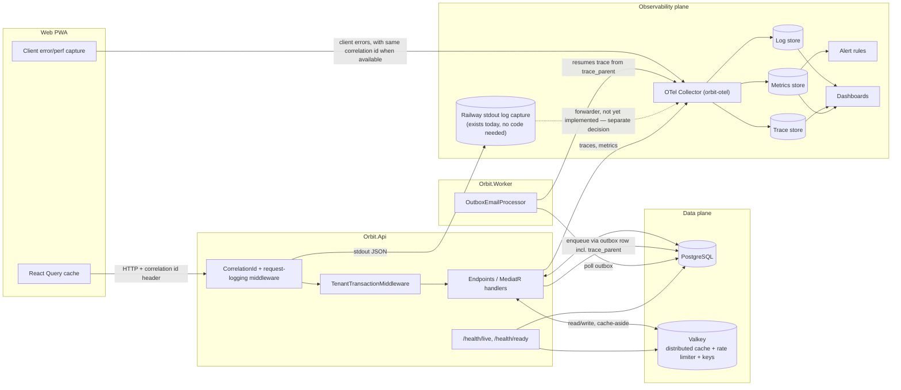
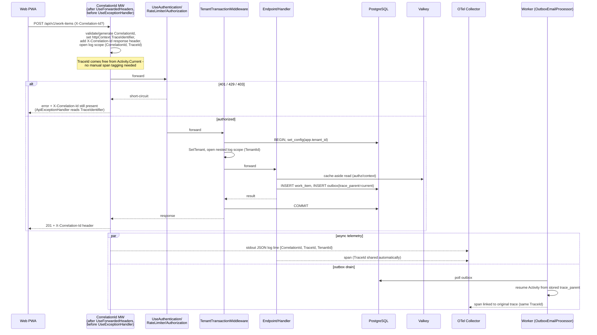
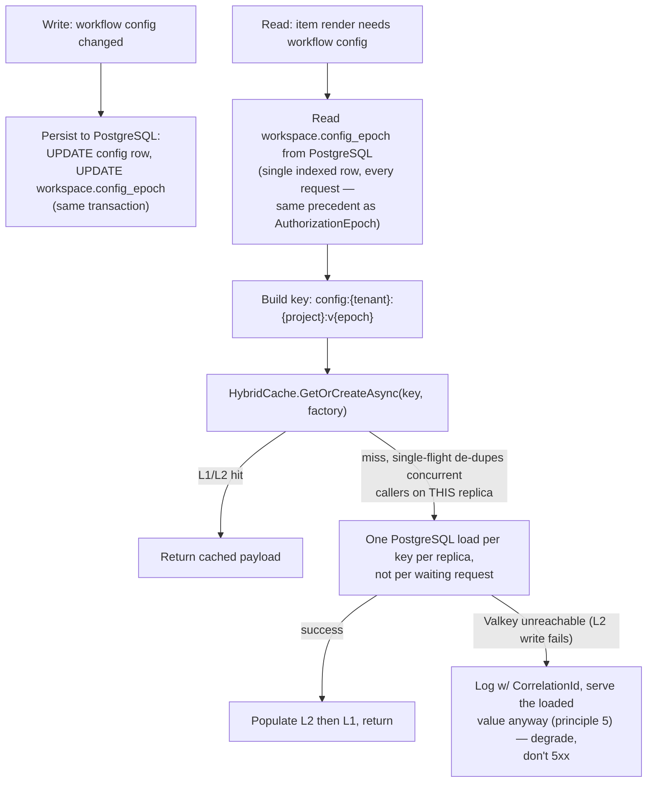

# Observability and Caching Architecture

This document specifies the target observability (logging, tracing, metrics, health) and
caching architecture for Orbit, and the gap between that target and what is implemented today.
It complements `ORBIT-WORK-MANAGEMENT-ARCHITECTURE.md` §3.5 (ADR-022 rate limiting, ADR-023
tracing) and §8.2 (observability signal table) rather than replacing them — this document is
the implementation-level detail; that document stays the source of truth for the target metric
names and alert thresholds. Where the two disagree, `ORBIT-WORK-MANAGEMENT-ARCHITECTURE.md`
wins.

## 1. Current state (baseline)

Established by direct inspection of the codebase, not aspiration.

### 1.1 Observability — implemented

| Concern | Status | Where |
|---|---|---|
| Tracing (OpenTelemetry) | Wired for API and Worker | `src/Orbit.Api/Program.cs:198-211`, `src/Orbit.Worker/Program.cs:20-31` |
| Trace propagation across outbox hop | Implemented via stored `trace_parent` column, not in-process `Activity` | `OutboxEmailProcessor.ActivitySourceName` |
| Metrics (OpenTelemetry) | Wired; ASP.NET Core, HttpClient, Npgsql, Redis instrumentation + custom meter | `src/Orbit.Api/Program.cs:198-211`, `src/Orbit.Infrastructure/RateLimiting/RateLimitTelemetry.cs` |
| OTLP export | Configured, defaults to `localhost:4317` | `src/Orbit.Api/Program.cs`, `src/Orbit.Worker/Program.cs` |
| Health endpoints | Hand-rolled minimal API, not the `Microsoft.Extensions.Diagnostics.HealthChecks` package | `src/Orbit.Api/Program.cs:274-277`, `src/Orbit.Api/Endpoints/HealthEndpoints.cs:11-39` |

### 1.2 Observability — gaps

| Gap | Why it matters |
|---|---|
| No structured logging framework (plain `ILogger` → console) | No sinks, no structured JSON output, nothing to ship to a log store |
| No correlation/request ID middleware | A trace has an id; a log line does not carry it, so logs cannot be joined to traces |
| `TenantTransactionMiddleware` logs nothing | The one middleware that touches every tenant-scoped request emits no signal on failure paths |
| No OTel Collector deployed | `orbit-otel` is referenced in the main architecture doc as a target (§3.3) but no compose/Railway service exists; OTLP export currently has nowhere to land outside local dev |
| No dashboards/alerts | The §8.2 signal table in the main doc is a target schema, not a deployed Grafana/equivalent instance |
| No frontend error tracking | No Sentry or equivalent in `web/`; client exceptions are invisible |
| `/health/ready` not wired into Railway | `deploy/railway/*.railway.json` only check `/health/live`, so a broken DB/cache connection does not fail a deploy health check |

### 1.3 Caching — implemented

| Concern | Status | Where |
|---|---|---|
| Distributed cache backend | Valkey via `IDistributedCache` (`AddStackExchangeRedisCache`), falls back to `AddDistributedMemoryCache()` when `ConnectionStrings:Redis` unset | `src/Orbit.Infrastructure/DependencyInjection.cs:104-121` |
| Authorization cache | Tenant membership/principal resolution, 5 min TTL, keyed by tenant + user + `AuthorizationEpoch` | `src/Orbit.Infrastructure/Authorization/AuthorizationContextCache.cs` |
| Distributed rate limiting | Raw `IConnectionMultiplexer` + Lua sliding window, not `IDistributedCache`; falls back to in-memory `FixedWindowLimiter` | `src/Orbit.Infrastructure/RateLimiting/RedisSlidingWindowRateLimiter.cs` |
| Data Protection key ring | Persisted to the same Valkey instance so keys survive container restarts on Railway | `src/Orbit.Infrastructure/DependencyInjection.cs:109-120` |
| Health check probe | `/health/ready` writes a probe key against `IDistributedCache` (no read-back yet — see §4.4 rollout step 3) | `src/Orbit.Api/Endpoints/HealthEndpoints.cs` |
| Error-response correlation field | `ApiExceptionHandler` already sets `problem.Extensions["correlationId"] = httpContext.TraceIdentifier` on every handled exception — an existing convention, not something this document introduces | `src/Orbit.Api/Errors/ApiExceptionHandler.cs:54` |

### 1.4 Caching — gaps

| Gap | Why it matters |
|---|---|
| No general-purpose query/response cache | Every board load, WQL query, and item read hits PostgreSQL directly; §8.3 performance budgets (150 ms item read, 700 ms board load, 400 ms WQL) assume ETag/cache assistance that does not exist yet outside authz |
| No cache invalidation convention beyond the authz epoch pattern | A new cached resource has no established "bump an epoch on write" idiom to copy |
| No `IMemoryCache` L1 tier | Every distributed-cache read is a Valkey round trip even for read-through-heavy, small, rarely-changing data (e.g. project/workflow config) |
| No React Query `staleTime`/`gcTime` policy | Global defaults are library defaults (`staleTime: 0`); only two ad hoc `staleTime: Infinity` overrides exist (`web/src/App.tsx:265,280`) — every other query refetches on every mount/focus by rule, not by design |
| Single non-replicated Valkey | §8.5 in the main doc already flags this as acceptable pre-GA ("cache loss is tolerated") — repeated here so a caching design doesn't accidentally assume durability |

## 2. Goals and non-goals

**Goals**

1. Every request is traceable end to end (HTTP → DB → outbox → worker): a `TraceId` joins the trace across that hop, and a `CorrelationId` present in logs and error responses joins support-facing reports back to it.
2. Structured logs are queryable by tenant, correlation id, trace id, and route without grepping console output.
3. Health checks reflect real dependency state and gate Railway deploys, not just process liveness.
4. A named, small set of cache-invalidation idioms exists so a new feature can cache safely without inventing a new pattern.
5. Cache and observability additions do not compromise tenant isolation — no cross-tenant cache key collisions, no tenant data in shared unscoped log fields.

**Non-goals**

- Multi-region cache replication (explicitly deferred to GA per §8.5 of the main doc).
- A dashboarding product decision (Grafana vs. hosted APM) — this doc specifies what must be emitted; the visualization backend is an infra choice made separately.
- Client-side session/offline cache redesign (PWA service worker caching) — out of scope, this covers React Query only.

## 3. Target architecture — system view

## 4. Observability design

### 4.1 Correlation id and request logging

**Correlation id and trace id are two different join keys, not one.** OpenTelemetry already gives every span in a request's trace the same `TraceId` for free — that propagation is automatic and requires no manual tagging of child DB/Redis spans. A hand-generated `X-Correlation-Id` cannot piggyback on that mechanism; it is a separate, human/support-facing id that must be logged explicitly and echoed to the client. Design both, don't conflate them:

- **`TraceId`** (`Activity.Current?.TraceId`) — the trace-store join key. Free, automatic, present on every span in the request's trace with no extra code.
- **`CorrelationId`** (`X-Correlation-Id`) — the log-store / support-ticket join key. Read from the inbound header if present and shaped like a GUID; otherwise generate one. Reject (regenerate rather than trust) a header value that isn't a well-formed, bounded GUID, so an external caller cannot inject unbounded-cardinality values into logs/telemetry.

**Placement is not "immediately before `TenantTransactionMiddleware`" — it must be near the top of the pipeline.** The actual `Program.cs` order is `UseForwardedHeaders` (`Program.cs:215`) → … → `UseExceptionHandler` (`Program.cs:237`) → … → `UseCors` → `UseAuthentication` → `UseRateLimiter` → `UseAuthorization` → `UseMiddleware<TenantTransactionMiddleware>` (`Program.cs:262-266`). A middleware placed only immediately before `TenantTransactionMiddleware` would run *after* authentication, rate limiting, and authorization — so a 401 from `UseAuthentication`, a 429 from `UseRateLimiter`, or a 403 from `UseAuthorization` would short-circuit the pipeline before the correlation middleware ever ran, leaving exactly the failure responses most likely to need a support-facing id untagged.

**Reuse the existing `TraceIdentifier` convention instead of inventing a second one.** `ApiExceptionHandler` already sets `problem.Extensions["correlationId"] = httpContext.TraceIdentifier` on every handled exception (`ApiExceptionHandler.cs:54`) — that convention already exists in the codebase and this document should plug into it, not add a parallel field.

**Decision:** add one middleware, ordered right after `UseForwardedHeaders` and before `UseExceptionHandler`, so it wraps every downstream middleware including auth, rate limiting, and exception handling. It:

1. Reads and validates `X-Correlation-Id` from the inbound request (GUID-shaped, else generate a new one).
2. Sets `httpContext.TraceIdentifier` to that value — this is the only change needed for `ApiExceptionHandler.cs:54`'s existing `correlationId` extension field to start carrying a real, client-joinable id instead of ASP.NET Core's default per-request random identifier; `ApiExceptionHandler.cs` itself is untouched.
3. Adds the response header `X-Correlation-Id` with that value *before* calling `next()`, so it is present even when a later middleware (auth, rate limiter) short-circuits the pipeline.
4. Pushes `CorrelationId` (`httpContext.TraceIdentifier`) and `TraceId` (`Activity.Current?.TraceId.ToString()`) into an `ILogger` scope so every log line for the request carries both without call sites passing them explicitly. **`TenantId` is not available here** — `TenantContext.SetTenant` only runs once `TenantTransactionMiddleware` has resolved and validated the tenant (`TenantTransactionMiddleware.cs:86`), which happens later in the pipeline for tenant-scoped routes and not at all for unauthenticated ones. `TenantTransactionMiddleware` itself opens a second, nested `ILogger` scope adding `TenantId` right after `SetTenant`, rather than the correlation middleware claiming a value it doesn't have yet.

This is a new, small middleware — not a restructuring of `TenantTransactionMiddleware`, which keeps its existing responsibilities and gains only the nested `TenantId` scope and the failure-path logging from §4.3.

### 4.2 Structured logging

**Decision:** adopt Serilog with the console sink writing compact JSON in non-Development environments (`appsettings.json` `Serilog:WriteTo` config-driven, matching the existing config-driven pattern for `ConnectionStrings:Redis`), and the existing human-readable console format retained for `Development`. Serilog's `Enrich.FromLogContext()` picks up the `CorrelationId`/`TraceId` scope from §4.1 and the `TenantId` scope from `TenantTransactionMiddleware` without extra plumbing. No new sink infrastructure (no direct-to-Seq/Elastic shipping) — JSON-to-stdout is the only decision made here.

**Log export path is a separate, explicit decision, not implied by "stdout JSON":** on Railway, stdout is captured by Railway's own logging product by default with no extra wiring. Routing those logs into the same store as traces/metrics (via a Railway log-forwarding integration, or a sidecar that tails stdout into the `orbit-otel` Collector's log receiver) is a distinct step that depends on which log/trace backend is chosen — this document requires JSON-structured stdout output so that *any* forwarding path is a mechanical hookup rather than a reformatting job, but does not pick the forwarder.

Rule carried over from the main doc's §8.2 log row: no field values for sensitive/tenant work-item content in log messages — only ids.

### 4.3 Tracing

Already correct in shape (§1.1) — no redesign needed. Two additions:

- `TenantTransactionMiddleware` gets `logger.LogWarning` on transaction rollback/exception paths (currently silent) — picked up automatically by the `CorrelationId`/`TraceId` log scope from §4.1, no explicit tagging needed at the call site.
- The OTel Collector (`orbit-otel`) referenced by ADR-023 needs an actual `deploy/podman/compose.yaml` service definition for local dev, and a Railway service for staging/prod. The local dev Collector can point its exporter at a console/file/`otlp-file` sink from day one — this is enough to actually see traces and metrics locally and is not blocked on the production trace/metrics store decision. Wiring the same Collector to a real staging/prod backend is a separate step once that backend is chosen; this document specifies the Collector must exist and receive OTLP on 4317, not which store it forwards to.

### 4.4 Health checks

**Decision:** keep the hand-rolled `/health/live` and `/health/ready` endpoints (no need to introduce the `HealthChecks` NuGet package purely for two checks) but:

1. Point `deploy/railway/api.railway.json`'s `healthcheckPath` at `/health/ready`, not `/health/live` — liveness alone lets Railway route traffic to a replica that can't reach Postgres or Valkey. **`deploy/railway/web.railway.json` is unaffected** — the web service is a static nginx build (`Dockerfile.web`) with no `/health/ready` route; it has nothing analogous to check and stays on `/health/live`.
2. Keep `/health/live` for container-orchestrator restart decisions (must never depend on downstream services, so a downstream blip doesn't cause a restart storm) — this split already exists, just needs to be wired into the deploy config that currently ignores it.
3. Bound the probe itself: `/health/ready`'s DB/cache checks must carry an explicit short timeout (e.g. 1-2 s via a linked `CancellationToken`), independent of `healthcheckTimeout` in the Railway config, so a slow-but-alive dependency degrades to a fast 503 rather than hanging the whole check window. `api.railway.json`'s existing `restartPolicyType: ON_FAILURE` / `restartPolicyMaxRetries: 3` (`deploy/railway/api.railway.json:7-8`) already bounds restart flapping from a single bad deploy; no change needed there.
4. Fix `/health/ready`'s cache check for correctness, not just intent: `HealthEndpoints.ReadyAsync` (`src/Orbit.Api/Endpoints/HealthEndpoints.cs:22-36`) today only writes the probe key — add a read-back (`GetStringAsync`) so a partially-degraded Valkey that accepts writes but fails reads is caught, not reported ready. Because `IDistributedCache` falls back to `AddDistributedMemoryCache()` when `ConnectionStrings:Redis` is unset (`DependencyInjection.cs:104-121`), the round-trip check is meaningful in every environment as written — it exercises whatever `IDistributedCache` is actually registered rather than assuming Valkey specifically, so there is no separate "is Valkey configured" branch to add.

### 4.5 Frontend error/perf capture

**Decision:** add a minimal client error boundary that reports uncaught errors and failed mutations with the `X-Correlation-Id` from the failed response attached, so a user-reported bug can be joined to the exact backend trace. This document does not select a vendor (Sentry vs. self-hosted); it specifies the join key (correlation id) as the requirement any choice must satisfy.

### 4.6 Sequence — traced request through to worker

## 5. Caching design

### 5.1 Principles

1. **Cache-aside, never write-through**, matching the existing `AuthorizationContextCache` shape — the source of truth is always PostgreSQL; Valkey holds a TTL'd or epoch-invalidated derived copy.
2. **Tenant id is always part of the cache key, and keys are built through one typed helper, not raw string interpolation at call sites.** No cache key format may omit the tenant id, even where a resource id is already globally unique, because a key-format change later must not silently create a cross-tenant leak. Format: `{context}:{tenant_id}:{resource}:{id}` — matching the existing `AuthorizationContextCache` key shape. A small `TenantCacheKey.For(tenantId, context, resource, id)` helper is the enforcement point (a code-review checklist rule alone is easy to miss); every new cache consumer calls it instead of formatting the string itself.
3. **Two invalidation idioms only** — do not invent a third without updating this document:
   - **TTL-only**, for data where staleness up to N seconds/minutes is acceptable (e.g. WQL result caching).
   - **Epoch-bumped**, copying `AuthorizationContextCache`'s `AuthorizationEpoch` pattern, for data where a write must be immediately visible (e.g. workflow/custom-field config used on every item render, board read models). **The epoch value itself must live on the authoritative PostgreSQL row** — a `WorkspaceConfigEpoch`/`BoardEpoch` column bumped in the same transaction as the write it invalidates, exactly like `Workspace.AuthorizationEpoch` (`TenantTransactionMiddleware.cs:224`) — never as a bare Valkey counter with no durable backing. A Valkey-only counter loses its value on a cache flush with no record of what it should resume from; a Postgres-backed epoch degrades to "one extra cache miss cascade," not silent data loss.
4. **L1 (process-local, short TTL) in front of L2 (Valkey) only for read-heavy, small, low-cardinality data** — project/workflow/custom-field config and board read models, not per-item or per-user data, to keep memory bounded per replica and avoid cross-replica staleness on data that changes often.
5. **Cache reads must fail open to PostgreSQL, not fail the request.** A Valkey outage or timeout on a cache read must be caught, logged (with the request's `CorrelationId`/`TraceId` from §4.1, so a spike is diagnosable), and treated as a cache miss — never surfaced as a 5xx to the caller. This applies uniformly to every cache consumer added under this document, not case-by-case.
6. **Concurrent misses on the same key must not all hit PostgreSQL, within the bound of one replica.** A TTL expiry or an epoch bump under concurrent read load (many open tabs on one board) is a cache-stampede risk if every miss independently reloads from PostgreSQL. Every cache consumer under this document — including WQL, principle 3's TTL-only idiom — uses `Microsoft.Extensions.Caching.Hybrid`'s `HybridCache` (GA since .NET 9, available in the pinned .NET 10 SDK) rather than hand-rolled `IMemoryCache`/`IDistributedCache` plumbing: `GetOrCreateAsync` de-duplicates concurrent misses on one key **per process**, which a hand-rolled pair does not give for free. This is per-replica, not cluster-wide — with N API replicas, a stampede is bounded to at most N concurrent PostgreSQL loads for one key instead of one per open browser tab; that bound is accepted as sufficient pre-GA rather than adding a distributed lock, matching this document's Railway-scale (§3.6 of the main doc) rather than over-building for a scale not yet reached. Where WQL's per-query key cardinality makes local (L1) storage a bad fit (principle 4 reserves L1 for low-cardinality data), use `HybridCache` with `HybridCacheEntryFlags.DisableLocalCache` — it still provides the single-flight de-duplication into L2 without the in-process memory growth risk.
7. **The epoch value is read from PostgreSQL on every use, never cached ahead of time.** Caching the epoch itself (in L1 or anywhere else) reintroduces exactly the staleness window principle 3's "epoch-bumped" idiom exists to avoid: a replica holding a stale cached epoch would keep serving a stale payload under a key the write already invalidated. `AuthorizationContextCache` does not cache `Workspace.AuthorizationEpoch` — every request reads it fresh via `settings.GetWorkspaceAsync` (`TenantTransactionMiddleware.cs:217`), a single indexed-row read, and that is the precedent every epoch-bumped consumer under this document follows. This does not reduce the value of `HybridCache`'s L1: the *epoch lookup* goes to PostgreSQL, but the *payload* it keys into (the actual config/board data) is still served from L1/L2 on a hit — only the miss path touches PostgreSQL twice (once for the epoch, once for the payload on a cache miss).
8. **Bound cache footprint explicitly per resource type**: a maximum serialized entry size, a TTL ceiling, and — for paginated data like WQL results — a maximum cached page size. Unbounded board/WQL caching is the next Valkey memory bottleneck after PostgreSQL saturation (§3.6 of the main doc) if left unbounded; state the limit when a resource is added to §5.2, don't leave it to the implementation to guess.

### 5.2 What gets cached next (in priority order)

| Candidate | Layer | Idiom | Bound | Rationale |
|---|---|---|---|---|
| Board read model (columns, cards, rank) | L1 + L2 via `HybridCache` | Epoch-bumped (`Board.Epoch` column) on any write affecting the board (item move, transition, rank change) | TTL ceiling 60 s; entry capped to one board's visible page | Directly targets §8.3's 700 ms board-load budget; board writes are already funneled through one transaction per §6.5 of the main doc, so bumping one epoch there is a single extra column update. **Caveat:** an actively-worked board (frequent drag/transition during sprint triage) can see a near-0% cache hit rate from constant epoch churn — this cache mainly pays off on initial load / cold navigation, not on a tab already open and receiving the realtime fan-out from §6.5; do not treat a low hit rate on a hot board as a bug |
| Project/workflow/custom-field config | L1 + L2 via `HybridCache` | Epoch-bumped (`Workspace`/`Project` config epoch column) on config write | TTL ceiling 5 min; small, bounded entry | Read on every item render; changes rarely; smallest, safest win |
| WQL query result pages | L2 only via `HybridCache` (`DisableLocalCache`) | TTL-only (short, e.g. 15-30 s) | TTL ceiling 30 s; max one page (existing page-size limit) per entry | Matches §8.3's WQL budget; TTL-only (not epoch) because WQL result sets are too broad to enumerate a precise invalidation set cheaply. `DisableLocalCache` keeps per-query-key cardinality out of process memory (principle 4) while still getting single-flight de-duplication on a miss (principle 6) |
| Work item single-read ETag | HTTP `ETag`/`If-None-Match`, not a server cache | N/A | N/A | Already implied by the main doc's §8.3 "ETag caching" note — a client-side/conditional-GET optimization, not a new Valkey entry |

**Implementation status (rollout step 7):** row 1 is implemented for the board's own columns/config (`GetBoardQuery`, epoch-bumped from `UpdateBoardHandler` and `CreateWorkItemStatusHandler`) — `Board` in this codebase holds columns/config only, not a combined board+cards+rank read model, so "cards, rank" in this row's label describes the row's intended eventual scope, not triggers implemented today; work items shown on a board are fetched separately via the existing `ListWorkItemsQuery`, which is not cached under this row and whose mutations (`ChangeWorkItemStatusHandler`, `ReorderWorkItemHandler`) therefore do not bump `Board.Epoch`. Row 3 (WQL) is **not implemented and not implementable yet** — WQL (parser, handler, `/api/v1/search` endpoint) does not exist anywhere in this codebase as of this rollout; row 3 is blocked on WQL shipping first, not a caching-scope decision.

### 5.3 Cache flow — read and epoch invalidation

The epoch lives on the PostgreSQL row (principle 3) and is read fresh from PostgreSQL on every use (principle 7) — the same single-indexed-row read `AuthorizationContextCache` already does for `Workspace.AuthorizationEpoch`, so an epoch bump is visible to every replica on its very next read, with no cross-replica staleness window. `HybridCache.GetOrCreateAsync` (principle 6) still collapses concurrent *payload* misses on one process into a single PostgreSQL load instead of one per waiting request, bounded per replica rather than cluster-wide.

Because the epoch is embedded in the cache key rather than used to delete keys, a bump is O(1) and old-epoch entries simply age out via TTL — the same trick `AuthorizationContextCache` already relies on, applied to further resource types instead of a bespoke mechanism per feature.

### 5.4 Frontend cache (React Query)

**Decision:** set explicit global defaults in `web/src/main.tsx` rather than leaving `staleTime: 0` implicit:

| Query class | `staleTime` | `gcTime` | Rationale |
|---|---|---|---|
| Reference/config data (choices, custom field defs, workflows) | `Infinity` with explicit invalidation on mutation | Library default (5 min) | Already the pattern for `choices` (`App.tsx:265`); extend it, don't leave it as two unexplained exceptions |
| Board/list views | 10-15 s | 5-10 min | Matches realtime fan-out (§6.5 of the main doc) already pushing updates; a short staleTime avoids redundant refetch storms on window focus while realtime keeps it fresh; `gcTime` bounds how long an unmounted board's query stays in memory on a long-running tab |
| Everything else (default) | keep library default (0) | keep library default (5 min) | Do not blanket-cache data with no established staleness tolerance; only promote a query class once it's deliberately reviewed |

This is a policy addition, not a caching-library change — `queryClient.setQueryData` optimistic-update usage in `App.tsx` is unaffected. The `staleTime`/`gcTime` values above are global defaults; assigning each existing query key in `App.tsx` to a class and setting per-query overrides where a query's key doesn't match its class default is implementation work for rollout step 6 (§7), not enumerated here.

## 6. Tenant isolation and security constraints

1. No cache key may be constructed from user-controlled input without going through the `TenantCacheKey` helper (§5.1.2), which forces the tenant id prefix — the helper is the enforcement point since Valkey has no per-key ACL matching Orbit's tenancy model and a code-review checklist alone is easy to miss.
2. Log scopes (§4.2) must enrich with `TenantId` from `CurrentPrincipal`/`TenantContext` inside `TenantTransactionMiddleware`, never from a client-supplied header, mirroring how that same middleware already sources tenant id for `set_config` — logs must not become a channel where a forged header claims a different tenant.
3. The correlation id (§4.1) is validated as GUID-shaped but, unlike tenant id, is otherwise safe to accept from the client (echoed, not trusted for authorization) since it is only a join key for support/debugging, never used in a query predicate. `TraceId` is read from `Activity.Current`, which ASP.NET Core's OpenTelemetry instrumentation may itself continue from an inbound W3C `traceparent` header rather than generate — so an external caller can influence which `TraceId` a request lands under. That remains safe for the same reason as `CorrelationId`: it is only ever used as an observability join key, never in a query predicate or an authorization decision.
4. Structured log fields exclude work-item content (§4.2) — this is the log-side mirror of the main doc's §8.6 data-residency rule that telemetry excludes work-item field values by default.

## 7. Rollout sequencing

Matches the "smallest safe increment" pattern the main doc's §13.5 backlog already uses — each step independently shippable and testable:

1. Correlation id middleware — placed after `UseForwardedHeaders`/before `UseExceptionHandler`, GUID-validated, setting `httpContext.TraceIdentifier` so the existing `ApiExceptionHandler.cs:54` convention picks it up for free (§4.1) — plus `TenantTransactionMiddleware` failure-path logging and nested `TenantId` scope (§4.1, §4.3). No external dependency, pure code change.
2. Serilog structured JSON logging (§4.2), config-gated like the existing Redis connection string pattern so `Development` behavior is unchanged.
3. `/health/ready` wired into `api.railway.json` only, with a bounded probe timeout and a read-back added to the cache check (§4.4) — config- and small-code-only change; `web.railway.json` is untouched. Verify in staging before relying on it to gate a real deploy.
4. `orbit-otel` Collector service in `deploy/podman/compose.yaml` for local dev, exporting to console/file initially (§4.3) — unblocks actually seeing traces/metrics emitted since v1.x without waiting on a hosted backend decision.
5. `TenantCacheKey` helper, `HybridCache` wiring (L1+L2, single-flight), and the fail-open wrapper (§5.1 principles 2, 5, 6) landed together with the first real cache consumer — config-epoch cache for workflow/custom-field data (§5.2 row 2). Smallest, safest new cache surface; proves the epoch-on-Postgres-row idiom and the shared cache primitives generalize beyond `AuthorizationContextCache` before board caching (higher blast radius, §5.2's board-churn caveat) reuses the same hardened building blocks.
6. React Query `staleTime`/`gcTime` policy (§5.4), including assigning each existing query key to a class — frontend-only, no backend dependency, can land any time after step 1 if correlation-id-tagged client errors aren't a blocker.
7. Board read-model caching (§5.2 row 1) and WQL result caching (§5.2 row 3) — deferred last: highest invalidation complexity, directly targets §8.3 performance budgets once the cheaper wins are in and the shared primitives from step 5 are proven.
8. Frontend error capture wired to correlation id (§4.5) and dashboards/alerts (§8.2 of the main doc) — vendor/tooling decision, sequenced last since it depends on the Collector (step 4) existing to receive anything and on a chosen production trace/log backend (§4.2, §4.3) to forward into.
