# ORBIT — Work Management Platform

<!-- markdownlint-disable MD013 MD060 -->

## End-to-End Architecture: HLD, LLD, and Phased Implementation Plan

**Document ID:** ARCH-ORBIT-001
**Status:** Proposed
**Version:** 1.32
**Owner:** ORBIT maintainers
**Reviewers:** Product, Architecture, Security, SRE, Open-source maintainers
**Last updated:** 2026-08-18

---

## Table of Contents

- [End-to-End Architecture: HLD, LLD, and Phased Implementation Plan](#end-to-end-architecture-hld-lld-and-phased-implementation-plan)
- [0. Scope Reality Check — Read This First](#0-scope-reality-check--read-this-first)
  - [0.1 What "the same features as Jira" actually costs](#01-what-the-same-features-as-jira-actually-costs)
  - [0.2 Recommended posture: wedge, not clone](#02-recommended-posture-wedge-not-clone)
  - [0.3 Legal note](#03-legal-note)
- [1. Context and Scope](#1-context-and-scope)
  - [1.1 Product definition](#11-product-definition)
  - [1.2 Personas](#12-personas)
  - [1.3 Functional requirements](#13-functional-requirements)
  - [1.4 Non-functional requirements](#14-non-functional-requirements)
  - [1.5 Constraints and assumptions](#15-constraints-and-assumptions)
  - [1.6 Requested capability coverage](#16-requested-capability-coverage)
- [2. Domain Model and Bounded Contexts](#2-domain-model-and-bounded-contexts)
  - [2.1 Context map](#21-context-map)
  - [2.2 Ubiquitous language](#22-ubiquitous-language)
- [3. High-Level Design](#3-high-level-design)
  - [3.1 System context — C4 Level 1](#31-system-context--c4-level-1)
  - [3.2 Container view — C4 Level 2](#32-container-view--c4-level-2)
  - [3.3 Technology selection](#33-technology-selection)
  - [3.4 Multi-tenancy model](#34-multi-tenancy-model)
  - [3.5 Architecture Decision Record index](#35-architecture-decision-record-index)
  - [3.6 Quantified scale-out triggers](#36-quantified-scale-out-triggers)
  - [3.7 Identity, bootstrap, and workspace hierarchy](#37-identity-bootstrap-and-workspace-hierarchy)
- [4. The Six Hard Subsystems](#4-the-six-hard-subsystems)
  - [4.1 Configurability engine — custom fields](#41-configurability-engine--custom-fields)
  - [4.2 Workflow engine](#42-workflow-engine)
  - [4.3 Permission model](#43-permission-model)
  - [4.4 WQL — the query language](#44-wql--the-query-language)
  - [4.5 Extension platform](#45-extension-platform)
  - [4.6 Agile core — boards, rank, sprints, and reports](#46-agile-core--boards-rank-sprints-and-reports)
- [5. Low-Level Design](#5-low-level-design)
  - [5.1 Component responsibilities](#51-component-responsibilities)
  - [5.2 Core data model](#52-core-data-model)
  - [5.3 Public API surface](#53-public-api-surface)
- [6. Sequence Diagrams](#6-sequence-diagrams)
  - [6.1 Create work item with configurable fields](#61-create-work-item-with-configurable-fields)
  - [6.2 Workflow transition with conditions, validators, and post-functions](#62-workflow-transition-with-conditions-validators-and-post-functions)
  - [6.3 WQL search execution](#63-wql-search-execution)
  - [6.4 Permission change propagation](#64-permission-change-propagation)
  - [6.5 Board drag-and-drop with ranking and realtime fan-out](#65-board-drag-and-drop-with-ranking-and-realtime-fan-out)
  - [6.6 Automation rule execution with loop protection](#66-automation-rule-execution-with-loop-protection)
  - [6.7 Sprint completion and rollover](#67-sprint-completion-and-rollover)
  - [6.8 Migration import from an incumbent tracker](#68-migration-import-from-an-incumbent-tracker)
  - [6.9 Extension invocation](#69-extension-invocation)
  - [6.10 First-run bootstrap](#610-first-run-bootstrap)
  - [6.11 Invite and activate a team member](#611-invite-and-activate-a-team-member)
- [7. Flowcharts](#7-flowcharts)
  - [7.0 Application entry and onboarding routing](#70-application-entry-and-onboarding-routing)
  - [7.1 Transition eligibility evaluation](#71-transition-eligibility-evaluation)
  - [7.2 Permission resolution](#72-permission-resolution)
  - [7.3 WQL planning](#73-wql-planning)
  - [7.4 Notification decisioning](#74-notification-decisioning)
- [8. Cross-Cutting Concerns](#8-cross-cutting-concerns)
  - [8.1 Security](#81-security)
  - [8.2 Observability](#82-observability)
  - [8.3 Performance budgets](#83-performance-budgets)
  - [8.4 Data lifecycle](#84-data-lifecycle)
  - [8.5 Reliability and disaster recovery](#85-reliability-and-disaster-recovery)
  - [8.6 Data residency](#86-data-residency)
- [9. Implementation Plan](#9-implementation-plan)
  - [9.1 Themes](#91-themes)
  - [9.2 Phases](#92-phases)
  - [9.3 Phase × Theme intensity matrix](#93-phase--theme-intensity-matrix)
  - [9.4 Epic and story decomposition](#94-epic-and-story-decomposition)
  - [9.5 Timeline](#95-timeline)
  - [9.6 Epic dependency graph](#96-epic-dependency-graph)
  - [9.7 Team shape](#97-team-shape)
  - [9.8 RAID log](#98-raid-log)
- [10. Test Strategy](#10-test-strategy)
  - [Traceability](#traceability)
- [11. Rollout](#11-rollout)
  - [11.1 Stages](#111-stages)
  - [11.2 Rollback and safety](#112-rollback-and-safety)
  - [11.3 Runbooks required before GA](#113-runbooks-required-before-ga)
- [12. Open Questions](#12-open-questions)
- [13. Open-source Development and Deployment Architecture](#13-open-source-development-and-deployment-architecture)
  - [13.1 Repository layout](#131-repository-layout)
  - [13.2 Podman Desktop local environment](#132-podman-desktop-local-environment)
  - [13.3 Railway reference topology](#133-railway-reference-topology)
  - [13.4 GitHub Actions CI/CD](#134-github-actions-cicd)
  - [13.5 Implementation baseline and next increments](#135-implementation-baseline-and-next-increments)
  - [13.6 Open-source governance and dependency policy](#136-open-source-governance-and-dependency-policy)
  - [13.7 Reliability increments: distributed rate limiting and OpenTelemetry](#137-reliability-increments-distributed-rate-limiting-and-opentelemetry)
    - [13.7.1 Distributed rate limiting (ADR-022)](#1371-distributed-rate-limiting-adr-022)
    - [13.7.2 OpenTelemetry distributed tracing (ADR-023)](#1372-opentelemetry-distributed-tracing-adr-023)
- [Appendix A — Delivery Tracking Field Mapping](#appendix-a--delivery-tracking-field-mapping)
- [Appendix B — Mermaid Conventions Used Here](#appendix-b--mermaid-conventions-used-here)
- [Appendix C — Change Log](#appendix-c--change-log)
- [10. Jira Parity Architectural Additions (Proposed Extensions)](#10-jira-parity-architectural-additions-proposed-extensions)
  - [10.1 Search & Advanced Filtering (WQL & Quick Filters)](#101-search--advanced-filtering-wql--quick-filters)
  - [10.2 Agile Reporting & Burndown Calculations](#102-agile-reporting--burndown-calculations)
  - [10.3 Attachment Management (MinIO / S3)](#103-attachment-management-minio--s3)
  - [10.4 Advanced IAM: Teams, Roles & Invitations](#104-advanced-iam-teams-roles--invitations)
  - [10.5 Notification Engine (Event Outbox)](#105-notification-engine-event-outbox)
  - [10.6 GitHub Integration (Webhooks)](#106-github-integration-webhooks)

---

## 0. Scope Reality Check — Read This First

### 0.1 What "the same features as Jira" actually costs

| Capability cluster | Rough engineer-years to credible parity | Why it is expensive |
|---|---|---|
| Work item core, comments, attachments | 2–3 | Well-understood CRUD; the easy part |
| Configurability engine — custom fields, screens, field configs, schemes | 12–20 | Schema design is effectively irreversible; every downstream feature must be config-aware |
| Workflow engine — statuses, transitions, conditions, validators, post-functions | 10–15 | Turing-adjacent extensibility; must be safe, sandboxed, and fast |
| Permission model — schemes, project roles, issue-level security, sharing | 8–12 | Must be enforced *inside* every query, not after it |
| Query language + search | 10–15 | Parser, planner, index, permission-aware execution, saved filters, subscriptions |
| Agile — boards, backlogs, sprints, ranking, reports | 8–12 | Ranking at scale and report correctness are both harder than they look |
| Automation rules engine | 6–10 | Loop detection, rate limiting, tenant fairness |
| App/extension platform — the actual moat | 20–40 | Sandboxing, versioning, marketplace, billing, backwards compatibility forever |
| Admin, audit, billing, migration, mobile, i18n, accessibility | 15–25 | Unglamorous and non-optional |
| **Total** | **~90–150 engineer-years** | — |

[Likely] A 10-engineer team reaches "credible replacement for a mid-size org" in 3–4 years, not 12 months. Plan accordingly or pick a wedge.

### 0.2 Recommended posture: wedge, not clone

| Strategy | Verdict | Reasoning |
|---|---|---|
| Full parity clone | **Reject** | You compete on Atlassian's strongest axis — surface area — with 1% of the budget |
| Vertical wedge — one segment done sharply better, plus import fidelity | **Recommended** | Parity only where switching cost lives: data model, WQL-equivalent, permissions, import |
| Pure UI reskin on top of Jira | Reject | Not a competitor; a dependency |

**Parity is required in four places** — anywhere else, differentiate or defer:

1. **Agile semantics** — board filters, column/status mapping, rank, sprint scope changes, and report calculations must be predictable to a migrating team.
2. **Data migration fidelity** — supported Jira constructs must import without silent loss; unsupported constructs require an explicit remediation report.
3. **Query compatibility** — muscle memory and saved filters live here, but ORBIT may ship a documented WQL dialect with an import translator rather than clone all of JQL.
4. **Permission semantics** — the security team must be able to reason about every grant, dynamic predicate, and revocation.

The first commercial and open-source milestone is an **Agile Core** product: a fast, filter-backed Kanban board and complete Scrum sprint lifecycle for software teams of 20–500 users. Advanced workflow schemes, automation, an extension marketplace, native mobile clients, and a separate analytics platform are later capabilities. §9 makes the Agile Core usable at the end of **P2**.

### 0.3 Legal note

[Likely] Re-implementing functionality is lawful; copying trademarks, distinctive UI trade dress, or documentation text is not. Clean-room the behaviour, not the pixels. Get counsel before naming anything "Jira-compatible" in marketing.

---

## 1. Context and Scope

### 1.1 Product definition

ORBIT is an open-source, multi-workspace work management platform focused first on sprint and Kanban execution. A **workspace** is the user-facing name for a tenant and is the security, billing, and data-residency boundary. A globally unique user account may belong to multiple workspaces. Each workspace contains administrators, teams, members, projects, and project-owned Kanban or Scrum boards. Its backend is a **headless .NET 10 REST API**: it owns no HTML rendering and serves no frontend assets. It provides filter-backed boards, configurable work items, explicit workflow transitions, sprint planning, scope-correct agile reports, and versioned contracts consumed by a separately deployable responsive React PWA.

### 1.2 Personas

| ID | Persona | Primary need | Fails if |
|---|---|---|---|
| PR-0 | First-run super admin | Securely initialize an empty installation and create the first workspace | Bootstrap can be replayed or requires direct database access |
| PR-1 | Individual contributor | Find my work, update it in under 3 clicks | Board is slow or transitions are confusing |
| PR-2 | Team lead | See flow, unblock, plan a sprint | Reports are wrong or backlog ranking is unstable |
| PR-3 | Project admin | Configure workflow, fields, permissions without a ticket to IT | Config requires site-admin rights |
| PR-4 | Site super admin | Govern installations, workspace administrators, audit, billing, and data residency | Initial ownership or global account recovery is ambiguous |
| PR-7 | Workspace admin | Create teams, invite members, and govern workspace projects | Membership and invitation state cannot be audited |
| PR-5 | Developer / integrator | Automate and extend via API | API is inconsistent or unversioned |
| PR-6 | Migrating org | Move from incumbent without losing history | Import drops custom fields, links, or history |

### 1.3 Functional requirements

| ID | Requirement | Priority | Theme |
|---|---|---|---|
| FR-01 | Create, read, update, delete work items with typed, configurable fields | Must | T2 |
| FR-02 | Model a work item hierarchy — portfolio → epic → story → sub-task — with configurable levels | Must | T2 |
| FR-03 | Attach files, comment, mention, react, and watch | Must | T2 |
| FR-04 | Define workflows: statuses, transitions, conditions, validators, post-functions | Must | T3 |
| FR-05 | Reuse configuration through schemes bound to projects | Must | T3 |
| FR-06 | Enforce permissions via schemes, project roles, groups, and issue-level security | Must | T4 |
| FR-07 | Query work items in WQL — a structured query language with saved filters | Must | T5 |
| FR-08 | Full-text search across items, comments, and attachments | Must | T5 |
| FR-09 | Scrum and Kanban boards with drag-ordered backlog, sprints, swimlanes, WIP limits | Must | T6 |
| FR-10 | Reports: burndown, velocity, cumulative flow, control chart, cycle time | Must | T6 |
| FR-11 | No-code automation rules: trigger, condition, action | Must | T7 |
| FR-12 | Public REST API with OpenAPI, webhooks, and OAuth 2.0 apps | Must | T7 |
| FR-13 | Extension platform: UI modules, sandboxed functions, lifecycle hooks | Should | T7 |
| FR-14 | Realtime collaborative updates and presence | Should | T8 |
| FR-15 | Notification engine with per-user preferences and digesting | Must | T8 |
| FR-16 | Import from incumbent trackers with full history fidelity | Must | T8 |
| FR-17 | Complete audit trail of configuration and data changes | Must | T4 |
| FR-18 | Bulk operations across up to 100k items | Should | T2 |
| FR-19 | Versioned work item history with field-level diffs | Must | T2 |
| FR-20 | SSO — SAML/OIDC — and SCIM provisioning | Must | T1 |
| FR-21 | Define every project-owned board from a permission-aware saved filter constrained to that project | Must | T6 |
| FR-22 | Map multiple workflow statuses to ordered board columns and an optional Kanban backlog | Must | T6 |
| FR-23 | Move a card across columns through a valid workflow transition and update its rank atomically | Must | T6 |
| FR-24 | Model future, active, closing, closed, and reopened sprint lifecycle states with optional parallel sprints | Must | T6 |
| FR-25 | Preserve sprint membership, estimate, status, and completion events required to reproduce reports | Must | T6 |
| FR-26 | Configure board estimation and completion semantics with versioned settings | Must | T6 |
| FR-27 | Export a tenant in an open, documented format without requiring a proprietary service | Must | T8 |
| FR-28 | Install the web client as a PWA with an offline application shell, update notification, and reconnect-safe queued drafts | Must | T8 |
| FR-29 | Support phone, tablet, laptop, desktop, touch, keyboard, and screen-reader interaction without feature loss | Must | T8 |
| FR-30 | Persist every choice-field value by stable option id with tenant-scoped definitions, ordering, enabled state, and historical labels | Must | T3 |
| FR-31 | On an uninitialized installation, show a one-time bootstrap flow that atomically creates the first globally unique user, site super-admin role, and workspace ownership | Must | T1 |
| FR-32 | Support local email/password login, logout, password reset, and session renewal alongside OIDC/SAML; never store plaintext or reversibly encrypted passwords | Must | T1 |
| FR-33 | Maintain one global user account per normalized email address and allow that account to hold memberships in multiple workspaces | Must | T1 |
| FR-34 | Let site super admins appoint workspace admins; let workspace admins create teams and manage team-admin/member assignments | Must | T4 |
| FR-35 | Invite a unique email address to a workspace or team using an expiring, single-use link; accepting creates or links the global user and activates membership | Must | T4 |
| FR-36 | Enforce the containment hierarchy workspace → project → board, with every board owned by exactly one project | Must | T6 |
| FR-37 | Support both Kanban and Scrum boards per project, each with independently versioned columns, filters, workflow mapping, and agile settings | Must | T6 |
| FR-38 | Seed software workspaces with stable Initiative, Epic, Task, Story, Bug, Spike, Test, Feature, and Request item types; admins may later configure types without rewriting historical values | Must | T3 |
| FR-39 | Use `#006fde` as the default application-header brand color while preserving WCAG 2.2 AA contrast and theme-token override support | Must | T8 |
| FR-40 | Let a signed-in user view and edit display name, avatar, locale, time zone, and accessibility/theme preferences from a profile surface | Must | T1 |
| FR-41 | Treat email change as a verified identity operation and password change as a step-up-authenticated credential operation; expose active-session review and revocation | Must | T1 |
| FR-42 | Provide layered settings navigation for personal, notification, workspace, project, board, item-type, workflow, field, permission, integration, and billing scopes, showing only scopes the principal may administer | Must | T8 |
| FR-43 | Persist per-user notification event, channel, digest-cadence, quiet-hours, and self-notify preferences independently of workspace membership | Must | T8 |
| FR-44 | Version workspace, project, and board settings; validate optimistic concurrency, record before/after audit facts, and invalidate affected authorization or board configuration caches | Must | T4 |
| FR-45 | Let users discover settings and profile actions from keyboard-accessible header/avatar menus with responsive deep links and unsaved-change protection | Must | T8 |

### 1.4 Non-functional requirements

| ID | Category | Target | Verification |
|---|---|---|---|
| NFR-01 | Latency | p95 work item read < 150 ms; p95 board load < 700 ms at 500 items | Load test |
| NFR-02 | Latency | p95 WQL search < 400 ms over 10M items per tenant | Search benchmark |
| NFR-03 | Scale | GA: 5k tenants and 2M items in one tenant; evolution target: 50k tenants and 20M items in one tenant | Capacity model + staged soak tests |
| NFR-04 | Throughput | GA: 1k writes/s and 10k reads/s platform-wide; scale-out target: 5k writes/s and 50k reads/s | Load test |
| NFR-05 | Availability | 99.9% GA, 99.95% enterprise tier | SLO dashboard |
| NFR-06 | Durability | RPO ≤ 1 min with PITR; RTO ≤ 1 hour for GA | Quarterly restore and cutover game day |
| NFR-07 | Isolation | No cross-tenant read possible even with an application bug | RLS + automated tenant-fuzz suite |
| NFR-08 | Extensibility safety | A misbehaving app cannot degrade the host | Sandbox + resource cap tests |
| NFR-09 | Consistency | Permission changes effective within 30 s globally | Propagation test |
| NFR-10 | Compliance | SOC 2 Type II, GDPR, configurable data residency | Audit |
| NFR-11 | Accessibility | WCAG 2.2 AA | Automated + manual audit |
| NFR-12 | Observability | Every request traceable by correlation id across services | Trace demo |
| NFR-13 | Board concurrency | Concurrent moves never duplicate rank tokens or bypass workflow validation | Property and contention tests |
| NFR-14 | Report reproducibility | A report rebuilt from immutable facts matches the online report byte-for-byte | Projection rebuild test |
| NFR-15 | Portability | Local and self-hosted installations run from OCI images without Railway-specific application code | Podman and clean-environment smoke tests |
| NFR-16 | Responsive PWA | Core create, board, backlog, and sprint flows pass at 320 px through ultrawide layouts and remain keyboard/touch usable | Playwright device matrix and manual accessibility audit |
| NFR-17 | Account security | Passwords use a memory-hard approved hash with per-password salt; login/reset/bootstrap endpoints are rate limited and resistant to account enumeration | Security tests and configuration audit |
| NFR-18 | Bootstrap safety | Exactly one first super admin can be created under concurrent bootstrap attempts | PostgreSQL advisory-lock contention test |
| NFR-19 | Invitation safety | Invitation tokens are random, stored only as hashes, expire, are single-use, and cannot cross workspace boundaries | Contract, replay, expiry, and tenant-fuzz tests |

### 1.5 Constraints and assumptions

| ID | Type | Statement | Impact if wrong |
|---|---|---|---|
| CON-01 | Constraint | Open-source, cloud-first, and self-hostable through OCI images | Public interfaces and migrations must remain portable |
| CON-02 | Constraint | PostgreSQL is the only authoritative datastore through GA | Additional stores must remain derived and rebuildable |
| CON-03 | Constraint | Extension code runs sandboxed; no arbitrary server-side code in the host process | Slower app ecosystem growth |
| CON-04 | Constraint | Railway is the reference hosted deployment; application code must not depend on Railway APIs | A second container platform remains possible |
| CON-05 | Constraint | Podman Desktop and `podman compose` are the documented local runtime for PostgreSQL, Valkey, and optional derived services | Local instructions must not require Docker Desktop |
| CON-06 | Constraint | GitHub Actions is the authoritative CI and release pipeline | Railway push deployment is disabled to avoid two deployment authorities |
| CON-07 | Constraint | The application begins as a modular monolith plus independently scalable workers | Premature network boundaries are prohibited |
| CON-08 | Constraint | The backend is headless and never serves the SPA or device-specific presentation | Frontend and API deploy, cache, and scale independently |
| CON-09 | Constraint | Self-hosted ORBIT must support first-party local accounts for bootstrap and recovery without requiring an external identity provider | ORBIT owns credential hardening and recovery controls |
| ASM-01 | Assumption | 95% of tenants have < 100k work items | Sharding needed earlier |
| ASM-02 | Assumption | Custom field cardinality per project ≤ 200 | Row-per-value model becomes necessary |
| ASM-03 | Assumption | Search freshness of 2 s is acceptable | Synchronous indexing required |

### 1.6 Requested capability coverage

| Requested capability | Prior architecture coverage | Version 1.5 disposition |
|---|---|---|
| Jira-like `#006fde` application header | Missing | Added as a theme token and implemented in the current React header; preserve independent ORBIT branding and layout |
| Login or register the first super admin on an empty installation | Missing; identity assumed an external provider | Added one-time atomic bootstrap, built-in local identity, sessions, recovery, and replay protection |
| Create further admins, teams, and team members | Roles existed, but workspace administration and teams were not modelled | Added site roles, workspace memberships, team administration, and explicit permission boundaries |
| Use email as the unique account identifier | Missing | Added a global normalized-email uniqueness invariant with workspace memberships separated from identity |
| Invite team members to a workspace | Missing | Added email-bound, expiring, single-use workspace/team invitations and acceptance flow |
| Workspace → project → Kanban/Scrum board | Tenant and project existed; boards were previously cross-project filter views | Standardized `Workspace` as the product term for tenant and made every board project-owned and project-constrained |
| Epic, Task, Story, Feature, Request, and Bug tickets | Configurable item types existed; exact defaults were unspecified | Added six stable software-workspace defaults while retaining administrator configurability |
| Settings and user profile flows | Header icons existed but were inert; `/me` exposed membership context only | Added personal-security-preference flows, permission-aware settings scopes, versioned admin changes, and concrete API/backlog contracts |

---

## 2. Domain Model and Bounded Contexts

### 2.1 Context map

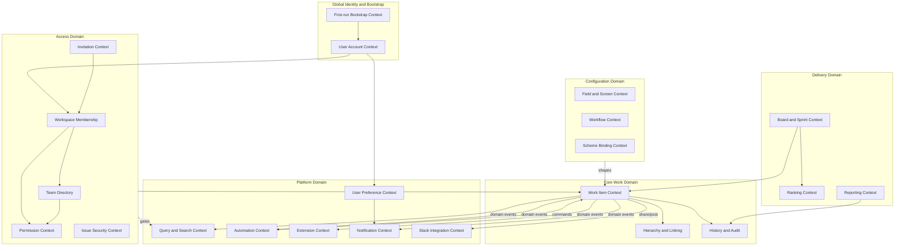

### 2.2 Ubiquitous language

| Term | Meaning | Do not confuse with |
|---|---|---|
| **Work Item** | Any tracked unit of work, of a configured Item Type | "Issue" — reserved for the defect Item Type |
| **User Account** | Global identity with one normalized, unique email that may join multiple workspaces | Workspace membership |
| **Site Super Admin** | Installation-level role created exactly once during bootstrap; may govern all workspaces | Workspace admin |
| **Workspace** | User-facing tenant; the security, billing, export, and data-residency boundary | Team or project |
| **Workspace Membership** | A user's role and lifecycle state inside one workspace | Global account |
| **Team** | Workspace-scoped group of active workspace members used for ownership and permissions | Project role |
| **Invitation** | Expiring, single-use offer for an email to join a workspace and optionally a team | Active membership |
| **Item Type** | Named template: hierarchy level + field configuration + workflow | Status |
| **Scheme** | Reusable configuration bundle bound to one or more projects | Template |
| **Screen** | Ordered set of fields shown in a given operation context | Form |
| **Transition** | Directed edge between statuses, with guards and effects | Status change |
| **Project Role** | Per-project indirection between principals and permissions | Group — global, directory-sourced |
| **WQL** | Work Query Language — the structured query surface | Full-text search |
| **Rank** | Lexicographic ordering token for backlog position | Priority |
| **Personal Preference** | Global per-user locale, time-zone, theme, accessibility, and notification choice | Workspace or project configuration |
| **Setting Scope** | The ownership and authorization boundary of a setting: personal, workspace, project, board, or site | A visual settings page section |

---

## 3. High-Level Design

### 3.1 System context — C4 Level 1

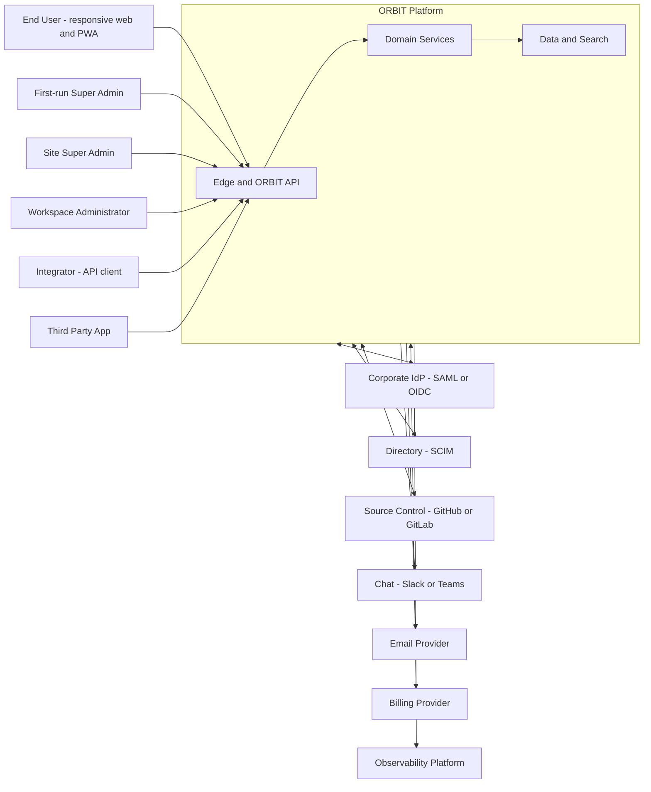

### 3.2 Container view — C4 Level 2

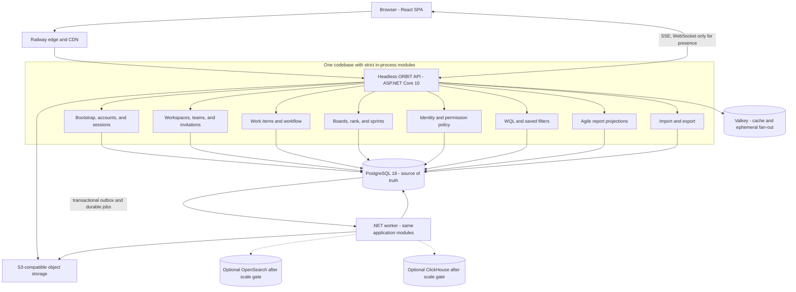

**Deployment rule:** API and worker are separate Railway services built from the same repository and image. They share code and schema but scale independently. Module-to-module calls are in-process and transactional; there is no internal HTTP between modules during the Agile Core phases.

### 3.3 Technology selection

The stack is selected for correctness, predictable operations, open-source licensing, efficient Railway containers, and a credible path from one deployable to high-scale services. It deliberately does not optimize for an existing team's current skills.

| Layer | Selected stack | Why this is the default | Revisit trigger |
|---|---|---|---|
| Backend | **.NET 10 LTS**, ASP.NET Core Minimal APIs, headless REST | High-throughput async runtime, mature security/observability, strong domain modelling, native OpenAPI, and LTS support | Keep presentation outside the API; do not introduce server-rendered UI |
| Application architecture | Clean Architecture, CQRS with MediatR, FluentValidation pipeline behaviours | Explicit use cases and dependency direction; cross-cutting validation, tenant transaction, idempotency, and telemetry | Commands and queries remain separate even while deployed as one modular monolith |
| Database access | EF Core 10 + Npgsql for aggregates, transactions, and migrations; Dapper/Npgsql for benchmark-proven WQL/report hot paths | Productive unit-of-work writes without hiding hand-tuned permission/query plans | Dapper is introduced per measured query, not as a parallel generic repository layer |
| Public API | REST/JSON described by OpenAPI 3.1; generated TypeScript SDK | Stable contracts, broad integrator support, cacheable reads, straightforward cost controls | Add GraphQL only after external demand and a query-cost/authorization design |
| Frontend | React 19, strict TypeScript, Vite, TanStack Query/Router/Virtual, React Aria, Tailwind CSS, Workbox through `vite-plugin-pwa` | Fully responsive installable PWA, accessible interaction primitives, virtualized boards, optimistic updates | Native mobile only after PWA telemetry proves a platform-specific gap |
| Primary store | **PostgreSQL 18**, RLS, `JSONB`, typed projections, native full-text search, `pg_trgm` | One authoritative transactional engine through GA; PostgreSQL 18 is supported through 2030 | Shard when a tenant or shard breaches the measured thresholds in §3.6 |
| Connection pooling | PgBouncer in transaction mode in hosted environments | Protects PostgreSQL from horizontally scaled API and worker connection storms | Use direct connections only in local development and migrations |
| Durable background work | PostgreSQL-backed job queue with transactional insertion; outbox for integration events | No lost job between commit and enqueue; no broker to operate during early phases | Introduce NATS JetStream when workers must be independently owned or PostgreSQL queue contention exceeds budget |
| Cache | **Valkey 9.1.x**, Redis protocol | Linux Foundation open-source implementation; efficient permission/config cache, rate limits, and ephemeral fan-out | Cache failure must degrade performance, never authorization correctness |
| Search | PostgreSQL first; **OpenSearch 3.x** as an optional derived projection | Avoids premature cluster cost while preserving an Apache-licensed scale path for text, facets, and attachment search | Enable when PostgreSQL cannot meet NFR-02 on production-shaped data |
| Analytics | PostgreSQL incremental projections first; **ClickHouse** as an optional derived fact store | Sprint reports remain transactionally reproducible early; ClickHouse provides a later columnar path | Enable when analytical workload consumes >20% of primary read capacity or retention exceeds PostgreSQL budget |
| Realtime | Server-Sent Events for board deltas; WebSocket only for bidirectional presence | SSE reconnect and HTTP semantics are simpler for server-to-client updates | Use NATS fan-out when more than one API replica must broadcast reliably |
| Object storage | S3-compatible API; Railway Bucket for reference hosting, MinIO for local integration tests | Provider portability and direct presigned upload/download | For regulated tiers require a provider with versioning, object lock, and verified server-side encryption |
| Identity | Built-in local email/password accounts for bootstrap and self-hosted access; OAuth 2.1/OIDC core; SAML and SCIM adapters; Keycloak profile for integration tests | Self-hosting has no external-IdP prerequisite while enterprise federation maps onto the same global user account | Replace the credential adapter with a managed provider only if account linking, export, and recovery semantics remain stable |
| Observability | OpenTelemetry SDK/Collector, Prometheus metrics, Grafana, Loki, Tempo | Vendor-neutral traces, metrics, and logs; portable from Podman to hosted backends | Export to a managed backend when operating the stack costs more than the service |
| Packaging | Multi-stage .NET 10 and Node builds, non-root ASP.NET runtime, static web image, SBOM, signed provenance | Reproducible, auditable API/worker/web images deployable by Podman and Railway | Maintain debug images separately; production images contain no SDK or package manager |

Current-version references as of 2026-08-11: [.NET support policy](https://dotnet.microsoft.com/en-us/platform/support/policy), [PostgreSQL support policy](https://www.postgresql.org/support/versioning/), [Valkey 9.1](https://valkey.io/blog/valkey-9-1-delivers-improvements-in-security-performance-and-more/), [Railway PostgreSQL](https://docs.railway.com/databases/postgresql), and [Railway S3-compatible buckets](https://docs.railway.com/storage-buckets).

#### 3.3.1 Options explicitly rejected for the initial architecture

| Option | Decision | Reason |
|---|---|---|
| Microservices from day one | Reject | Network boundaries, distributed transactions, and deployment coordination add risk before independent scaling is necessary |
| Kafka in P0/P1 | Defer | PostgreSQL jobs and outbox meet the initial throughput with fewer failure modes |
| GraphQL as a public must-have | Defer | Arbitrary query shape complicates permission enforcement, cost control, and API compatibility |
| Event sourcing as the primary write model | Reject | Mutable current state plus append-only domain facts provides auditability without making every read a fold |
| One OpenSearch index per tenant | Reject | 50k tenants would create untenable shard and cluster-state overhead |
| Railway volume as attachment storage | Reject | Attachments require an object-storage API, independent lifecycle, and direct presigned transfer |
| Long-lived feature branches and environment drift | Reject | Trunk-based delivery, short branches, immutable images, and declarative Railway configuration are the reference workflow |

#### 3.3.2 Evolution stages

| Stage | Runtime topology | Data plane | Exit trigger |
|---|---|---|---|
| Agile Core | API + worker | PostgreSQL, Valkey, S3-compatible bucket | NFR-01, 05, 13, and 14 met; real teams complete sprints |
| Growth | Multiple API/worker replicas | PgBouncer, PostgreSQL HA/PITR, Valkey, optional OpenSearch | 1k sustained writes/s, search benchmark breach, or dedicated worker ownership |
| Scale-out | Extract query/index, notifications, and import workers | NATS JetStream, OpenSearch, ClickHouse; tenant placement directory | A measured bottleneck cannot be removed inside the modular deployment |
| Regulated | Regional cells with no cross-region tenant data | Dedicated PostgreSQL clusters, regional object/search/cache/telemetry | Contractual residency, isolation, or recovery requirements |

### 3.4 Multi-tenancy model

The product term **workspace** maps one-to-one to the existing tenant boundary and physical `tenant_id`. Global user accounts and site roles live in a minimal control plane outside workspace RLS; all teams, memberships, invitations, projects, boards, items, and work content are workspace-scoped. A membership row is the only bridge from a global account into a workspace permission context.

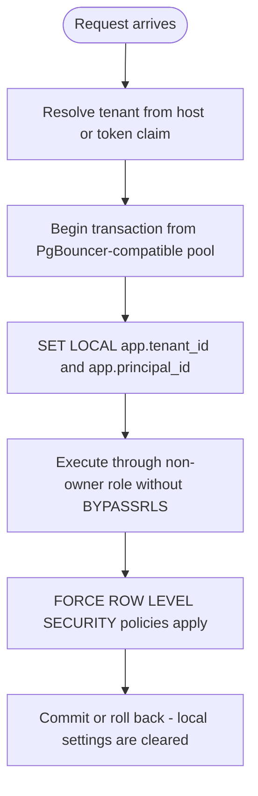

| Decision | Choice | Consequence |
|---|---|---|
| Isolation mechanism | Shared schema + `tenant_id` + forced PostgreSQL RLS | Defence in depth; application predicates remain required for plan quality |
| Database roles | Migrations use an owner role; runtime uses a non-owner role that cannot `BYPASSRLS` | Runtime defects cannot disable policies |
| Session safety | `SET LOCAL` only inside an explicit transaction | Pooled connections cannot retain another tenant's context |
| Referential integrity | Tenant-scoped composite primary/foreign keys | A row cannot reference an object in another tenant even when ids are malformed |
| Placement at Agile Core | One regional PostgreSQL cluster; no tenant router | Removes an unneeded distributed dependency |
| Placement at scale-out | Directory maps tenant to a regional cell and shard | Enables residency, noisy-neighbour relief, and dedicated enterprise placement |
| Migration at scale-out | Snapshot + logical change capture + write fence + verified cutover | Tenant movement is a tested workflow, not assumed zero-downtime magic |
| Testing | Automated tenant-fuzz suite runs every build | NFR-07 enforced continuously |

### 3.5 Architecture Decision Record index

| ADR | Title | Status | Irreversible? |
|---|---|---|---|
| ADR-001 | Custom field storage: hybrid `JSONB` + typed projection tables | Accepted | **Yes** |
| ADR-002 | Workflow engine as interpreted declarative graph, not generated code | Accepted | Partially |
| ADR-003 | Permission evaluation pushed into query predicates, never post-filtered | Accepted | **Yes** |
| ADR-004 | WQL: hand-written recursive-descent parser → AST → planner | Accepted | No |
| ADR-005 | LexoRank-style lexicographic ranking for backlog ordering | Accepted | Partially |
| ADR-006 | Row-level security for tenant isolation | Accepted | **Yes** |
| ADR-007 | WASM sandbox for third-party extension code | Proposed; post-GA | Partially |
| ADR-008 | Mutable current state plus append-only domain facts and audit records | Accepted | **Yes** |
| ADR-009 | Search index is a derived, rebuildable projection | Accepted | No |
| ADR-010 | Automation engine is single-tenant-fair with hard loop detection | Accepted | No |
| ADR-011 | Modular monolith plus independently scalable worker through GA | Accepted | No |
| ADR-012 | Boards are project-owned permission-aware saved-filter views; work items remain project records | Accepted | **Yes** |
| ADR-013 | Sprint membership and scope changes are temporal facts, not one mutable item field | Accepted | **Yes** |
| ADR-014 | Every post-commit command and event originates in a transactional outbox | Accepted | **Yes** |
| ADR-015 | Headless .NET 10 Clean Architecture/CQRS and PostgreSQL 18 are the reference application stack | Accepted | Partially |
| ADR-016 | OpenSearch and ClickHouse remain optional, derived, and rebuildable | Accepted | No |
| ADR-017 | OCI portability with Podman local development and Railway reference hosting | Accepted | No |
| ADR-018 | Global unique user identity with workspace-scoped membership and one-time bootstrap | Accepted | **Yes** |
| ADR-019 | Built-in credentials are an identity adapter; passwords use a memory-hard one-way hash | Accepted | **Yes** |
| ADR-020 | `Organization` is a self-service tenancy root above `Workspace`, provisioned by unauthenticated signup rather than only the one-time bootstrap | Accepted | Partially |
| ADR-021 | `MembershipTier` (Guest/Standard) is orthogonal to `TenantRole`, enforced redundantly at domain, database constraint, and query layers | Accepted | No |
| ADR-022 | Rate limiting moves from per-replica in-memory `RateLimiter` policies to a custom Valkey-backed `RateLimiter` (atomic Lua sliding window), config-flagged with an in-memory fallback rather than a hard dependency | Proposed; see §13.7.1 | No |
| ADR-023 | Distributed tracing uses the OpenTelemetry SDK with an OTLP Collector (`orbit-otel`, §13.3), and trace context is carried through the outbox as a stored column rather than relying on in-process `Activity` propagation | Proposed; see §13.7.2 | No |

### 3.6 Quantified scale-out triggers

Architecture evolution is authorized by measured thresholds, not forecasts alone.

| Concern | Stay in current topology while | Scale action |
|---|---|---|
| PostgreSQL write load | Primary CPU < 60% at peak, WAL and lock waits within budget | Optimize queries/indexes, then isolate workers, then shard by tenant cell |
| Job queue | Claim latency p95 < 500 ms and queue tables < 5% of database I/O | Partition queue tables; introduce NATS JetStream only when contention remains |
| Search | PostgreSQL WQL/text p95 meets NFR-02 and index growth is controlled | Enable shared OpenSearch indexes per regional cell with tenant routing |
| Reporting | Projection queries consume < 20% of replica/primary read capacity | Stream immutable facts into ClickHouse and compare rebuild results |
| Realtime | SSE fan-out fits one regional Valkey deployment and reconnect storm test passes | Introduce NATS regional subjects and stateless gateway replicas |
| Tenant size | Largest tenant < 2M items and maintenance operations meet SLO | Promote tenant to a dedicated database or shard before raising global complexity |
| Railway boundary | Volume, IOPS, region, or recovery constraints cannot meet an enterprise SLO | Move that data service to a managed provider while retaining the same open protocol |

### 3.7 Identity, bootstrap, and workspace hierarchy

#### ADR-018 and ADR-019 decision

| Option | Self-host bootstrap | Enterprise federation | Operational burden | Decision |
|---|---|---|---|---|
| External IdP only | Requires another product before first login | Strong | Low for ORBIT | Reject — violates self-hosted first-run requirement |
| Local accounts only | Strong | Weak; duplicates corporate identity | High | Reject |
| **Global ORBIT account with local credential and federated identity adapters** | **Strong** | **Strong** | Medium | **Accepted** |

The global account is keyed by immutable `user_id`; normalized email is globally unique and is a login and invitation locator, not a foreign key. Normalization trims whitespace, applies Unicode normalization, lowercases the address under ORBIT's documented case-insensitive policy, and canonicalizes the internationalized domain; it never applies provider-specific dot or plus-alias rules. Local credentials and external identities attach to that account. The default password adapter uses Argon2id with versioned parameters; a FIPS deployment may select PBKDF2 through the same adapter. Email changes require verification and a uniqueness transaction. Workspace authorization always starts from an active workspace membership; a site role alone does not silently create workspace membership.

Bootstrap invariants:

1. `GET /api/v1/bootstrap/status` reveals only whether initialization is required.
2. `POST /api/v1/bootstrap` is enabled only while no site super-admin assignment exists.
3. The command takes a PostgreSQL advisory lock, rechecks state, normalizes and reserves the email, hashes the password with the configured memory-hard algorithm, and atomically creates the user, site role, first workspace, and owner membership.
4. Concurrent losing attempts receive `409`; after initialization the endpoint behaves as unavailable and never creates a second super admin.
5. Additional site super admins require an authenticated super-admin action plus step-up authentication and an audit entry.

Containment and ownership are explicit:

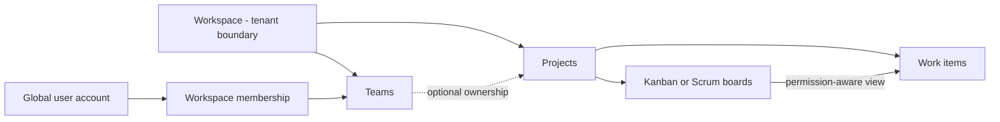

Every board has one owning project. During Agile Core its saved filter is constrained to that project; cross-project portfolio views are separate dashboard/query features rather than boards. A project may be associated with multiple teams, but team membership never replaces permission evaluation.

v1.24 (ADR-020, §13.5.4) adds a second, unauthenticated way to reach this same `Workspace → TenantMembership` shape: self-service `POST /api/v1/auth/register` creates an `Organization` above the workspace instead of requiring the one-time super-admin bootstrap. The two paths do not conflict — bootstrap still creates exactly one installation-level super admin; registration creates an organization-scoped owner with no site role — but a reader of the diagram above should read it as "workspace membership is reachable from either an admin-provisioned or a self-service root," not solely from bootstrap.

---

## 4. The Six Hard Subsystems

Everything above is table stakes. These six determine whether the product survives contact with a real customer.

### 4.1 Configurability engine — custom fields

**The problem:** every tenant defines its own fields, and those fields must be filterable, sortable, aggregatable, indexable, and reportable — without a schema migration per tenant.

| Option | Write cost | Query cost | Type safety | Verdict |
|---|---|---|---|---|
| Untyped EAV — one row per scalar value | Low | Poor: N joins for N filters | Weak | Reject |
| Wide table with `custom_01…custom_200` | Low | Good | None | Reject — hard ceiling, hostile to reason about |
| Pure `JSONB` column | Low | Adequate with GIN; poor for sorting and range | Weak | Insufficient alone |
| **Hybrid: `JSONB` payload + typed EAV projections for indexed fields** | Medium | Good when selectively indexed | Enforced at write | **Accepted — ADR-001** |

#### How the hybrid works

- All field values are written to `work_item.fields JSONB` — the single source of truth for reads of one item.
- Fields marked *indexed* in the field configuration are additionally projected into narrow typed tables: `wi_field_text`, `wi_field_number`, `wi_field_date`, `wi_field_option`, `wi_field_user`.
- Projection happens in the same transaction as the item write. A drift detector still verifies code defects, failed backfills, and historical migrations.
- Each typed row contains `tenant_id`, `work_item_id`, `field_id`, `value_ordinal`, and exactly one typed value. Multi-valued fields preserve order through `value_ordinal`.
- WQL filters and sorts compile to joins against projection tables. An unindexed field uses a cost-budgeted `JSONB` plan for small scopes or returns guidance to index the field; OpenSearch is not required for correctness.
- Marking a field indexed creates a versioned backfill job. Queries use the projection only after its state reaches `READY`; cancellation and retry are idempotent.
- Field definitions and option sets are versioned. History renders the label that applied when the change occurred, while current reads resolve the current label.
- Choice definitions contain a stable option id, field id, label, description, display order, color token, enabled flag, and configuration version. Work items persist option ids only. Disabling an option prevents new selection but never corrupts historical values.
- All system choice columns use defined enums or reference tables — board type, sprint state, estimation mode, WIP mode, actor kind, item type category, status category, operation state, and fact type. Unknown values are rejected at the API boundary and constrained in PostgreSQL.

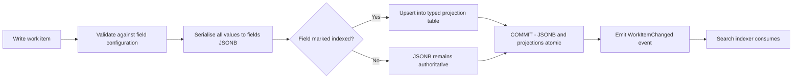

### 4.2 Workflow engine

A workflow is a directed graph of statuses; each transition carries **conditions** (may I see this transition), **validators** (may this specific attempt proceed), and **post-functions** (effects on success). This is the single most-requested extension point, and the single most common source of production incidents in trackers.

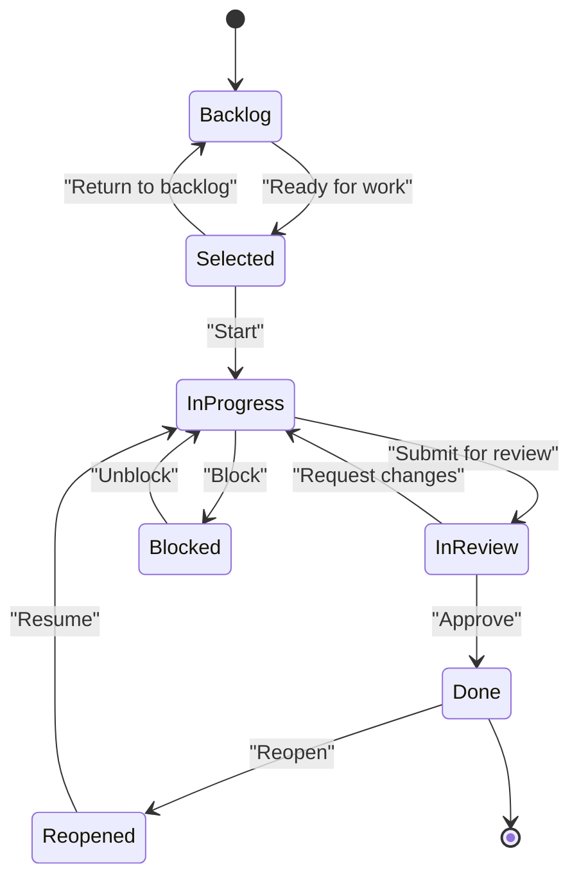

#### Execution guarantees

| # | Guarantee | Mechanism |
|---|---|---|
| 4.2.1 | Conditions never mutate state | Pure predicates; engine rejects a condition that requests a write handle |
| 4.2.2 | Validators run after conditions, before any mutation | Two-phase evaluation |
| 4.2.3 | Post-functions execute in a defined, admin-visible order | Ordered list; system post-functions pinned first |
| 4.2.4 | A failing post-function rolls back the transition | All in-process post-functions share the transaction |
| 4.2.5 | Third-party post-functions run **after** commit, asynchronously | Prevents an app stalling a user transition |
| 4.2.6 | Every evaluation is traceable | Per-transition trace stored for 7 days, visible to admins |
| 4.2.7 | Loop safety | Automation-originated transitions carry a depth counter; capped at 10 |

### 4.3 Permission model

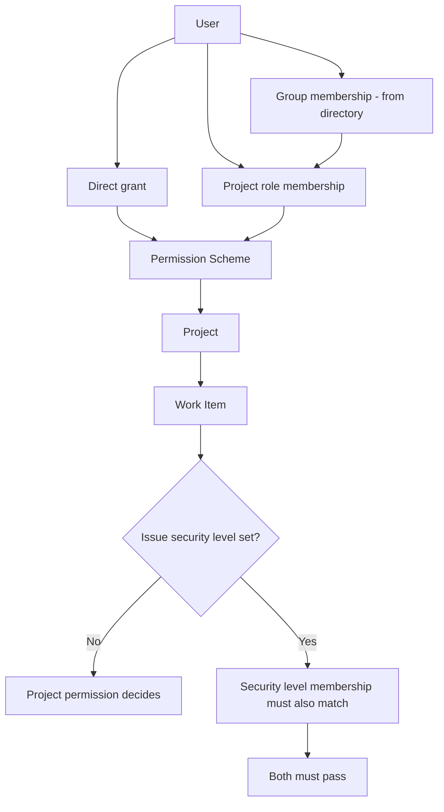

#### ADR-003 in practice — permission is a query predicate, not a filter

Naive implementations fetch results, then drop the ones the user cannot see. That breaks pagination, breaks counts, leaks existence through totals, and collapses under load. Instead:

1. Resolve directory groups, project roles, static grants, security-level grants, and the tenant's `authorization_epoch` into a compact **permission context**.
2. Compile static grants into project/security-level sets and dynamic grants into item predicates such as reporter, assignee, or a user-valued custom field. Dynamic rules must not be incorrectly collapsed into project ids.
3. Inject the complete expression at the planner level before filtering, sorting, aggregation, counting, or pagination.
4. Store only stable resource attributes — tenant, project, security level, reporter, assignee, and configured ACL references — in a search document. Apply the caller's current context at query time and reapply the SQL predicate during hydration.
5. Increment `authorization_epoch` on a revocation or scheme change. Cache entries carry the epoch and fail closed when stale; event-driven invalidation improves latency but is not the security boundary.

| Failure mode this prevents | How |
|---|---|
| Incorrect result counts | Predicate applied before `COUNT` |
| Page-size drift on filtering | No post-filtering |
| Existence leak via 403 vs 404 | Invisible items return `404`, never `403` |
| Slow queries on large tenants | Static sets use indexed arrays; dynamic predicates are explicit, benchmarked plan shapes |
| Stale revocation | Epoch mismatch forces context refresh before protected data is returned |
| Search-side leak | SQL hydration reapplies authorization; unauthorized totals and aggregations are never returned |

### 4.4 WQL — the query language

```text
project = ORBIT AND status IN ("In Progress", "In Review")
  AND assignee = currentUser()
  AND "Story Points" >= 3
  AND created >= startOfSprint()
  ORDER BY rank ASC
```

#### Pipeline

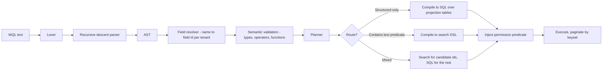

| Design rule | Reason |
|---|---|
| Parse to an AST, never string-concatenate SQL | Injection safety and query rewriting |
| Field names resolve per tenant to stable field ids | Renaming a field must not break saved filters |
| Functions are a fixed, versioned registry | `currentUser()`, `startOfSprint()`, `membersOf()` — no arbitrary evaluation |
| Keyset pagination, not `OFFSET` | Deep pagination on 20M rows must stay constant-time |
| Every query carries a cost budget | Reject or degrade queries exceeding the tenant's budget rather than tipping the cluster |

### 4.5 Extension platform

| # | Requirement | Mechanism |
|---|---|---|
| 4.5.1 | An app cannot read another tenant's data | App tokens are tenant-scoped and permission-scoped |
| 4.5.2 | An app cannot degrade the host | WASM sandbox: CPU-instruction cap, memory cap, wall-clock timeout, no ambient network |
| 4.5.3 | Apps extend UI without shipping arbitrary scripts into the host page | Declarative UI modules rendered by the host; iframes only for full-page modules |
| 4.5.4 | Apps react to changes | Event subscriptions with at-least-once webhook delivery and signed payloads |
| 4.5.5 | Breaking changes are survivable | Versioned manifests, deprecation windows, dual-running API versions |
| 4.5.6 | Apps are auditable | Every app-initiated write is attributed to the app in history |

### 4.6 Agile core — boards, rank, sprints, and reports

This subsystem is part of the product wedge and must be correct before advanced configurability or an extension platform.

#### 4.6.1 Board semantics

- A board belongs to exactly one project and is a permission-aware view over a saved WQL filter constrained to that project during Agile Core; it does not own work items.
- A board column maps one or more workflow statuses. Unmapped statuses are excluded. An optional Kanban backlog has its own status mapping.
- Board configuration is versioned. Reports retain the configuration version that determined column and completion semantics.
- Quick filters append validated AST predicates to the board's saved filter. They never concatenate WQL strings.
- The default completion rule is membership in the right-most column; ORBIT may offer an explicit done-column setting, but the chosen rule is versioned.
- WIP limits support minimum and maximum values. Enforcement mode is `WARN` by default and may be `BLOCK` only when the board administrator opts in.

#### 4.6.2 Ranking semantics

- The Agile Core uses one tenant-wide rank namespace so the same work item has stable relative order on every overlapping board, matching migration expectations.
- Rank rows contain a bucket and lexicographic token. `(tenant_id, rank_bucket, rank_token)` is unique.
- A rebalance is an idempotent background operation protected by an advisory lock per bucket. Readers accept old and new token generations during cutover.
- Moving an item within a column updates only rank. Moving it across columns invokes `MoveBoardCard`, which performs a workflow transition and rank update in one transaction.
- If a destination column maps multiple statuses, the server returns eligible transitions. The client prompts when a transition requires fields; it never chooses silently.

#### 4.6.3 Sprint semantics

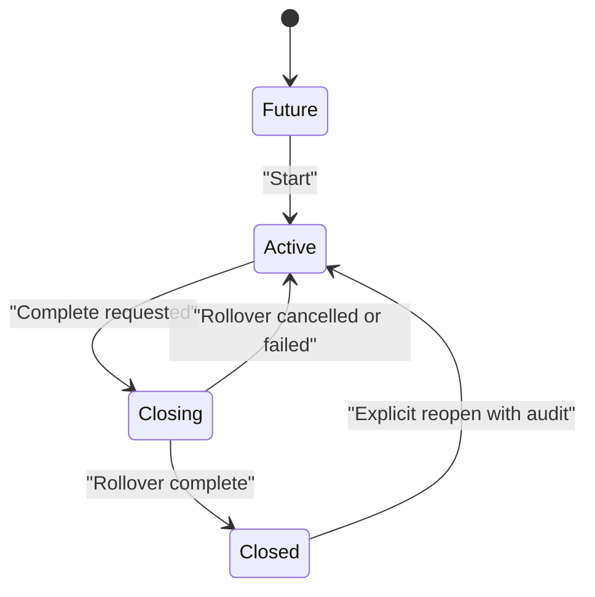

- A sprint has an origin board but its visible items are still governed by board filters and permissions.
- Sprint membership is temporal. `sprint_membership` records addition and removal rather than overwriting one `sprint_id` field.
- Parallel active sprints are disabled by default and enabled by a tenant policy.
- Completion is a durable workflow: persist a completion plan, enter `Closing`, roll over incomplete items idempotently, then finalize `Closed`.
- Sprint membership, estimates, status/column changes, completion, and reopening emit immutable scope facts with event time, recorded time, actor, source, and board-configuration version.

#### 4.6.4 Report invariants

| Report | Authoritative facts | Required invariant |
|---|---|---|
| Burndown/burnup | Sprint start, membership, estimate, completion, reopening | Rebuild shows scope changes at the time they occurred, not only final scope |
| Velocity | Sprint commitment and completed estimate at close | Closed sprint values never change when current work items change |
| Cumulative flow | Board configuration version and column-entry intervals | Status remapping does not rewrite historical column meaning |
| Control chart | Work-item entry/exit timestamps for configured start/done columns | Reopened work creates a new interval rather than deleting the old one |
| Cycle/lead time | Immutable status/column intervals and calendar policy | Tenant timezone and working-calendar version are explicit |

Online reports use PostgreSQL incremental projections. A replay job can rebuild the projection into shadow tables and compare checksums before cutover. ClickHouse, when introduced, consumes the same facts and must pass the same reproducibility suite.

---

## 5. Low-Level Design

### 5.1 Component responsibilities

| # | Component | Layer | Responsibility | Must not |
|---|---|---|---|---|
| 5.1.1 | `WorkItemEndpoints` | API | Minimal API binding, versioning, status codes | Contain domain rules or serve frontend assets |
| 5.1.2 | `CreateWorkItemCommandHandler` | Application | Orchestrate create use case through CQRS | Know HTTP or EF Core |
| 5.1.3 | `WorkItem` aggregate | Domain | Field invariants, status, history entries | Perform I/O |
| 5.1.4 | `IFieldConfigurationRepository` | Application port | Supply effective versioned field config for project + item type | Cache policy decisions |
| 5.1.5 | `FieldValueValidator` | Domain | Type, required, and option-set validation | Format for display |
| 5.1.6 | `WorkflowEngine` | Domain service | Evaluate conditions, validators, ordered post-functions | Call external systems inline |
| 5.1.7 | `PermissionCompiler` | Application service | Produce static and dynamic predicates for a principal | Post-filter result sets |
| 5.1.8 | `WqlParser` / `WqlPlanner` | Application | Text → AST → executable plan | Execute without a permission predicate |
| 5.1.9 | `ProjectionWriter` | Infrastructure | Maintain typed field projection tables | Diverge from `JSONB` |
| 5.1.10 | `OutboxRelay` | Infrastructure | Deliver committed domain events at least once | Claim exactly-once transport |
| 5.1.11 | `SearchIndexer` | Infrastructure | Consume events, upsert index documents | Be a source of truth |
| 5.1.12 | `RankService` | Domain service | Allocate and rebalance rank tokens | Block on rebalance |
| 5.1.13 | `MoveBoardCard` | Application | Atomically transition status and rank across columns | Treat a cross-column move as rank-only |
| 5.1.14 | `SprintCompletion` | Durable workflow | Persist plan, roll over batches, and finalize sprint | Close before durable rollover succeeds |
| 5.1.15 | `AgileFactProjector` | Infrastructure | Build reproducible online report projections | Read mutable current state as historical truth |
| 5.1.16 | `Orbit.Worker` | Infrastructure host | Claim idempotent PostgreSQL jobs with bounded retries | Perform unbounded work in an API request |
| 5.1.17 | `AutomationEvaluator` | Post-GA application | Match rules, enforce depth and rate limits | Execute unbounded loops |
| 5.1.18 | `ExtensionHost` | Post-GA infrastructure | Load, sandbox, and meter app invocations | Trust app-supplied identity |

### 5.2 Core data model

```mermaid
erDiagram
    USER_ACCOUNT ||--o| LOCAL_CREDENTIAL : "authenticates with"
    USER_ACCOUNT ||--o{ EXTERNAL_IDENTITY : "links"
    USER_ACCOUNT ||--o{ SITE_ROLE_ASSIGNMENT : "holds"
    USER_ACCOUNT ||--o{ WORKSPACE_MEMBERSHIP : "joins"
    WORKSPACE ||--o{ WORKSPACE_MEMBERSHIP : "contains"
    WORKSPACE ||--o{ TEAM : "contains"
    WORKSPACE_MEMBERSHIP ||--o{ TEAM_MEMBERSHIP : "joins teams"
    TEAM ||--o{ TEAM_MEMBERSHIP : "has"
    WORKSPACE ||--o{ INVITATION : "invites"
    WORKSPACE ||--o{ PROJECT : "owns"
    TEAM ||--o{ PROJECT_TEAM : "supports"
    PROJECT ||--o{ PROJECT_TEAM : "owned by"
    PROJECT ||--o{ WORK_ITEM : "contains"
    PROJECT ||--o{ BOARD : "owns"
    PERMISSION_SCHEME ||--o{ PROJECT : "bound to"
    WORKFLOW_SCHEME ||--o{ PROJECT : "bound to"
    FIELD_CONFIG_SCHEME ||--o{ PROJECT : "bound to"
    ITEM_TYPE ||--o{ WORK_ITEM : "types"
    WORK_ITEM ||--o{ WORK_ITEM : "parent of"
    WORK_ITEM ||--o{ ITEM_HISTORY : "records"
    WORK_ITEM ||--o{ COMMENT : "has"
    WORK_ITEM ||--o{ ATTACHMENT : "has"
    WORK_ITEM ||--o{ ITEM_LINK : "links"
    WORK_ITEM ||--o{ WI_FIELD_VALUE : "projects"
    FIELD_DEFINITION ||--o{ FIELD_OPTION : "defines"
    FIELD_OPTION ||--o{ WI_FIELD_VALUE : "selected by"
    WORK_ITEM ||--|| WORK_ITEM_RANK : "orders"
    WORKFLOW ||--o{ STATUS : "declares"
    WORKFLOW ||--o{ TRANSITION : "declares"
    PERMISSION_SCHEME ||--o{ PERMISSION_GRANT : "contains"
    PROJECT_ROLE ||--o{ ROLE_MEMBERSHIP : "has"
    WORKSPACE ||--o{ SAVED_FILTER : "owns"
    SAVED_FILTER ||--o{ BOARD : "defines"
    BOARD ||--o{ BOARD_CONFIG_VERSION : "versions"
    BOARD ||--o{ BOARD_COLUMN : "contains"
    BOARD_COLUMN ||--o{ BOARD_COLUMN_STATUS : "maps"
    STATUS ||--o{ BOARD_COLUMN_STATUS : "appears in"
    BOARD ||--o{ SPRINT : "originates"
    SPRINT ||--o{ SPRINT_MEMBERSHIP : "tracks"
    WORK_ITEM ||--o{ SPRINT_MEMBERSHIP : "participates"
    SPRINT ||--o{ SPRINT_SCOPE_FACT : "records"
    SPRINT ||--o{ SPRINT_COMPLETION_OPERATION : "completes through"
    WORK_ITEM ||--o{ SPRINT_SCOPE_FACT : "affects"
    WORKSPACE ||--o{ OUTBOX_EVENT : "publishes"

    USER_ACCOUNT {
        uuid id PK
        string normalized_email UK
        string display_name
        string status
        timestamptz email_verified_at
        timestamptz created_at
    }
    LOCAL_CREDENTIAL {
        uuid user_id PK,FK
        string password_hash
        string hash_algorithm
        int hash_parameters_version
        timestamptz changed_at
    }
    EXTERNAL_IDENTITY {
        uuid id PK
        uuid user_id FK
        string issuer
        string subject
    }
    SITE_ROLE_ASSIGNMENT {
        uuid user_id FK
        string role
        timestamptz granted_at
    }
    WORKSPACE {
        uuid id PK
        string slug
        string name
        string placement_key
        string residency_region
        string tier
        bigint authorization_epoch
    }
    WORKSPACE_MEMBERSHIP {
        uuid id PK
        uuid tenant_id FK
        uuid user_id FK
        string role
        string status
        timestamptz joined_at
    }
    TEAM {
        uuid id PK
        uuid tenant_id FK
        string name
        string slug
    }
    TEAM_MEMBERSHIP {
        uuid tenant_id FK
        uuid team_id FK
        uuid workspace_membership_id FK
        string role
    }
    INVITATION {
        uuid id PK
        uuid tenant_id FK
        string normalized_email
        string workspace_role
        uuid team_id FK
        string token_hash
        timestamptz expires_at
        timestamptz accepted_at
    }
    PROJECT_TEAM {
        uuid tenant_id FK
        uuid project_id FK
        uuid team_id FK
    }
    PROJECT {
        uuid id PK
        uuid tenant_id FK
        string key
        string name
        uuid lead_user_id
    }
    WORK_ITEM {
        uuid id PK
        uuid tenant_id FK
        uuid project_id FK
        bigint sequence_no
        uuid item_type_id FK
        uuid status_id FK
        uuid parent_id FK
        uuid security_level_id
        jsonb fields
        int version
        timestamptz created_at
        timestamptz updated_at
    }
    WI_FIELD_VALUE {
        uuid tenant_id FK
        uuid work_item_id FK
        uuid field_id FK
        int value_ordinal
        string typed_value
        int projection_version
    }
    FIELD_DEFINITION {
        uuid id PK
        uuid tenant_id FK
        string field_type
        string name
        int configuration_version
    }
    FIELD_OPTION {
        uuid id PK
        uuid tenant_id FK
        uuid field_id FK
        string label
        string description
        int display_order
        string color_token
        boolean enabled
        int configuration_version
    }
    WORK_ITEM_RANK {
        uuid tenant_id FK
        uuid work_item_id FK
        string bucket
        string rank_token
        bigint generation
    }
    ITEM_HISTORY {
        uuid id PK
        uuid tenant_id FK
        uuid work_item_id FK
        uuid actor_id
        string actor_kind
        string change_type
        jsonb before
        jsonb after
        timestamptz occurred_at
        timestamptz recorded_at
    }
    TRANSITION {
        uuid id PK
        uuid workflow_id FK
        uuid from_status_id FK
        uuid to_status_id FK
        jsonb conditions
        jsonb validators
        jsonb post_functions
    }
    PERMISSION_GRANT {
        uuid id PK
        uuid scheme_id FK
        string permission_key
        string holder_type
        uuid holder_id
    }
    SAVED_FILTER {
        uuid id PK
        uuid tenant_id FK
        jsonb canonical_ast
        int language_version
        string share_policy
    }
    BOARD {
        uuid id PK
        uuid tenant_id FK
        uuid project_id FK
        uuid saved_filter_id FK
        string board_type
        string estimation_mode
        boolean parallel_sprints
        int config_version
    }
    BOARD_CONFIG_VERSION {
        uuid tenant_id FK
        uuid board_id FK
        int version
        jsonb configuration_snapshot
        timestamptz published_at
    }
    BOARD_COLUMN {
        uuid id PK
        uuid tenant_id FK
        uuid board_id FK
        int position
        int wip_min
        int wip_max
        string wip_mode
    }
    BOARD_COLUMN_STATUS {
        uuid tenant_id FK
        uuid board_id FK
        uuid board_column_id FK
        uuid status_id FK
    }
    SPRINT {
        uuid id PK
        uuid tenant_id FK
        uuid origin_board_id FK
        string state
        string name
        string goal
        timestamptz planned_start_at
        timestamptz planned_end_at
        timestamptz started_at
        timestamptz completed_at
        int version
    }
    SPRINT_MEMBERSHIP {
        uuid id PK
        uuid tenant_id FK
        uuid sprint_id FK
        uuid work_item_id FK
        timestamptz added_at
        timestamptz removed_at
        uuid actor_id
    }
    SPRINT_SCOPE_FACT {
        uuid id PK
        uuid tenant_id FK
        uuid sprint_id FK
        uuid work_item_id FK
        string fact_type
        numeric estimate_delta
        int board_config_version
        timestamptz occurred_at
        timestamptz recorded_at
    }
    SPRINT_COMPLETION_OPERATION {
        uuid id PK
        uuid tenant_id FK
        uuid sprint_id FK
        string state
        jsonb completion_plan
        int processed_count
        int total_count
        timestamptz updated_at
    }
    OUTBOX_EVENT {
        uuid event_id PK
        uuid tenant_id FK
        string aggregate_type
        uuid aggregate_id
        int aggregate_version
        string event_type
        int schema_version
        jsonb payload
        timestamptz occurred_at
        timestamptz published_at
        timestamptz next_attempt_at
        int attempt_count
    }
```

`WORKSPACE` is the user-facing name; tenant-owned physical tables continue to use `tenant_id`. `USER_ACCOUNT`, `LOCAL_CREDENTIAL`, `EXTERNAL_IDENTITY`, and `SITE_ROLE_ASSIGNMENT` are global control-plane tables and contain no workspace work content. `WI_FIELD_VALUE` is conceptual. Physical tables are `wi_field_text`, `wi_field_number`, `wi_field_date`, `wi_field_option`, and `wi_field_user`, each with tenant-aware composite foreign keys. All tenant-owned tables use a composite key or unique constraint beginning with `tenant_id`; UUID equality alone is never trusted as a tenant boundary.

The software-workspace seed owns stable item-type ids for `Initiative`, `Epic`, `Task`, `Story`, `Bug`, `Spike`, `Test`, `Feature`, and `Request`. Labels may be renamed and additional types may be configured, but persisted work items reference the stable item-type id. Sub-task behavior is a hierarchy capability that an admin may enable on any suitable item type; it is retained as a disabled historical type in the executable baseline.

#### Key indexes

| Table | Index | Serves |
|---|---|---|
| `user_account` | unique `(normalized_email)` | Global email uniqueness and account linking |
| `external_identity` | unique `(issuer, subject)` | Prevent one federated identity linking to multiple users |
| `workspace_membership` | unique `(tenant_id, user_id)` plus `(tenant_id, status, role)` | One account membership and admin/member queries |
| `team` / `team_membership` | unique `(tenant_id, slug)` and `(tenant_id, team_id, workspace_membership_id)` | Team directory and duplicate-safe assignment |
| `invitation` | `(tenant_id, normalized_email, accepted_at)` plus unique `(token_hash)` | Pending invite lookup and replay prevention |
| `board` | `(tenant_id, project_id, board_type)` | Project board navigation |
| `work_item` | `(tenant_id, project_id, status_id)` | Board and project queries |
| `work_item` | GIN on `fields` | Ad-hoc `JSONB` containment |
| `work_item` | `(tenant_id, updated_at DESC, id)` | Keyset pagination and indexer catch-up |
| `work_item_rank` | unique `(tenant_id, bucket, rank_token)` plus `(tenant_id, work_item_id)` | Stable global ordering and contention-safe inserts |
| Typed field tables | `(tenant_id, field_id, value, work_item_id)` and sort-specific variants | WQL filter and keyset sort |
| `item_history` | `(tenant_id, work_item_id, occurred_at DESC, id)` | History pane and replay |
| `sprint_membership` | `(tenant_id, sprint_id, removed_at, work_item_id)` plus partial unique current membership | Current and historical sprint scope |
| `sprint_scope_fact` | `(tenant_id, sprint_id, occurred_at, id)` | Deterministic report rebuild |
| `board_config_version` | unique `(tenant_id, board_id, version)` | Historical report interpretation |
| `board_column_status` | unique `(tenant_id, board_id, status_id)` | One status maps to at most one column on a board |
| `outbox_event` | partial `(occurred_at, event_id) WHERE published_at IS NULL` | Ordered relay without scanning published rows |

### 5.3 Public API surface

| # | Method | Path | Notes |
|---|---|---|---|
| 5.3.1 | POST | `/api/v1/work-items` | `Idempotency-Key` required |
| 5.3.2 | GET | `/api/v1/work-items/{key}` | ETag; `If-None-Match` supported |
| 5.3.3 | PATCH | `/api/v1/work-items/{key}` | Optimistic concurrency via `If-Match` version |
| 5.3.4 | POST | `/api/v1/work-items/{key}/transitions` | Body: `transitionId` + required screen fields |
| 5.3.5 | GET | `/api/v1/work-items/{key}/transitions` | Only transitions passing conditions |
| 5.3.6 | POST | `/api/v1/search` | WQL body; keyset cursor |
| 5.3.7 | POST | `/api/v1/bulk/operations` | Async; returns operation id |
| 5.3.8 | GET | `/api/v1/boards/{id}/backlog` | Rank-ordered, windowed |
| 5.3.9 | GET | `/api/v1/boards/{id}/cards` | Filtered board page with column and rank cursors |
| 5.3.10 | POST | `/api/v1/boards/{id}/moves` | Same-column rank or atomic cross-column transition; idempotent |
| 5.3.11 | POST | `/api/v1/sprints/{id}/start` | Version checked; validates active/parallel policy |
| 5.3.12 | POST | `/api/v1/sprints/{id}/complete` | Creates durable completion operation and enters `Closing` |
| 5.3.13 | GET | `/api/v1/operations/{id}` | Progress, failed batches, retry eligibility |
| 5.3.14 | GET | `/api/v1/events` | Authenticated SSE stream with resumable event cursor |
| 5.3.15 | POST | `/api/v1/webhooks` | Post-GA app-scoped subscriptions |
| 5.3.16 | GET | `/api/v1/bootstrap/status` | Public; returns only `initializationRequired` |
| 5.3.17 | POST | `/api/v1/bootstrap` | Public only before initialization; creates first account, super admin, and workspace atomically |
| 5.3.18 | POST | `/api/v1/auth/login` | Local email/password login with enumeration-safe errors and rate limits |
| 5.3.19 | POST | `/api/v1/auth/refresh` | Rotating refresh session; replay revokes the session family |
| 5.3.20 | POST | `/api/v1/auth/logout` | Revokes the current refresh session |
| 5.3.21 | POST | `/api/v1/workspaces/{id}/admins` | Site super admin appoints a workspace admin; step-up required |
| 5.3.22 | POST | `/api/v1/workspaces/{id}/teams` | Workspace admin creates a team |
| 5.3.23 | PUT | `/api/v1/teams/{id}/members/{membershipId}` | Assigns team admin/member role idempotently |
| 5.3.24 | POST | `/api/v1/workspaces/{id}/invitations` | Invites an email to the workspace and optional team |
| 5.3.25 | POST | `/api/v1/invitations/accept` | Consumes the single-use token and creates or links membership |
| 5.3.26 | POST | `/api/v1/projects/{id}/boards` | Creates a project-owned Kanban or Scrum board |
| 5.3.27 | GET | `/api/v1/projects/{id}/boards` | Lists boards visible in the project |
| 5.3.28 | GET | `/api/v1/workspaces/{id}/item-types` | Returns stable configured types including the six software defaults |
| 5.3.29 | GET | `/api/v1/me` | Account identity, memberships, effective locale/time zone, capabilities, and preference version; no credential material |
| 5.3.30 | PATCH | `/api/v1/me/profile` | Updates display name, avatar reference, locale, time zone, theme, and accessibility preferences with `If-Match` |
| 5.3.31 | POST | `/api/v1/me/email-change` | Step-up authenticated; sends verification and commits global uniqueness only after confirmation |
| 5.3.32 | POST | `/api/v1/me/password-change` | Verifies the current credential, rehashes if required, revokes other refresh-session families, and audits the change |
| 5.3.33 | GET/DELETE | `/api/v1/me/sessions/{sessionId?}` | Lists active sessions without tokens and revokes one or all other sessions |
| 5.3.34 | GET/PATCH | `/api/v1/me/notification-preferences` | Versioned event/channel/digest/quiet-hours preferences |
| 5.3.35 | GET/PATCH | `/api/v1/workspaces/{id}/settings` | Workspace-admin settings; versioned, audited, and authorization-cache aware |
| 5.3.36 | GET/PATCH | `/api/v1/projects/{id}/settings` | Project-admin defaults, permissions, item types, integrations, and feature flags with impact preview |
| 5.3.37 | GET/PATCH | `/api/v1/boards/{id}/settings` | Board type, filter, columns, estimation, WIP, sprint, and completion semantics with config versioning |
| 5.3.38 | GET | `/api/v1/settings/navigation` | Returns only settings destinations and capabilities visible to the current principal |
| 5.3.39 | POST | `/api/v1/workspaces` | Site super administrator creates a workspace and becomes its owner atomically |
| 5.3.40 | GET | `/api/v1/me/site-capabilities` | Returns installation-level capabilities for the authenticated global account |

#### Conventions

- Errors use RFC 7807 with a stable `type` URI and a `correlationId`.
- Create and command-style authenticated `POST` requests require `Idempotency-Key`, scoped by tenant, principal, route, and request hash. A reused key with a different request is rejected. Bootstrap and login use dedicated replay/concurrency controls because no authenticated tenant principal exists yet.
- Concurrency: `version` on the aggregate; an `If-Match` mismatch returns `412 Precondition Failed`. A business-state conflict that is not an HTTP precondition returns `409`.
- Pagination is keyset-only on collection endpoints; `OFFSET` is not offered.
- Rate limits are per tenant *and* per app, surfaced in `X-RateLimit-*` headers.
- Public GraphQL is not part of the Agile Core. The SPA uses the same documented REST contracts as external clients.

---

## 6. Sequence Diagrams

Every diagram uses Mermaid `autonumber`. The table beneath each diagram explains numbered step *n*; keep the two in sync when editing.

### 6.1 Create work item with configurable fields

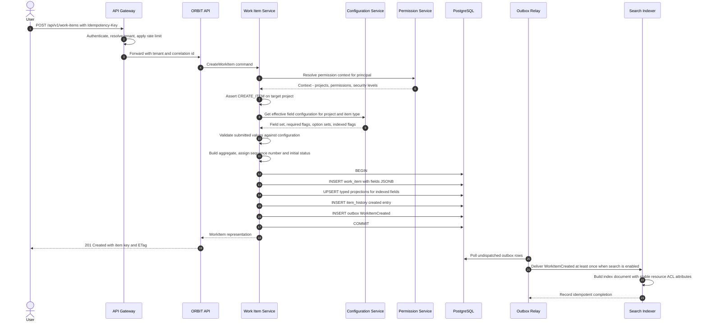

| # | Step | Failure mode | Handling |
|---|---|---|---|
| 1–3 | Ingress, tenant resolution | Unknown tenant or bad token | `401` at the gateway; nothing touched |
| 5–7 | Permission resolution | Cache miss or epoch mismatch | Falls through to database; stale authorization contexts fail closed |
| 8 | Authorisation | Not permitted | `404`, never `403` — no existence leak |
| 9–11 | Configuration and validation | Required field missing | `400` with per-field violations from RFC 7807 |
| 13–18 | Atomic write | Any failure | Full rollback; drift detector still verifies defects and historical migrations |
| 17 | Outbox insert | — | Guarantees the event matches committed state |
| 19–20 | Response | — | User is unblocked; indexing is asynchronous |
| 21–25 | Indexing | Indexer lag | Item is readable by key immediately; searchable within ASM-03 budget of 2 s |

### 6.2 Workflow transition with conditions, validators, and post-functions

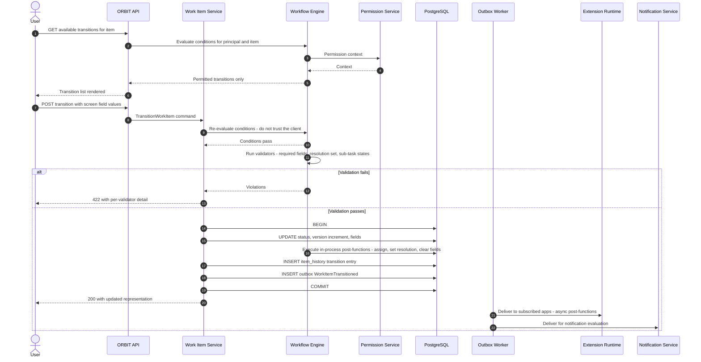

| # | Step | Design rule |
|---|---|---|
| 1–6 | Transition discovery | The UI shows only what conditions permit; this is UX, not security |
| 9–10 | Server-side re-evaluation | The client list is advisory; the server is authoritative — never skip this |
| 11 | Validators | Run after conditions, before any mutation (§4.2.2) |
| 12–14 | Failure path | `422` with structured violations so the client can highlight fields |
| 16–21 | Atomic transition | In-process post-functions share the transaction — a failure rolls the whole transition back (§4.2.4) |
| 23–25 | Async extension effects | Third-party post-functions run after commit so an app outage cannot block a user (§4.2.5) |

### 6.3 WQL search execution

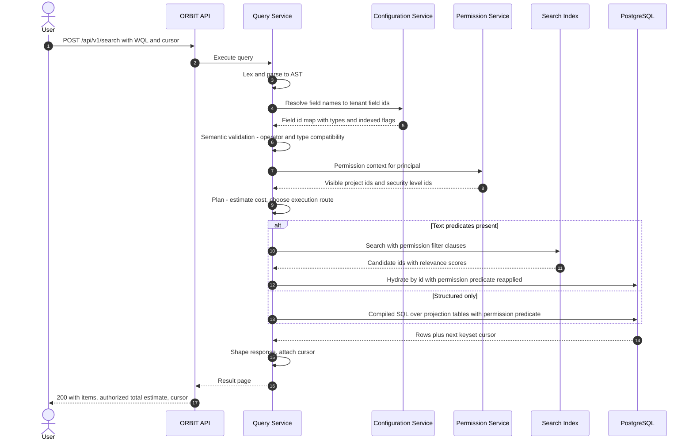

| # | Step | Note |
|---|---|---|
| 3 | Parse | Never build SQL from raw text — AST only (§4.4) |
| 4–5 | Field resolution | Saved filters store field *ids*, so renames do not break them |
| 7–8 | Permission context | Cache entry carries the tenant authorization epoch; stale epochs refresh before execution |
| 9 | Planning | Cost budget enforced here; over-budget queries are rejected with guidance, not silently truncated |
| 10–13 | Hybrid execution | Index narrows, relational store hydrates — the index is never the source of truth |
| 14–15 | Reapplied predicate | Belt and braces: index filters are an optimisation, the SQL predicate is the control |
| 16–18 | Pagination | Keyset cursor keeps deep pages constant-time |

### 6.4 Permission change propagation

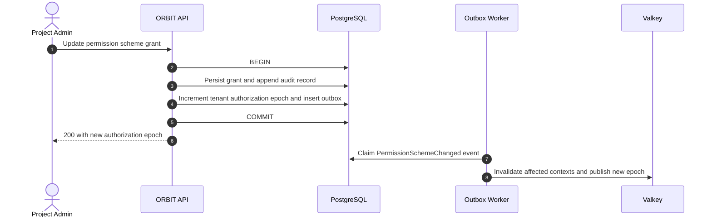

| # | Step | Note |
|---|---|---|
| 2–5 | Atomic security change | Grant, audit, epoch, and outbox commit together |
| 6 | Epoch returned | Every protected request rejects a cached context with an older epoch |
| 8 | Targeted invalidation | Improves latency but is not required for correctness |
| — | Search behavior | Stable resource ACL attributes are indexed; a scheme change does not require project-wide document reindexing |

### 6.5 Board drag-and-drop with ranking and realtime fan-out

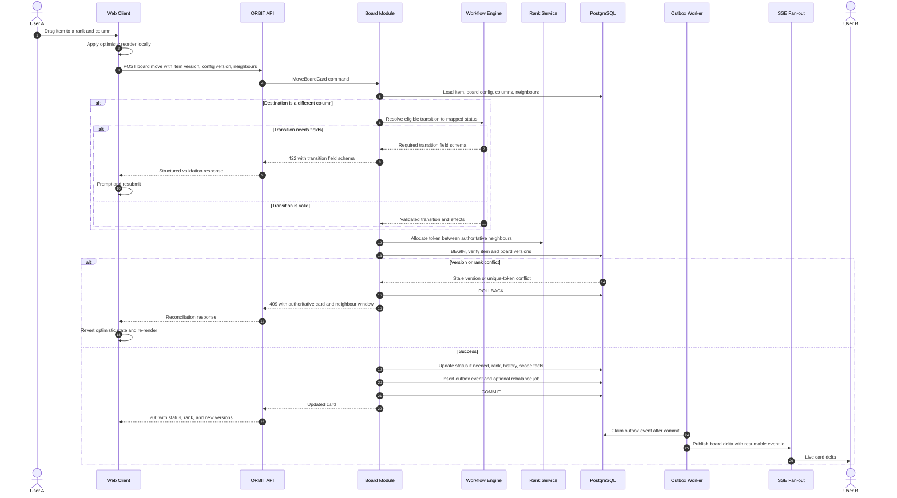

| # | Step | Note |
|---|---|---|
| 2 | Optimistic UI | Drag must feel instant; correctness is reconciled on response |
| 5–11 | Cross-column move | A board drag is a real workflow transition; conditions, validators, and required fields are not bypassed |
| 12–13 | Allocation and preconditions | Token is computed against authoritative neighbours; item and board versions are checked in the transaction |
| 14–18 | Conflict branch | A stale item/config version or rank collision returns the authoritative reconciliation window |
| 19–23 | Success branch | Status, rank, history, sprint facts, outbox, and optional rebalance job commit together |
| 24–26 | Fan-out | Only a committed outbox event reaches subscribers; clients resume from the last event id after reconnect |

### 6.6 Automation rule execution with loop protection

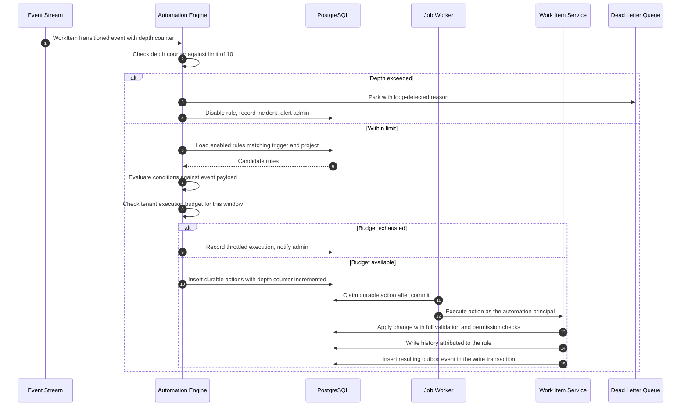

| # | Step | Note |
|---|---|---|
| 2–5 | Loop detection | Depth travels *in the event*, so cross-rule cycles are caught, not just self-triggers |
| 5 | Auto-disable | A looping rule is disabled rather than throttled forever — the admin must see it |
| 9 | Tenant budget | Per-tenant execution quota prevents one tenant starving the engine |
| 13–15 | Same code path | Automation writes go through the ordinary command handler — no privileged bypass of validation |
| 16 | Attribution | History records the rule, not a generic system user (§4.5.6) |

### 6.7 Sprint completion and rollover

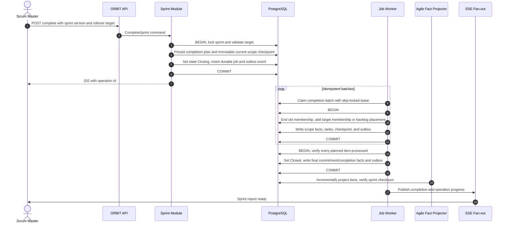

| # | Step | Note |
|---|---|---|
| 3–7 | Durable start | State, completion plan, job, and event commit atomically; there is no commit-to-queue loss window |
| 8–12 | Batching | Membership changes and checkpoints are idempotent; retries cannot duplicate scope facts |
| 13–15 | Finalization | A sprint becomes `Closed` only after every planned rollover action is durable |
| 16–18 | Reporting | PostgreSQL projects immutable facts continuously; ClickHouse is an optional later consumer, not required for correctness |
| — | Failure handling | The sprint remains `Closing` with visible failed batches and retry controls; cancellation is allowed only before the first batch commits |

### 6.8 Migration import from an incumbent tracker

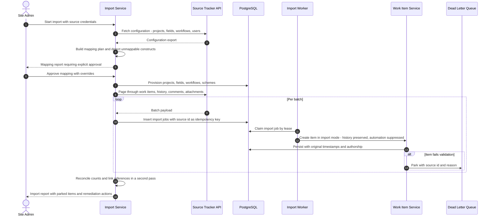

| # | Step | Note |
|---|---|---|
| 4–6 | Explicit mapping approval | Silent lossy mapping is the number one reason migrations are abandoned |
| 11 | Source id as idempotency key | A resumed or restarted import cannot duplicate |
| 12 | Import mode | Automation and notifications suppressed, or the target tenant is flooded |
| 13 | Original timestamps and authorship | Otherwise every item appears created today by the admin — history is destroyed |
| 15 | Second pass for links | Cross-item links cannot resolve until all items exist |
| 17 | Parked items surfaced | Partial success with a remediation list beats an all-or-nothing failure |

### 6.9 Extension invocation

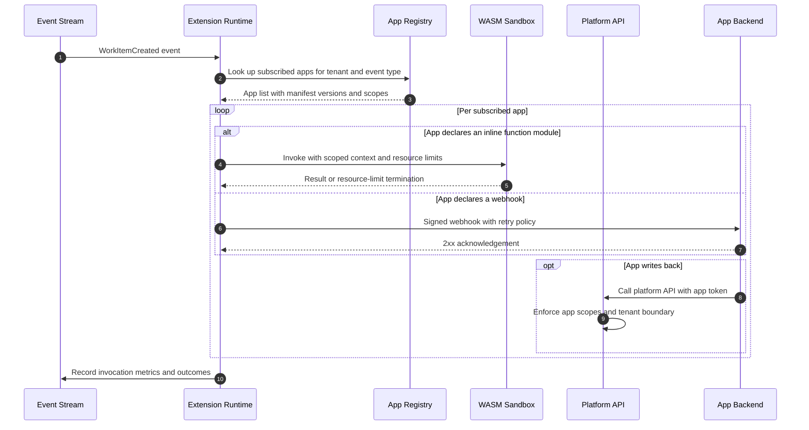

| # | Step | Note |
|---|---|---|
| 2–3 | Registry lookup | Cached per tenant; manifest version pinned per install |
| 5–6 | Sandbox | CPU, memory, and wall-clock caps enforced by the runtime, not by app goodwill (§4.5.2) |
| 8 | Webhook signing | HMAC with timestamp and a 5-minute replay window |
| 10–11 | Write-back | App tokens carry only the scopes granted at install; never the installing user's rights |
| 13 | Metering | Feeds fair-use limits and per-app health scores shown in the marketplace |

### 6.10 First-run bootstrap

```mermaid
sequenceDiagram
    autonumber
    actor A as First Super Admin
    participant SPA as React PWA
    participant API as ORBIT API
    participant ID as Identity Module
    participant PG as PostgreSQL

    SPA->>API: GET bootstrap status
    API->>PG: Check for site super-admin assignment
    PG-->>API: Installation is uninitialized
    API-->>SPA: initializationRequired true
    A->>SPA: Submit name, email, password, workspace name
    SPA->>API: POST bootstrap
    API->>API: Apply bootstrap rate limit
    API->>PG: Acquire advisory lock and recheck state
    API->>ID: Normalize email and hash password
    ID-->>API: Account and credential material
    API->>PG: Insert account, credential, site role, workspace, owner membership, audit
    API->>PG: Commit and release lock
    API-->>SPA: Authenticated session and first workspace
```

| # | Step | Guarantee |
|---|---|---|
| 1–4 | Discovery | The public response exposes no account or email information |
| 6–8 | Concurrency boundary | Advisory lock plus in-transaction recheck permits exactly one winner |
| 9–10 | Credential handling | Password is normalized only for policy checks, hashed once, and never logged or stored plaintext |
| 11–12 | Atomic bootstrap | Account, site authority, workspace ownership, and audit either all exist or none exist |
| 13 | Session | The PWA enters workspace onboarding without asking the super admin to authenticate again |

### 6.11 Invite and activate a team member

```mermaid
sequenceDiagram
    autonumber
    actor WA as Workspace Admin
    actor M as Invited Member
    participant API as ORBIT API
    participant PG as PostgreSQL
    participant WORKER as Notification Worker
    participant MAIL as Email Provider

    WA->>API: Invite email with workspace role and optional team
    API->>PG: Verify admin permission and normalize email
    API->>PG: Upsert pending invitation and enqueue email job
    API-->>WA: Invitation status and expiry
    WORKER->>PG: Claim invitation email job
    WORKER->>WORKER: Generate random single-use token and link
    WORKER->>PG: Replace invitation token hash
    WORKER->>MAIL: Deliver invitation
    M->>API: Accept token and authenticate or register
    API->>PG: Verify token hash, expiry, email, and unused state under lock
    API->>PG: Link global account, activate workspace and team membership, mark accepted, audit
    API-->>M: Workspace access granted
```

| # | Step | Guarantee |
|---|---|---|
| 1–4 | Administration | Only authorized workspace admins can select role or team; repeated invites update one pending record |
| 5–8 | Delivery | Each retry rotates the random token hash before sending; the database never stores a reusable plaintext bearer token |
| 9–10 | Acceptance | Existing accounts authenticate; new accounts verify the invited email before activation |
| 11–12 | Single use | Invitation consumption, memberships, and audit commit atomically inside the target workspace boundary |

---

## 7. Flowcharts

### 7.0 Application entry and onboarding routing

```mermaid
flowchart TD
    OPEN(["Open ORBIT PWA"]) --> STATUS["Load bootstrap status"]
    STATUS --> INIT{"Installation initialized?"}
    INIT -- No --> SUPER["Register first super admin and workspace"]
    SUPER --> HOME["Open workspace administration"]
    INIT -- Yes --> AUTH{"Authenticated?"}
    AUTH -- No --> LOGIN["Login or accept invitation"]
    LOGIN --> MEMBERSHIP{"Active workspace membership?"}
    AUTH -- Yes --> MEMBERSHIP
    MEMBERSHIP -- No --> EMPTY["Show pending invites or request-access state"]
    MEMBERSHIP -- Yes --> SELECT["Select last or requested workspace"]
    SELECT --> PROJECTS{"Workspace has projects?"}
    PROJECTS -- No --> CREATEP["Create first project"]
    CREATEP --> CREATEB["Create Kanban or Scrum board"]
    PROJECTS -- Yes --> BOARD["Open project board"]
    CREATEB --> BOARD
```

### 7.1 Transition eligibility evaluation

```mermaid
flowchart TD
    S(["Transition requested"]) --> A{"User can view the item?"}
    A -- No --> R1["404 Not Found"]
    A -- Yes --> B{"Transition exists in this workflow from current status?"}
    B -- No --> R2["409 Conflict - stale client state"]
    B -- Yes --> C{"All conditions pass?"}
    C -- No --> R3["403 Transition not available"]
    C -- Yes --> D{"All validators pass?"}
    D -- No --> R4["422 with per-validator violations"]
    D -- Yes --> E["BEGIN transaction"]
    E --> F["Apply status change and screen field values"]
    F --> G["Run in-process post-functions in declared order"]
    G --> H{"Any post-function failed?"}
    H -- Yes --> I["ROLLBACK - 500 with trace id"]
    H -- No --> J["Write history entry and outbox event"]
    J --> K["COMMIT"]
    K --> L["Async: extensions, automation, notifications"]
    L --> M(["200 OK"])
```

### 7.2 Permission resolution

```mermaid
flowchart TD
    S(["Permission check for principal, permission, project"]) --> A{"Context cached and fresh?"}
    A -- Yes --> Z["Evaluate against cached context"]
    A -- No --> B["Load group memberships from directory projection"]
    B --> C["Load project role memberships"]
    C --> D["Load permission scheme bound to project"]
    D --> E["Expand grants: user, group, role, project lead, item reporter"]
    E --> F["Collapse into project id set per permission key"]
    F --> G["Load applicable issue security levels for principal"]
    G --> H["Cache with 30 second TTL keyed by principal and tenant"]
    H --> Z
    Z --> I{"Project in permitted set?"}
    I -- No --> N["Deny - return 404 at the API boundary"]
    I -- Yes --> J{"Item has a security level?"}
    J -- No --> Y["Allow"]
    J -- Yes --> K{"Principal in that security level?"}
    K -- No --> N
    K -- Yes --> Y
```

### 7.3 WQL planning

```mermaid
flowchart TD
    S(["Validated AST"]) --> A["Extract predicates and classify each"]
    A --> B{"Any full text or unindexed field predicate?"}
    B -- No --> C["Route: relational only"]
    B -- Yes --> D{"Selective structured predicate also present?"}
    D -- Yes --> E["Route: index narrows, relational hydrates"]
    D -- No --> F["Route: index primary"]
    C --> G["Estimate cost from statistics"]
    E --> G
    F --> G
    G --> H{"Cost within tenant budget?"}
    H -- No --> R["400 with a suggestion to add a selective filter"]
    H -- Yes --> I["Inject permission predicate"]
    I --> J{"Sort field indexed?"}
    J -- No --> K["Reject sort or degrade to relevance order with a warning"]
    J -- Yes --> L["Compile keyset pagination clause"]
    L --> M(["Executable plan"])
```

### 7.4 Notification decisioning

```mermaid
flowchart TD
    S(["Domain event received"]) --> A["Resolve candidate recipients: watchers, assignee, reporter, mentions, role subscriptions"]
    A --> B["Drop the actor unless self-notify is enabled"]
    B --> C{"Recipient can view the item?"}
    C -- No --> D["Drop silently - never leak via notification"]
    C -- Yes --> E["Apply per-user event type preferences"]
    E --> F{"Channel preference?"}
    F -- "Immediate" --> G["Enqueue for delivery"]
    F -- "Digest" --> H["Append to digest bucket"]
    F -- "None" --> I["Drop"]
    G --> J{"Duplicate within suppression window?"}
    J -- Yes --> K["Coalesce into the existing notification"]
    J -- No --> L["Deliver via email, chat, in-app, push"]
    H --> M["Scheduled digest job flushes on the user's cadence"]
```

---

## 8. Cross-Cutting Concerns

### 8.1 Security

| # | Control | Implementation | Verification |
|---|---|---|---|
| 8.1.1 | Authentication | OIDC for users, OAuth 2.0 client credentials for apps, SAML for enterprise SSO | Negative tests per flow |
| 8.1.2 | Tenant isolation | Tenant-scoped composite keys, `SET LOCAL`, forced PostgreSQL RLS, non-owner runtime role | Automated tenant-fuzz and connection-reuse suite per build |
| 8.1.3 | Authorisation | Permission predicate injected at the planner (§4.3) | Cross-tenant and cross-project probes must return `404` |
| 8.1.4 | Existence hiding | Unauthorised reads return `404`, never `403` | Contract test |
| 8.1.5 | Attachment safety | Direct presigned upload to quarantine, malware scan, content-type pinning, envelope encryption, no inline HTML rendering | Crafted payload remains inaccessible until scan passes |
| 8.1.6 | Extension sandboxing | Post-GA WASM with CPU, memory, time, scope, and egress caps | Resource-exhaustion and scope-escape tests |
| 8.1.7 | Secrets | Railway/environment secret store for hosting; envelope keys from a replaceable KMS interface | Rotation drill without rewriting application configuration |
| 8.1.8 | Audit | Append-only audit rows, per-tenant hash chain, signed daily checkpoint exported to independent object storage | Mutation and deletion produce a failed chain verification |
| 8.1.9 | Rate limiting | Per tenant, per user, per app; separate budgets for reads, writes, and search | Load test |
| 8.1.10 | Supply chain | Minimal GitHub permissions, actions pinned by full SHA, CodeQL, NuGet/npm vulnerability audit, dependency review, Trivy, Syft SBOM, Cosign signature and provenance | Protected CI and release gates |
| 8.1.11 | Local credentials | Memory-hard password hash with per-password salt, breached-password screening, constant-time verification, and no credential values in logs/events | Hash-configuration audit and negative authentication tests |
| 8.1.12 | Bootstrap | Public status exposes one boolean; advisory lock and unique site-role invariant permit one initial super admin | Concurrent bootstrap contention test |
| 8.1.13 | Invitations | Opaque random, expiring, single-use token bound to workspace and normalized email; only its hash is stored, and acceptance is audited and transactional | Replay, tamper, expiry, and cross-workspace tests |
| 8.1.14 | Sessions | Short-lived access token, rotating refresh session, secure HttpOnly refresh cookie, CSRF/origin controls, family revocation on replay | Session replay and browser security tests |

### 8.2 Observability

| Signal | What | Alert |
|---|---|---|
| Metric | `work_item_write_latency`, `board_load_latency`, `wql_query_latency` — per tenant tier | p95 breach of NFR-01 or NFR-02 for 10 min |
| Metric | `search_index_lag_seconds` | > 5 s for 5 min |
| Metric | `outbox_lag_seconds` | > 60 s |
| Metric | `job_claim_latency_seconds`, `job_retry_total`, oldest job age | Claim p95 > 500 ms or oldest ready job > 60 s |
| Metric | `automation_executions_total`, `automation_loops_detected_total` | Any loop detection → alert |
| Metric | `permission_cache_hit_ratio` | < 90% |
| Metric | `authorization_epoch_refresh_total` and stale-context rejection | Unexpected spike or any protected stale-context success |
| Metric | `extension_invocation_timeouts_total` per app | Per-app circuit breaker trip |
| Metric | `rank_rebalance_duration_seconds` | > 30 s |
| Metric | `sprint_closing_age_seconds` and failed completion batches | Closing > 15 min or any terminal batch failure |
| Metric | `agile_projection_lag_seconds` and rebuild checksum mismatch | Lag > 10 s or any mismatch |
| Metric | PostgreSQL saturation, lock waits, WAL archive age, pool wait | Any §3.6 threshold breached |
| Trace | End-to-end span chain including event hops | Broken chain in canary |
| Log | Structured, tenant id and correlation id on every line, no field values for sensitive fields | — |
| Dashboard | Per-tenant health: latency, error rate, queue depth, quota consumption | Reviewed each release |

### 8.3 Performance budgets

| Operation | Budget | Strategy |
|---|---|---|
| Work item read | 150 ms p95 | Single-row read plus `JSONB` decode; ETag caching |
| Board initial load, 500 visible cards | 700 ms p95 | Saved-filter plan, rank join, projected card fields, column windows, virtualised client |
| WQL search, 2M GA / 10M scale test | 400 ms p95 | Typed projections, PostgreSQL text or optional index narrowing, cost budget |
| Backlog scroll page | 200 ms p95 | Keyset pagination on `(rank_bucket, rank_token, work_item_id)` after board filter |
| Board card move | 250 ms p95 without a transition form | One transaction for transition, rank, facts, history, and outbox |
| Transition | 300 ms p95 | Post-functions capped; third-party effects deferred past commit |
| Bulk operation, 100k items | Async, progress within 5 s | PostgreSQL durable jobs, bounded batches, leases, and checkpoints |

### 8.4 Data lifecycle

| Data | Retention | Disposal |
|---|---|---|
| Work items and history | Tenant lifetime | Hard delete 30 days after tenant termination |
| Global account and verified email | Account lifetime plus legal retention | Delete or irreversibly anonymize after all memberships and obligations end |
| Local credential and sessions | Account/session lifetime | Immediate revocation on password reset; expired session partition purge |
| Pending invitations | 30 days after expiry or cancellation | Token metadata and delivery history purge; audit fact retained |
| Attachments | Tenant lifetime | Provider lifecycle and versioning; cryptographic erasure of tenant envelope key after retention |
| Audit log | 7 years | Archive tier after 1 year |
| Item history and sprint scope facts | Tenant lifetime | Tenant export, then deletion according to contract and legal hold |
| Outbox payloads | 30 days after acknowledged delivery | Partition drop; authoritative rows/facts remain |
| Search index | Derived | Rebuildable from PostgreSQL current state and retained facts |
| Automation execution logs | 90 days | Rolling purge |
| Extension invocation traces | 7 days | Rolling purge |
| Analytics store | 3 years rolling | Aggregate-and-drop |

### 8.5 Reliability and disaster recovery

| Area | Agile Core / beta | GA requirement |
|---|---|---|
| Application | At least two stateless API replicas in one Railway region; worker uses leases and graceful shutdown | Multi-region API only when database latency remains acceptable; one active writer region per tenant cell |
| PostgreSQL | Railway PostgreSQL with daily backups in non-production | Railway PostgreSQL HA, PgBouncer, PITR enabled, WAL archive alerting, and quarterly point-in-time restore |
| Cache | Single Valkey; cache loss is tolerated | Replicated/managed Valkey when reconnect and rate-limit tests require it; never a source of truth |
| Object storage | Railway Bucket or other S3-compatible provider | Regulated tenants require verified encryption, versioning, retention, and independent backup features |
| Deployments | Health check, overlap/drain window, automatic rollback on failed smoke check | Progressive rollout, schema compatibility for N and N-1, documented rollback trigger |
| Recovery | Restore into an isolated environment and run reconciliation | Cut over only after tenant counts, outbox state, attachment references, and report checksums pass |

Railway currently provides PostgreSQL HA templates, PgBouncer templates, volume backups, and PostgreSQL PITR. PITR restores to a sibling service and therefore requires an explicit verification and connection cutover runbook: [Railway databases](https://docs.railway.com/databases), [PITR](https://docs.railway.com/volumes/point-in-time-recovery).

### 8.6 Data residency

A tenant cell includes PostgreSQL, Valkey, object storage, optional search/analytics, backups, job payloads, and telemetry. Residency is not satisfied by placing only PostgreSQL in-region. Logs and traces use tenant identifiers but exclude work-item field values by default. The global identity/control plane stores account id, normalized email, credential or external-identity binding, site role, workspace placement, plan, and service health; it contains no work content. Enterprise contracts must explicitly disclose and, where required, regionally place this identity PII.

---

## 9. Implementation Plan

### 9.1 Themes

Themes are long-lived capability streams. Every story belongs to exactly one theme; every phase draws from several.

| Theme | Name | Objective | Exit definition |
|---|---|---|---|
| **T1** | Platform Foundation | Bootstrap, global identity, workspace tenancy, sessions, PostgreSQL jobs/outbox, Podman, Railway, GitHub Actions, observability | A first super admin initializes ORBIT and an invited user signs in to a traced workspace write |
| **T2** | Work Item Core | Items, hierarchy, comments, attachments, history, bulk operations | FR-01, 02, 03, 18, 19 verified |
| **T3** | Configurability | Custom fields, screens, workflows, schemes | An admin configures a non-trivial project with no engineering involvement |
| **T4** | Access Control | Site/workspace administrators, teams, invitations, permission schemes, project roles, issue security, audit | Membership/invitation security review passed; tenant-fuzz suite green |
| **T5** | Query and Search | WQL, PostgreSQL plans, saved filters, optional derived search | NFR-02 met at GA scale; a 10M-item evolution benchmark is documented |
| **T6** | Agile Delivery | Project-owned Kanban/Scrum boards, backlog, ranking, sprints, reports | A team runs a full project sprint cycle without workarounds |
| **T7** | Automation and Ecosystem | Post-GA rules engine, webhooks, extension runtime | A third party ships an app against a published, versioned REST API |
| **T8** | Experience and Scale | Realtime, notifications, accessibility, migration, export, and scale tests | NFR-01, 03, 11, 15 met; a real tenant migrates and can export again |

### 9.2 Phases

| Phase | Name | Duration | Themes engaged | Exit criteria |
|---|---|---|---|---|
| **P0** | Product and Domain Proof | 4 weeks | T1, T4, T5, T6 | Wedge signed; board/sprint/report semantics approved; custom-field, rank, permission, and board-query prototypes benchmarked; threat model complete |
| **P1** | Portable Walking Skeleton | 6 weeks | T1, T2, T4 | One-time super-admin bootstrap, local login, first workspace, admin/team/member invitation flow, tenant RLS, API/worker, PostgreSQL jobs/outbox, one traced work-item flow |
| **P2** | Agile Core — Internal Alpha | 12 weeks | T2, T3, T5, T6, T8 | Project-owned Kanban and Scrum boards, six seeded item types, atomic card moves, rank, sprint lifecycle, backlog, scope facts; ORBIT runs its own delivery |
| **P3** | Agile Core — Private Beta | 12 weeks | T4, T5, T6, T8 | Burndown, velocity, CFD, control chart, saved filters, collaboration, Jira migration pilot, SSE reconciliation; **shippable wedge product** |
| **P4** | Open-source GA | 12 weeks | T1, T4, T5, T8 | Public REST/OpenAPI, installer/docs, tenant export, WCAG 2.2 AA, HA/PITR restore, NFR-01 to 06 and 13 to 15, security review |
| **P5** | Enterprise Growth | 12 weeks | T3, T4, T5, T8 | SAML/SCIM, richer schemes and issue security, import fidelity, optional OpenSearch gate, 2M-item tenant soak |
| **P6** | Ecosystem — Post-GA | 16 weeks | T7, T4, T8 | Automation, signed webhooks, extension sandbox alpha, quotas, and first design-partner integration |

### 9.3 Phase × Theme intensity matrix

| | T1 Foundation | T2 Work Item | T3 Config | T4 Access | T5 Query | T6 Agile | T7 Ecosystem | T8 Experience |
|---|---|---|---|---|---|---|---|---|
| **P0** | ●● | ● | ● | ●● | ●● | ●●● | — | ● |
| **P1** | ●●● | ●●● | ● | ●● | ● | ● | — | ● |
| **P2** | ●● | ●●● | ●● | ● | ●● | ●●● | — | ●● |
| **P3** | ● | ●● | ● | ●● | ●●● | ●●● | — | ●●● |
| **P4** | ●●● | ●● | ● | ●●● | ●● | ●● | — | ●●● |
| **P5** | ●● | ● | ●●● | ●●● | ●●● | ● | — | ●● |
| **P6** | ●● | ● | ● | ●● | ● | ● | ●●● | ●● |

Legend: ●●● primary · ●● significant · ● supporting · — not engaged

### 9.4 Epic and story decomposition

| Theme | Epic | Representative stories |
|---|---|---|
| T1 | **E1.1** Tenancy foundation | S1.1.1 Composite tenant keys and forced RLS · S1.1.2 transaction-scoped context · S1.1.3 tenant provisioning · S1.1.4 tenant-fuzz and pooled-connection harness · S1.1.5 scale-out placement directory design only |
| T1 | **E1.2** Identity | S1.2.1 one-time super-admin bootstrap · S1.2.2 local email/password login and recovery · S1.2.3 global email uniqueness/account linking · S1.2.4 OIDC sign-in · S1.2.5 SAML enterprise SSO · S1.2.6 SCIM provisioning · S1.2.7 rotating session lifecycle |
| T1 | **E1.5** Workspace directory | S1.5.1 workspace creation and selection · S1.5.2 workspace admin lifecycle · S1.5.3 team directory · S1.5.4 team membership · S1.5.5 invitation delivery/acceptance |
| T1 | **E1.3** Delivery pipeline | S1.3.1 Podman Compose developer stack · S1.3.2 GitHub CI/security gates · S1.3.3 OCI image, SBOM, signature, provenance · S1.3.4 Railway config and preview environments · S1.3.5 OpenTelemetry baseline |
| T1 | **E1.4** Durable execution | S1.4.1 PostgreSQL job leases · S1.4.2 transactional outbox · S1.4.3 inbox/idempotent consumers · S1.4.4 retry and dead-letter operator UI |
| T2 | **E2.1** Work item aggregate | S2.1.1 Aggregate and invariants · S2.1.2 Sequence numbering per project · S2.1.3 Optimistic concurrency · S2.1.4 Soft delete and restore |
| T2 | **E2.2** Field persistence | S2.2.1 `JSONB` payload write path · S2.2.2 Typed projection writer · S2.2.3 Indexed-field backfill job · S2.2.4 Projection drift detector |
| T2 | **E2.3** Collaboration | S2.3.1 Comments with mentions · S2.3.2 Attachments with scanning · S2.3.3 Watchers and reactions · S2.3.4 Field-level history diffs |
| T2 | **E2.4** Bulk operations | S2.4.1 Async operation framework · S2.4.2 Batched executor with checkpoints · S2.4.3 Progress and partial-failure reporting |
| T3 | **E3.1** Field and item configuration | S3.1.1 stable item-type registry and six software defaults · S3.1.2 field type registry · S3.1.3 field configuration and schemes · S3.1.4 screens and screen schemes · S3.1.5 option set management |
| T3 | **E3.2** Workflow engine | S3.2.1 Workflow graph model · S3.2.2 Condition registry · S3.2.3 Validator registry · S3.2.4 Post-function registry and ordering · S3.2.5 Workflow designer UI · S3.2.6 Transition trace viewer |
| T3 | **E3.3** Scheme binding | S3.3.1 Scheme to project binding · S3.3.2 Draft and publish with impact preview · S3.3.3 Configuration export and import |
| T4 | **E4.1** Permission model | S4.1.1 Permission key registry · S4.1.2 static and dynamic grant expressions · S4.1.3 project roles · S4.1.4 epoch-aware context cache |
| T4 | **E4.2** Enforcement | S4.2.1 Planner-level predicate injection · S4.2.2 stable search ACL attributes · S4.2.3 hydration recheck · S4.2.4 `404` existence-hiding contracts |
| T4 | **E4.3** Issue security and audit | S4.3.1 Security levels · S4.3.2 append-only hash-chained audit · S4.3.3 signed checkpoint export · S4.3.4 admin audit search UI |
| T5 | **E5.1** WQL | S5.1.1 Lexer and parser · S5.1.2 Field resolver · S5.1.3 Semantic validator · S5.1.4 Function registry · S5.1.5 Planner and cost model · S5.1.6 SQL compiler · S5.1.7 Query editor with autocomplete |
| T5 | **E5.2** Search | S5.2.1 PostgreSQL FTS and `pg_trgm` · S5.2.2 production-shaped search benchmark · S5.2.3 optional OpenSearch projection · S5.2.4 rebuild from PostgreSQL · S5.2.5 attachment text extraction |
| T5 | **E5.3** Saved filters | S5.3.1 Canonical AST persistence · S5.3.2 sharing and board binding · S5.3.3 subscriptions and scheduled delivery |
| T6 | **E6.1** Boards | S6.1.1 project-owned Kanban/Scrum board creation · S6.1.2 project-constrained saved filters · S6.1.3 versioned column/status mapping · S6.1.4 Kanban backlog and WIP policy · S6.1.5 swimlanes and AST quick filters · S6.1.6 virtualized rendering |
| T6 | **E6.2** Ranking | S6.2.1 Tenant-wide rank namespace · S6.2.2 generation-aware rebalancer · S6.2.3 unique-token contention tests · S6.2.4 client reconciliation |
| T6 | **E6.3** Sprints | S6.3.1 Future/active/closing/closed lifecycle · S6.3.2 temporal membership · S6.3.3 backlog and planning UI · S6.3.4 durable completion workflow · S6.3.5 parallel-sprint policy |
| T6 | **E6.4** Reports | S6.4.1 Immutable agile facts · S6.4.2 shadow projection rebuild · S6.4.3 burndown and velocity · S6.4.4 cumulative flow/control chart · S6.4.5 cycle and lead time |
| T6 | **E6.5** Card movement | S6.5.1 Same-column rank · S6.5.2 cross-column transition resolution · S6.5.3 required-field prompt · S6.5.4 atomic transition/rank/fact/outbox write |
| T7 | **E7.1** Public API | S7.1.1 REST/OpenAPI versioning · S7.1.2 generated TypeScript SDK · S7.1.3 idempotency and precondition semantics · S7.1.4 rate limiting and quotas · S7.1.5 API documentation portal |
| T7 | **E7.2** Automation | S7.2.1 Rule model and designer · S7.2.2 Trigger and condition evaluation · S7.2.3 Action executor · S7.2.4 Loop detection and budgets · S7.2.5 Execution audit UI |
| T7 | **E7.3** Extensions | S7.3.1 App manifest and registry · S7.3.2 WASM sandbox runtime · S7.3.3 Declarative UI modules · S7.3.4 Webhook delivery with signing · S7.3.5 App install, scopes, and consent · S7.3.6 Marketplace and billing hooks |
| T8 | **E8.1** Realtime | S8.1.1 Resumable SSE board events · S8.1.2 Valkey fan-out · S8.1.3 client reconciliation and reconnect · S8.1.4 WebSocket presence only when enabled |
| T8 | **E8.2** Notifications | S8.2.1 Recipient resolution with visibility checks · S8.2.2 Preferences and channels · S8.2.3 Digesting and coalescing · S8.2.4 Email, chat, and push adapters |
| T8 | **E8.3** Migration | S8.3.1 Source connectors · S8.3.2 Mapping planner and approval report · S8.3.3 Fidelity-preserving import mode · S8.3.4 Reconciliation and remediation |
| T8 | **E8.4** Scale and access | S8.4.1 Scale-trigger dashboard · S8.4.2 load and soak harness · S8.4.3 WCAG 2.2 AA · S8.4.4 Railway HA/PITR game day · S8.4.5 tenant export and restore |

### 9.5 Timeline

```mermaid
gantt
    title ORBIT — Phases and Theme Streams
    dateFormat YYYY-MM-DD
    axisFormat %b %y

    section P0 Product and Domain Proof
    Wedge and agile semantics            :p0a, 2026-09-01, 28d
    Data and security prototypes         :p0b, 2026-09-01, 28d

    section P1 Portable Walking Skeleton
    Podman, GitHub Actions, Railway       :p1a, after p0a, 42d
    Bootstrap, workspace, teams, identity :p1b, after p0b, 42d

    section P2 Agile Core Alpha
    Filter boards, columns, and rank      :p2a, after p1a, 84d
    Workflow moves and sprint lifecycle  :p2b, after p1b, 84d
    Scope facts and accessible UX         :p2c, after p1b, 84d

    section P3 Private Beta
    Agile reports and saved filters       :p3a, after p2a, 84d
    Jira migration pilot and SSE          :p3b, after p2b, 84d
    Permission conformance               :p3c, after p2c, 84d

    section P4 Open-source GA
    Public API, docs, export, WCAG        :p4a, after p3a, 84d
    HA, PITR, load, security review       :p4b, after p3c, 84d

    section P5 Enterprise Growth
    SAML, SCIM, schemes, issue security  :p5a, after p4a, 84d
    Search scale gate and migration      :p5b, after p4b, 84d

    section P6 Post-GA Ecosystem
    Automation and signed webhooks       :p6a, after p5a, 112d
    Extension sandbox alpha              :p6b, after p5b, 112d
```

### 9.6 Epic dependency graph

```mermaid
flowchart LR
    E11["E1.1 Tenancy"] --> E12["E1.2 Identity"]
    E12 --> E15["E1.5 Workspace directory"]
    E11 --> E21["E2.1 Aggregate"]
    E13["E1.3 Pipeline"] --> E21
    E14["E1.4 Durable execution"] --> E21
    E21 --> E22["E2.2 Field persistence"]
    E31["E3.1 Field config"] --> E22
    E22 --> E23["E2.3 Collaboration"]
    E22 --> E51["E5.1 WQL"]
    E31 --> E32["E3.2 Workflow engine"]
    E32 --> E33["E3.3 Scheme binding"]
    E15 --> E41["E4.1 Permission model"]
    E15 --> E21
    E41 --> E42["E4.2 Enforcement"]
    E42 --> E51
    E42 --> E43["E4.3 Security and audit"]
    E51 --> E52["E5.2 Search"]
    E51 --> E53["E5.3 Saved filters"]
    E21 --> E62["E6.2 Ranking"]
    E62 --> E61["E6.1 Boards"]
    E32 --> E61
    E53 --> E61
    E61 --> E65["E6.5 Card movement"]
    E61 --> E63["E6.3 Sprints"]
    E63 --> E64["E6.4 Reports"]
    E22 --> E71["E7.1 Public API"]
    E71 --> E72["E7.2 Automation"]
    E71 --> E73["E7.3 Extensions"]
    E61 --> E81["E8.1 Realtime"]
    E42 --> E82["E8.2 Notifications"]
    E33 --> E83["E8.3 Migration"]
    E51 --> E83
    E11 --> E84["E8.4 Scale and access"]
```

### 9.7 Team shape

| Stream | Headcount | Owns |
|---|---|---|
| Platform and reliability | 2 | T1, Podman, GitHub Actions, Railway, PostgreSQL, observability |
| Core domain | 4 | T2, T3, transaction and event invariants |
| Agile product | 3 | T6 backend and report semantics |
| Web experience | 3 | React board/backlog, realtime reconciliation, accessibility |
| Access and query | 2 | T4, T5, threat model and planner correctness |
| Product design | 1–2 | Wedge discovery, interaction design, design system |
| Quality/SRE | 2 | Property, isolation, migration, performance, chaos, and recovery tests |

Recommended funded team for P0–P4: **17–18 people**, senior-heavy, with open-source contributors supplementing but not replacing accountable owners. Do not create an ecosystem team until P6. With fewer than 12 funded contributors, re-estimate phases instead of running every stream at reduced staffing.

### 9.8 RAID log

| ID | Type | Description | Impact | Likelihood | Mitigation | Owner |
|---|---|---|---|---|---|---|
| RSK-01 | Risk | Custom field storage model proves wrong after tenants hold data | **Critical** | Medium | Prototype representative plans in P0; run 2M-item GA and 10M-item evolution benchmarks; keep `JSONB` authoritative | Architect |
| RSK-02 | Risk | Permission model semantics diverge from incumbent, blocking migrations | High | Medium | Build a semantic conformance suite in P3 from real customer configurations | Access lead |
| RSK-03 | Risk | WQL parity gaps break customers' saved filters at migration | High | High | Publish a supported-syntax matrix; importer flags unsupported clauses rather than silently dropping them | Query lead |
| RSK-04 | Risk | Extension work distracts from agile correctness | High | High | Extension runtime is post-GA and requires a separate P6 go/no-go decision | Product |
| RSK-05 | Risk | Rank rebalancing or duplicate tokens degrade large backlogs | High | Medium | Generation-aware rebalance, unique constraint, property tests, and 50k-item contention test in P2 | Delivery lead |
| RSK-06 | Risk | Scope pressure toward parity starves differentiation | **Critical** | High | Wedge decision in P0 is a written, signed commitment; parity requests routed to a public gap register | CTO |
| RSK-07 | Risk | Automation loops cause tenant-wide incidents | High | Medium | Depth counters in events, auto-disable, per-tenant budgets (§6.6) | Ecosystem lead |
| RSK-08 | Risk | Sprint reports disagree with visible board behavior | **Critical** | Medium | Version board config, retain scope facts, and require projection rebuild equivalence in P2–P3 | Delivery lead |
| RSK-09 | Risk | Railway service or volume limits prevent an enterprise SLO | High | Medium | Track §3.6 thresholds; retain protocol portability; qualify an external managed PostgreSQL/object-store path before enterprise contracts | SRE |
| RSK-10 | Risk | Open-source forks cannot run without proprietary dependencies | High | Low | Podman smoke test uses only documented OCI images and open protocols on every release | Maintainers |
| RSK-11 | Risk | GitHub Actions supply-chain compromise reaches production | **Critical** | Medium | Full-SHA action pins, minimal permissions, protected environments, signed images/provenance, environment-scoped Railway token | Security |
| RSK-12 | Risk | Bootstrap, account linking, or invitation defects grant installation/workspace access to the wrong email identity | **Critical** | Medium | One-time bootstrap lock, global normalized-email uniqueness, verified-email linking, hashed/signed single-use invitations, and dedicated conformance suite | Identity lead |
| ISS-01 | Issue | No reference tenant data set for realistic performance testing | Medium | — | Synthetic generator built in P1, modelled on public tracker statistics | QA |
| DEP-01 | Dependency | Compliance auditor availability for enterprise launch | High | — | Start readiness in P4 and book the audit before P5 commitments | Ops |
| ASM-04 | Assumption | Design partners will tolerate a beta lacking automation | Medium | — | Validate in P0 interviews | Product |

---

## 10. Test Strategy

| Level | Scope | Owner | Gate |
|---|---|---|---|
| Unit | Aggregate invariants, workflow evaluation order, WQL parser, rank allocation, sprint state machine | Engineer | PR |
| Property-based | WQL round-trip, random concurrent rank inserts, permission algebra, sprint fact replay | Engineer | PR |
| Contract | REST/OpenAPI compatibility and generated TypeScript SDK | Engineer | Merge |
| Integration | Repositories, RLS, projections, PostgreSQL jobs/outbox, Valkey degradation, optional indexer against Podman services | Engineer | Merge |
| **Tenant isolation fuzz** | Randomised cross-tenant access attempts across every endpoint | QA | **Every build — non-negotiable** |
| Permission conformance | Matrix of scheme, role, and security-level combinations, asserted against expected visibility | QA | Release candidate |
| Board conformance | Saved-filter membership, status/column mapping, card transitions, WIP policy, overlapping boards | QA | Release candidate |
| Report reproducibility | Online projection versus clean replay across scope/estimate/status/config changes | QA | Every release candidate |
| End-to-end | §6.1 to §6.11 scenarios in staging | QA | Release candidate |
| Identity lifecycle | Bootstrap contention, login/reset/session replay, global email uniqueness, account linking, workspace/team invitations | Security + QA | Every release candidate |
| Migration fidelity | Import a reference export; assert item, field, history, link, and attachment counts and content match | QA | Release candidate |
| Performance | NFR-01 to NFR-04, 13, 14 load and 24-hour soak at current phase scale | SRE | Pre-prod |
| Chaos | Kill worker between batches, Valkey loss, index unavailable, PostgreSQL failover, outbox duplicates, SSE reconnect storm | SRE | Pre-prod |
| Portability | Fresh Podman installation with no Railway access; tenant export/import round trip | Maintainers | Release |
| Recovery | Railway PITR restore into sibling service, reconciliation, and controlled cutover | SRE | Quarterly and pre-GA |
| Security | AuthZ boundary probes, sandbox escape attempts, attachment payloads, log redaction audit | Security | Pre-prod |
| Accessibility | Automated axe sweep plus manual screen-reader passes on core flows | Design | Pre-GA |

### Traceability

| Requirement | Design section | Test |
|---|---|---|
| FR-01 | §6.1 steps 9–18 | E2E-01, INT-04 |
| FR-04 | §6.2, §7.1 | E2E-02, UNIT-WF-* |
| FR-06 | §4.3, §6.4, §7.2 | PERM-CONF-*, FUZZ-TENANT |
| FR-07 | §4.4, §6.3, §7.3 | WQL-PARSE-*, PERF-02 |
| FR-09 | §6.5 | E2E-05, PERF-03 |
| FR-21, FR-22 | §4.6.1, §5.2 | BOARD-CONF-*, E2E-BOARD-* |
| FR-23 | §4.6.2, §6.5 | MOVE-CARD-*, RANK-PROP-* |
| FR-24, FR-25 | §4.6.3, §6.7 | SPRINT-STATE-*, SPRINT-RETRY-* |
| FR-26 | §4.6.4 | REPORT-REPLAY-*, BOARD-CONFIG-VERSION-* |
| FR-27 | §13.5 | PORTABILITY-EXPORT-* |
| FR-28, FR-29 | §3.3, §13.1 | PWA-INSTALL-*, RESPONSIVE-DEVICE-*, A11Y-* |
| FR-30 | §4.1, §5.2 | CHOICE-OPTION-*, HISTORY-LABEL-* |
| FR-31, FR-32 | §3.7, §6.10, §7.0, §8.1 | BOOTSTRAP-RACE-*, AUTH-LOCAL-*, SESSION-REPLAY-* |
| FR-33 | §3.7, §5.2 | EMAIL-UNIQUE-*, ACCOUNT-LINK-* |
| FR-34, FR-35 | §5.2, §6.11, §7.0 | WORKSPACE-ROLE-*, TEAM-MEMBER-*, INVITE-* |
| FR-36, FR-37 | §3.7, §5.2 | PROJECT-BOARD-OWNERSHIP-*, BOARD-TYPE-* |
| FR-38 | §5.2 | ITEM-TYPE-SEED-*, ITEM-TYPE-HISTORY-* |
| FR-39 | §3.3, §8.1 | BRAND-CONTRAST-*, THEME-TOKEN-* |
| FR-11 | §6.6 | AUTO-LOOP-01 |
| FR-16 | §6.8 | MIGR-FIDELITY-01 |
| NFR-07 | §3.4, §8.1.2 | FUZZ-TENANT |
| NFR-08 | §4.5, §6.9 | SANDBOX-LIMIT-* |
| NFR-13 | §4.6.2, §6.5 | RANK-CONTENTION-*, MOVE-CARD-CONCURRENT-* |
| NFR-14 | §4.6.4, §8.3 | REPORT-REPLAY-* |
| NFR-15 | §13.2, §13.3 | PODMAN-CLEAN-INSTALL, NO-RAILWAY-SMOKE |
| NFR-16 | §3.3, §13.1 | PLAYWRIGHT-DEVICE-*, KEYBOARD-BOARD-* |
| NFR-17 to NFR-19 | §3.7, §6.10, §6.11, §8.1 | AUTH-HARDENING-*, BOOTSTRAP-RACE-*, INVITE-SECURITY-* |

---

## 11. Rollout

### 11.1 Stages

| Stage | Audience | Duration | Promote when | Abort when |
|---|---|---|---|---|
| Dogfood | Internal teams | From P2 | Team runs its own delivery on it | Daily blockers persist a week |
| Design partner alpha | 5 tenants | Early P3 | Partners complete Kanban and Scrum cycles with report reconciliation | Two partners disengage |
| Private beta | Up to 50 tenants | Late P3 | Migration pilot reconciles; sub-1% request error rate; no report mismatch | Data-integrity or authorization incident |
| Open beta | Self-serve | P4 | NFR phase gates, export, restore, accessibility, and security review pass | SLO breach two months running |
| Open-source GA | All | End of P4 | Support model staffed; no unresolved critical pen-test finding; release artifacts signed | Failed recovery game day or critical integrity issue |
| Enterprise | Contracted tenants | P5 onward | SAML/SCIM, residency cell, HA/PITR, and contractual controls verified | Any unmet recovery or residency commitment |

### 11.2 Rollback and safety

| # | Mechanism | Notes |
|---|---|---|
| 1 | Per-tenant feature flags on every new subsystem | Blast radius of one tenant |
| 2 | Expand and contract migrations only | No destructive schema change ships with the code that stops using it |
| 3 | Search index fully rebuildable from PostgreSQL current state and retained facts | Index corruption is recoverable, never fatal |
| 4 | Configuration changes versioned with one-click revert | Workflow and scheme edits are the highest-risk admin action |
| 5 | Automation global kill switch, per tenant and platform-wide | An automation storm must be stoppable in seconds |
| 6 | Extension circuit breakers per app | A failing app is disabled automatically, tenant notified |
| 7 | Sprint completion operation state and retry controls | A partial rollover remains observable and idempotently resumable |
| 8 | Signed immutable image digests | Rollback deploys a previously verified artifact; it does not rebuild old source |

### 11.3 Runbooks required before GA

- `RB-01` Search index rebuild for a single tenant
- `RB-02` Outbox lag investigation
- `RB-03` Stuck sprint completion and safe retry
- `RB-04` Railway PostgreSQL PITR restore, reconciliation, and cutover
- `RB-05` Rank bucket rebalance failure and recovery
- `RB-06` Permission incident: suspected cross-tenant exposure
- `RB-07` Import failure triage and resume
- `RB-08` Valkey outage and cache warm-up
- `RB-09` Bad deployment rollback with N-1 schema compatibility
- `RB-10` Automation storm containment — required before P6
- `RB-11` Extension misbehaviour and forced uninstall — required before P6

---

## 12. Open Questions

| # | Question | Owner | Needed by | Status |
|---|---|---|---|---|
| 1 | Within software teams of 20–500 users, which buyer segment and one differentiating capability lead the wedge? | Product | End of P0 | **Open — blocks P1 scope** |
| 2 | Do we commit to WQL syntax compatibility, or a documented dialect with a translator? | Query lead | End of P0 | Open |
| 3 | Hierarchy depth: fixed four levels, or fully configurable? | Product | Start of P2 | Open |
| 4 | Confirm licensing: AGPL-3.0 for server/web and Apache-2.0 for SDKs/examples, subject to counsel | Maintainers | End of P0 | Proposed |
| 5 | Marketplace revenue share and app review policy | Product | Start of P6 | Deferred |
| 6 | Which data-residency cells are commercially required for enterprise launch? | Ops | Start of P5 | Open |
| 7 | Does hosted GA use Railway Bucket for attachments or a provider with object versioning and verified server-side encryption? | Security + Ops | Start of P4 | Open |
| 8 | What audited recovery ceremony restores site-super-admin access when every super admin is locked out? | Security + Maintainers | Before local accounts ship | Open — blocks production bootstrap |
| 9 | Which transactional email adapter and local-development mail catcher are the supported defaults for verification, reset, and invitation delivery? | Platform | Start of P1 identity work | Open |

---

## 13. Open-source Development and Deployment Architecture

### 13.1 Repository layout

```text
/
├── src/
│   ├── Orbit.Domain/          # entities, value objects, domain events, choice enums
│   ├── Orbit.Application/     # CQRS requests/handlers, ports, validation, behaviours
│   ├── Orbit.Infrastructure/  # EF Core, Npgsql, Valkey, jobs, outbox, object storage
│   ├── Orbit.Api/             # headless ASP.NET Core REST composition root
│   └── Orbit.Worker/          # outbox, projections, import, notifications
├── web/                       # React/TypeScript application
├── tests/
│   ├── Orbit.Domain.Tests/
│   ├── Orbit.Application.Tests/
│   ├── Orbit.IntegrationTests/
│   └── Orbit.ArchitectureTests/
├── deploy/
│   ├── podman/                # compose.yaml and local configuration
│   └── railway/               # railway.json per service and environment notes
├── docs/adr/
├── .github/workflows/
├── Orbit.slnx
├── Directory.Build.props
├── Directory.Packages.props
├── global.json
├── Dockerfile.api
├── Dockerfile.worker
├── Dockerfile.web
├── LICENSE
└── CONTRIBUTING.md
```

Project dependencies point inward: `Domain` has no project dependencies; `Application` references only `Domain`; `Infrastructure` references `Application`; API and Worker are composition roots. Feature folders inside `Application` and API endpoints follow the bounded contexts. Domain or Application code must not reference EF Core, ASP.NET Core, Valkey, Railway, or frontend types.

### 13.2 Podman Desktop local environment

`deploy/podman/compose.yaml` is the reference local dependency stack. Application binaries run either on the host for fast reload or as OCI containers through an optional `app` profile.

| Service | OCI image policy | Purpose | Persistence |
|---|---|---|---|
| `postgres` | Official `postgres:18` major tag, current minor in lock file | Authoritative local database | Named volume `orbit_pgdata` |
| `valkey` | Official `valkey/valkey:9.1-alpine` or approved 9.1 patch digest | Redis-compatible cache, rate limit, SSE fan-out | No persistence required by default; optional named volume for failure tests |
| `minio` | Current approved MinIO release | S3-compatible attachment integration tests | Named volume `orbit_objects` |
| `mailpit` | Current approved release | Email capture | Ephemeral |
| `otel-collector` | Current approved OpenTelemetry Collector | Local OTLP routing | Configuration only |
| `opensearch` | Approved OpenSearch 3.x, profile `search` | Optional scale-gate and rebuild tests | Disposable named volume |
| `clickhouse` | Approved ClickHouse stable, profile `analytics` | Optional report equivalence tests | Disposable named volume |

Rules:

1. Start core dependencies with `podman compose -f deploy/podman/compose.yaml up -d`.
2. Use health checks and `depends_on` conditions; application startup still retries dependencies with a bounded deadline.
3. Pin production and CI images by digest. The developer compose file may use approved major/minor tags recorded in a dependency lock document.
4. Commit `.env.example`, never `.env`. Local secrets are generated, non-production, and replaceable.
5. Database initialization creates separate owner, migration, and runtime roles. Tests fail if the runtime role owns tables or has `BYPASSRLS`.
6. `make dev-up`, `make dev-down`, `make migrate`, `make test-integration`, and equivalent cross-platform scripts wrap the commands; Podman remains directly usable.

Podman is daemonless and OCI-oriented; the project relies on standard Compose semantics and documents the minimum supported Podman Desktop version: [Podman documentation](https://docs.podman.io/).

### 13.3 Railway reference topology

| Railway resource | Replicas | State | Notes |
|---|---:|---|---|
| `orbit-web` | 2+ | Stateless | Static React assets, immutable cache headers, health endpoint |
| `orbit-api` | 2+ | Stateless | Public REST/SSE, same region as PostgreSQL, graceful drain |
| `orbit-worker` | 1 initially; scale by queue partition | Stateless with database leases | No in-memory ownership assumptions |
| `orbit-postgres` | Single in beta; HA template at GA | Authoritative | PostgreSQL 18, PITR, scheduled backups, tested restore |
| `orbit-pgbouncer` | 2 at GA | Ephemeral | Transaction pooling; migrations bypass it |
| `orbit-valkey` | 1 initially | Cache only | Private networking; application remains correct when unavailable |
| `orbit-attachments` | One bucket per environment and region | Durable object | S3 interface; presigned URLs; quarantine prefix |
| `orbit-otel` | 1+ | Buffered telemetry | Exports to the selected observability backend |

All service-to-service traffic uses Railway private networking. Stateful resources and write-path application replicas remain in the same region. Multi-region stateless API replicas are introduced only after measuring database round-trip latency. Railway services are container deployments and support private networking, health checks, replicas, config-as-code, and S3-compatible buckets: [services](https://docs.railway.com/services), [performance](https://docs.railway.com/deployments/optimize-performance), [buckets](https://docs.railway.com/storage-buckets).

**Railway limitations treated as architecture inputs:**

- Ordinary volumes attach to one service and constrain overlapping deploys and replicas. Do not place application state or attachments on an API/worker volume.
- Railway Bucket currently lacks object versioning, object lock, lifecycle rules, and server-side encryption controls exposed by the service. Use application-layer envelope encryption and qualify a stronger S3-compatible provider before regulated tiers.
- PITR restore creates a sibling PostgreSQL service. Recovery is incomplete until reconciliation and controlled connection cutover succeed.
- The platform is the reference host, not an application dependency. Database, cache, object, telemetry, and message integrations use open protocols.

### 13.4 GitHub Actions CI/CD

#### Pull-request workflow

1. Validate generated files, `dotnet format`, analyzers with warnings as errors, NuGet vulnerability audit, ESLint, TypeScript strict compilation, and Markdown/Mermaid syntax.
2. Run .NET domain/application/architecture tests and frontend unit/accessibility tests.
3. Start PostgreSQL 18 and Valkey using OCI service containers; run migrations, integration tests, RLS connection-reuse tests, and report replay tests.
4. Run CodeQL, dependency review, secret scanning, and license-policy checks.
5. Build the production OCI image and web artifact without deployment secrets.
6. For trusted branches only, create an isolated Railway preview environment and run Playwright smoke tests. Forked pull requests never receive Railway or production credentials.

#### Main and release workflow

```mermaid
flowchart LR
    M["Merge to main"] --> T["Repeat required CI gates"]
    T --> B["Build .NET API, worker, migrations, and PWA artifacts once"]
    B --> S["Trivy scan, Syft SBOM, Cosign sign and attest"]
    S --> R["Push immutable SHA and release tags to GHCR"]
    R --> STG["Deploy exact digest to Railway staging"]
    STG --> MIG["Run expand-only migration under advisory lock"]
    MIG --> E2E["Smoke, migration, and reconciliation tests"]
    E2E --> A{"Protected production approval"}
    A -- "Approved" --> PROD["Promote the same image digest"]
    PROD --> V["Health, synthetic transaction, and SLO verification"]
    V -->|"Failure"| RB["Rollback to prior signed digest"]
```

Deployment requirements:

- GitHub workflow permissions are explicitly minimal. Third-party actions are pinned to full commit SHAs.
- Use GitHub environments for `staging` and `production`, with required reviewers for production.
- Railway deployment uses an environment-scoped project token stored only in the corresponding protected GitHub environment. Replace it with workload identity if Railway adds trusted OIDC federation; do not use an account-wide token.
- `railway up --ci` is acceptable for previews. Staging and production deploy an immutable GHCR image digest so the same artifact is promoted rather than rebuilt.
- Railway's own push-to-deploy integration is disabled when GitHub Actions owns deployment.
- A database migration is backward compatible with both N and N-1 application versions. Contract/destructive migrations ship only after the old application version is no longer running and rollback retention has expired.
- Release artifacts include image digest, source commit, SBOM, provenance, OpenAPI document, database schema version, and change log.

Railway supports CI deployments with environment-scoped project tokens and explicit service/environment targeting: [Railway CLI deployment](https://docs.railway.com/cli/deploying). GitHub recommends minimal workflow permissions, OIDC where supported, artifact attestations, and full-SHA action pinning: [GitHub Actions security](https://docs.github.com/en/actions/how-tos/secure-your-work), [security hardening](https://docs.github.com/en/code-security/tutorials/secure-your-organization/protect-against-threats).

### 13.5 Implementation baseline and next increments

The repository contains the first executable vertical slice. This baseline is intentionally smaller than the target architecture; it proves the boundaries and deployment path without presenting unfinished capabilities as Jira parity.

| Area | Implemented baseline | Next production increment |
|---|---|---|
| Backend | .NET 10 headless Minimal API; Clean Architecture; CQRS/MediatR; FluentValidation; RFC 7807 errors; Valkey-backed sliding-window distributed rate limiting for `bootstrap`/`auth`/`slack-share`, config-gated with an in-memory `FixedWindowLimiter` fallback (§13.7.1, v1.35); OpenTelemetry tracing/metrics on `Orbit.Api` and `Orbit.Worker`, including cross-process trace propagation through the outbox (§13.7.2, v1.35); explicit `/api/v1` version policy with a documented v2 coexistence seam (`GET /api/version`, `Api-Version` response header); `Idempotency-Key` support on work item, sprint, and project creation via a reusable `IEndpointFilter` and a tenant-scoped, forced-RLS `idempotency_records` table, with the concurrent-replay race resolved by a DB unique constraint rather than an in-process lock | Generated SDK contract tests, staging soak of the distributed rate limiter before flipping its default |
| Tenancy | `Organization` as the top-level self-service tenancy root (v1.24) above workspaces, with `OrganizationMembership` Owner role seeded atomically at signup; self-service `POST /api/v1/auth/register` provisioning organization + first workspace + owner membership + session in one transaction (v1.24); global user account and workspace persistence; one-time advisory-lock bootstrap; site-super-admin workspace provisioning and owner assignment; local email/password login with concurrency-safe rotating refresh-session families and a caller-selected "remember me" session lifetime (~1 day unchecked, ~30 days checked, v1.24); backend-brokered Google OAuth login/registration (authorize → callback → one-time handoff code → exchange, v1.24) alongside locally-signed and external OIDC bearer validation; proof-validated external identity linking; self-service password reset; authenticated workspace discovery and refresh-token-rotated workspace switching (`GET /api/v1/me/workspaces`); complete EF tenant filters; transaction-local PostgreSQL RLS; production startup rejection of `SUPERUSER`/`BYPASSRLS` runtime roles; separate migration-owner connection; service-account client-credentials auth (`ServiceAccountCredential`, step 5); `ConnectionReuseIsolationTests` proving pooled-connection tenant isolation; multi-workspace organizations via `POST /api/v1/organization/workspaces` (v1.28) | External-SSO workspace switching |
| Access control | Owner/admin/member tenant roles; a `MembershipTier` (Standard/Guest) orthogonal to `TenantRole`, enforced at domain validation, a Postgres check constraint, and the project-access query's tenant-wide-access shortcut so a guest only sees explicitly assigned projects (v1.24); direct and directory-group administrator/member/viewer project roles; shared permission predicates inside project/work-item queries; existence-hiding reads; authorization epoch/cache; advisory-lock-serialized owner lifecycle | Custom, fully user-defined roles and permission sets (a `Role`/`RolePermission` schema replacing the `TenantRole`/`ProjectRole` enums and their `ProjectPermissionRoles` switch — deliberately not started without wiring real enforcement to it); permission schemes and dynamic grants, issue security, administration UI and audit |
| Workspace directory | Bootstrap-created first workspace and owner membership; tenant memberships and project roles; workspace-scoped teams; hashed, expiring, single-use workspace/team invitations with transactional email delivery, renewal/revocation, forced RLS, and local-account acceptance (`/api/v1/invitations`, `/api/v1/workspaces/{tenantId}/invitations/accept`) | Workspace selection, federated-only invitation acceptance, verified-email account linking, invitation audit search |
| Work items | Create/list; tenant-scoped versioned registry for stable Initiative, Epic, Task, Story, Bug, Spike, Test, Feature, Request, and Subtask ids (v1.31 enabled Subtask by default; previously disabled as historical); administrator rename/enable/order UI; typed creation fields; portfolio hierarchy; self-referencing dependency links; many-to-many work item linking (v1.23); ownership ids; labels/countries arrays; attachment-name metadata; `If-Match` status transition; versioned full-field update (`PATCH /api/v1/work-items/{id}`, summary/description/priority/hierarchy/ownership/labels); post-creation type change (v1.33, previously immutable), flag, vote, cover image, time-tracking worklog, clone, cross-project move, archive/unarchive, hard delete (blocked while children exist), and CSV/XML/JSON/XLSX/DOCX export (v1.33); comments; real file attachments via presigned MinIO/S3 upload (`POST /work-items/{id}/attachments/presign`\|``, `GET`/`DELETE`, v1.22) with ClamAV-backed malware/quarantine scanning (`AttachmentScanProcessor`/`ClamAvAttachmentScanner`, config-gated with a `NoOpAttachmentScanner` fallback, download withheld until `ScanStatus.Clean`); project-scoped custom field definitions with choice options (`CustomFieldDefinition`, `GET`/`POST`/`PATCH /projects/{id}/custom-fields`) and typed values stored per work item (`WorkItemCustomFieldValue`, one row per work item/field, `GET`/`PUT /work-items/{id}/custom-field-values`, v1.37); detail view for subtasks and linked items; email sharing and a per-project Slack channel connection for posting a ticket summary (v1.33); required-field enforcement rejecting an explicit attempt to save a required custom field blank, non-retroactively (v1.39); per-type screen registry for custom fields (`CustomFieldDefinition.ApplicableTypes`, empty means every type, enforced in `SetWorkItemCustomFieldValuesHandler` and filtered client-side, v1.41); immutable append-only field-change audit history (`WorkItemHistoryEntry`, actor/field/old/new/timestamp, recorded across create/clone/status/type/assignee/move/flag/full-update and now custom field values, v1.33 + v1.42, undocumented here until v1.42) | Administrator-created item-type ids and hierarchy capabilities, a per-type screen/required-field registry for the fixed built-in fields (custom fields only, done in v1.41); extending history coverage to comments, attachments, worklog, watchers, votes, and cover image |
| Agile UI | Persisted boards, configurable columns/WIP limits, fractional ranking, and Future/Active/Closing/Closed/Reopened sprint lifecycle; temporal memberships; atomic sprint completion with optional rollover, idempotent operation records, reopening, and sprint-scope facts with `EstimateDelta` written on scope/status/estimate changes; batched sprint/member reads; sprint burndown/scope-change/velocity report projected from the immutable fact log, reproducible for closed sprints (`GET /sprints/{id}/report`, v1.21); backlog/board search and an assignee quick-filter backed by an enriched member directory (v1.20); cumulative-flow, cycle-time, and control-chart reports folded from sprint-scope facts and the existing "Status" `WorkItemHistoryEntry` log (`GET /sprints/{id}/reports/{cumulative-flow,cycle-time,control-chart}`, v1.35); cross-column and same-column board drag (v1.11/v1.12), drag-and-drop backlog↔sprint and sprint↔sprint reassignment (v1.36), and assignee-grouped board swimlanes (S6.1.5, v1.36) | Parallel active sprints, worker-backed completion for very large sprints, virtualization |
| PWA | Installable manifest, generated service worker, offline application shell, responsive sidebar/bottom navigation; update-available prompt (`useServiceWorkerUpdate`, undocumented until v1.43); encrypted offline drafts for the comment and create-work-item composers (`offlineDrafts.ts`/`useDraft.ts`, IndexedDB + AES-GCM, v1.43) | Background-sync mutation queue for replaying failed API calls once connectivity returns (offline drafts protect typed content, not an already-attempted submission), accessibility/device conformance suite |
| Data | EF Core/Npgsql migrations, PostgreSQL choice/role constraints, tenant-composite foreign keys, indexes, forced RLS for work, settings, links, and access tables (including `sprints`/`sprint_memberships`, `workspace_invitations`, `settings`, `work_item_links`, and `attachments`); a global, unfiltered `outbox_email_messages` table for transactional email, now also consumed by the comment-mention (v1.25) and status-transition (v1.26) notification triggers (§10.5) | Field definitions/options, typed projections, workflow graph, audit partitions |
| Delivery | Podman PostgreSQL 18 and Valkey 9.1, separate OCI files, Railway service configs, SHA-pinned GitHub Actions, pinned `dotnet-ef`, separate admin/runtime database connections, fail-closed runtime-role validation; `OutboxEmailProcessor` claims its batch with `FOR UPDATE SKIP LOCKED` inside one held transaction (v1.34, correcting a prior doc/code mismatch — the class comment claimed this locking before the code actually did it); Data Protection keys persist to Valkey via `PersistKeysToStackExchangeRedis` instead of the ephemeral per-container file-system ring (v1.34); `/health/ready` also round-trips `IDistributedCache` so a Valkey outage fails the Railway healthcheck instead of reporting ready (v1.34) | GHCR digest promotion, SBOM/provenance/signing, preview environments, migration compatibility gate, rollback automation, distributed rate limiting (§13.7.1), OpenTelemetry (§13.7.2) |

#### 13.5.1 Settings and profile implementation audit

Version 1.7 implements the first settings vertical slice. The header Settings and avatar controls open a responsive, keyboard-accessible settings surface. `/api/v1/me` now returns the linked global profile and preferences; optimistic-concurrency commands update display name, avatar reference, locale, time zone, theme, density, motion, contrast, and notification delivery. Workspace and project settings have tenant-scoped persistence, PostgreSQL RLS, versioned `If-Match` updates, and permission-aware forms. Verified email change, password change, active-session management, audit facts, and persisted board configuration remain gated on their owning identity, audit, and board aggregates.

| Flow | Required user journey | Current code evidence | Completion boundary |
|---|---|---|---|
| Profile discovery | Avatar menu → Profile → editable account form | Settings icon and avatar open `SettingsView` | Add URL-addressable deep links and unsaved-change navigation guard |
| Personal profile | View/update display name, avatar, locale and time zone | Implemented with versioned profile/preferences APIs and EF persistence | Add avatar object upload, audit facts and verified email change |
| Account security | Verify email change; change password; list/revoke sessions | Argon2id exists only for bootstrap credential creation | Step-up authentication, verification token lifecycle, rotating sessions, revoke-all-other-sessions and security audit events |
| Personal preferences | Theme, density, accessibility, default workspace/project | Locale, time zone, theme, density, reduced-motion and contrast persistence implemented | Add default workspace/project and device-local presentation overrides |
| Notifications | Event/channel/digest/quiet-hours/self-notify controls | Versioned preference API and UI implemented; every outbox email trigger (§10.5) now consults `EmailEnabled`/`SelfNotify` (v1.25-v1.30) and schedules delivery against `DigestCadence`/quiet hours via `OutboxEmailMessage.NotBefore` (v1.38) | Add preview/test delivery; digest cadence currently delays each event's own email to the next digest window rather than batching several events into one combined email body |
| Settings navigation | Header Settings → permitted personal/workspace/project/board sections | Responsive personal, notification, security, workspace and project navigation implemented; board editing is reached inline from the Board tab rather than through this settings surface | Return navigation capabilities from the API and add a board settings route alongside the inline board editor |
| Workspace settings | General details, members, teams, roles, invitations, security, integrations, billing | General defaults, workspace typography settings (v1.23), workspace logo branding via presigned MinIO/S3 upload rendered in Settings and the header (v1.24), member role lifecycle, teams, and the invitation issue/list/revoke UI are implemented with RLS and admin enforcement (v1.10/v1.16) | Add security, integration, and billing modules, audit and authorization-epoch invalidation |
| Project settings | Details, people, item types, workflows, fields, permissions, automation, integrations | Default item type/priority and feature toggles implemented with project-admin enforcement; workspace administrators can rename, enable/disable and order stable item types, and disabled types are rejected by work creation and project-default updates (v1.19) | Add administrator-created types, draft/publish configuration, people, schemes, impact preview and audit |
| Board settings | Kanban/Scrum type, filter, columns, estimation, WIP and sprint behavior | Persisted versioned board aggregate (name, type, `Version`) with an owned `board_columns` collection (status, order, nullable WIP limit, Warn/Block mode), edited together under one `If-Match` PATCH (v1.11/v1.12) | Add filter/estimation configuration, atomic publish and historical config retention for report reproducibility |

Settings must be a thin presentation layer over owning bounded contexts, not a generic key/value dumping ground. Global account and personal-preference rows live outside workspace RLS; workspace, project, and board settings remain tenant-scoped and use composite tenant keys. Every security- or behavior-affecting update uses `If-Match`, emits a structured audit fact, and invalidates the smallest applicable cache/configuration epoch.

#### 13.5.2 Screenshot-derived work creation increment

Version 1.8 implements the visible work-creation semantics captured in the supplied Jira reference media without copying Jira branding. The create contract and PostgreSQL schema now persist common fields plus type-specific fields. The header separates personal account actions from administration settings, and the Orbit brand returns to a dedicated home surface.

| Reference field or interaction | Orbit implementation | Current boundary |
|---|---|---|
| Space, work type, initial status, summary, description, priority | Required project/type/summary contract; fixed safe initial `Backlog`; persisted common columns | Project-configured screens and per-type required-field schemes remain next |
| Initiative → Epic → delivery item hierarchy | Tenant-safe `parent_id` self-reference plus application hierarchy validation | Hierarchy levels are stable code choices, not yet administrator-configurable |
| Epic name and acceptance criteria | `epic_name` and `acceptance_criteria` with domain and database epic-name rules | Rich-text document format and field history remain next |
| Bug steps, environment, sprint, developer, countries, story points | Dedicated validated fields and responsive form controls | Sprint is a name until the persisted sprint aggregate lands |
| Spike product owner and assignee | Nullable ownership ids with assign-to-me UI | User picker/directory search and membership validation remain next |
| Labels | Normalized, de-duplicated PostgreSQL text array | Configured label suggestions and indexing remain next |
| Linked work items | One typed dependency relation with same-project authorization and tenant-composite foreign key | Replace with a many-link relation table before bulk import |
| Attachments | Selected file names persisted as safe metadata | Binary object upload is intentionally blocked until quarantine, scanning, content hashing, authorization and retention exist |
| Create another | Successful create invalidates project work and resets the form when selected | Offline draft queue remains next |
| Orbit logo | Opens the home surface with project and work summaries | URL routing and browser-history integration remain next |
| Gear menu | Personal settings plus permitted workspace/project administration destinations | Capability-driven server navigation and remaining admin modules remain next |
| Profile menu | Identity card, profile, account security, theme selection and explicitly unavailable session actions | Login/session lifecycle must land before switch-account/logout are enabled |

#### 13.5.3 Jira delivery batch for the next vertical slice

The initial tracker batch uses Jira's configured `Feature` type as the equivalent of the requested enhancement type. It intentionally contains two epics and two tickets of each child type, with every child assigned to one epic and dependency links expressing delivery order.

| Planned type | Summary | Parent epic | Target status after creation | Dependency |
|---|---|---|---|---|
| Epic | Identity, Profile and Personal Preferences | — | In Progress | Blocks the settings integration epic |
| Epic | Administration Settings and Configuration | — | In Review | Blocked by the identity/profile epic |
| Task | Implement profile, preference and session persistence/API | Identity, Profile and Personal Preferences | In Progress | Blocks the profile story and security bug |
| Task | Implement versioned workspace/project/board settings APIs | Administration Settings and Configuration | In Review | Blocked by profile capability contract; blocks settings UI |
| Story | Let users manage profile, locale, time zone and theme | Identity, Profile and Personal Preferences | In Review | Blocked by profile API task |
| Story | Let administrators navigate and manage authorized settings | Administration Settings and Configuration | In Progress | Blocked by settings API task |
| Feature | Add notification preferences, digests and quiet hours | Identity, Profile and Personal Preferences | In Progress | Blocked by profile API task |
| Feature | Add configuration impact preview and audited publish | Administration Settings and Configuration | In Review | Blocked by settings API task |
| Bug | Wire header Settings and avatar controls to accessible routes | Identity, Profile and Personal Preferences | In Progress | Blocks both UI stories/features |
| Bug | Remove client-generated tenant identity from authenticated requests | Administration Settings and Configuration | In Progress | Blocks secure settings administration |

The checked-in GitHub deployment workflow is a bootstrap path that builds through Railway. It is not the GA artifact-promotion flow described in §13.4. Replace it with signed GHCR digest promotion before a production launch.

Implementation order from this baseline:

1. ~~Finish local identity after the implemented global account, Argon2id credential, atomic super-admin bootstrap, first workspace, and user-linked owner membership: add login/reset/rotating sessions~~ **Done for login/rotating sessions (v1.9) and password reset (v1.15):** `POST /api/v1/auth/login|refresh|logout` and `GET/DELETE /api/v1/me/sessions` are implemented — local email/password login issues a locally-signed JWT access token plus an opaque rotating refresh token; refresh tokens form a family, reuse of an already-rotated or revoked token revokes the whole family (theft response), and login/refresh timing is enumeration-resistant (constant-cost Argon2 verify against a dummy hash for unknown accounts). `POST /api/v1/auth/password-reset/request`\|`/confirm` add self-service reset via a `RefreshSession`-style hashed, single-use, one-hour `PasswordResetToken`; the request handler is a no-op (same response either way) for an unknown email or an account with no local credential, so it stays enumeration-resistant; confirming revokes every active session for the account. Remaining: migrating existing external identities through explicit account linking.
2. ~~Implement workspace creation/selection, site and workspace admin management, teams, team membership, invitation delivery/acceptance, and audit.~~ **Done through site-admin workspace creation (v1.18):** owner changes are serialized per tenant; teams, groups, project-group roles, and invitations are implemented; local accounts discover and securely switch active workspaces; and a capability-gated PWA flow lets a site super administrator create a new workspace with an atomic owner membership before switching into it. Remaining: external-SSO switching, federated-only invitation acceptance, and append-only audit.
3. ~~Replace the implemented stable choice baseline with a configurable item-type registry; implement project-owned Kanban/Scrum board definitions and creation UI.~~ **Done for the stable registry and board aggregate (v1.11/v1.19):** `GET`/`PATCH /api/v1/projects/{id}/board` persist the versioned project-owned board. `work_item_type_definitions` now stores the stable software defaults per tenant behind forced RLS and tenant-composite foreign keys from work items and project defaults; bootstrap, workspace provisioning and migration backfill seed the same ids. `GET /api/v1/work-item-types` and `PATCH /api/v1/work-item-types/{id}` plus the settings UI support optimistic-concurrency rename, enable/disable and ordering, while creation and project defaults reject disabled types. Remaining: administrator-created type ids, configurable hierarchy capabilities, type schemes and replacement of the separate fixed status enum through the workflow epic.
4. ~~Backlog and sprint lifecycle: replace the client-side mock Backlog tab with a persisted sprint aggregate and temporal membership.~~ **Done through v1.13:** fractional ranking and atomic card moves shipped in v1.11 (`PATCH /work-items/{id}/rank`; `WorkItem.Reorder` computes a midpoint/gap rank from `beforeId`/`afterId` neighbors, `If-Match`-guarded, with same-column drag-and-drop in the UI); workflow status-to-column mappings and WIP policy shipped in v1.12 — `Board.Columns` is an owned `board_columns` collection (status, order, nullable WIP limit, `Warn`/`Block` mode) replacing the old hardcoded six-column client projection, edited via the same board `PATCH`, with Block-mode columns disabled as a move target in the UI once at capacity. v1.13 added the persisted `Sprint` aggregate (`Orbit.Domain.Boards.Sprint`, Future/Active/Closed via the existing `SprintState` enum) with `POST`/`GET /api/v1/projects/{id}/sprints` and `If-Match`-guarded `POST /api/v1/sprints/{id}/start`\|`/complete`; a single active sprint per project is enforced in `StartSprintHandler`. Sprint membership is `Orbit.Domain.Boards.SprintMembership`, a separate temporal table (`sprint_memberships`, add/remove events via `AddedAt`/`RemovedAt`) rather than a mutable field on `WorkItem`, per ADR-013; `PUT`/`DELETE /api/v1/work-items/{id}/sprint` move an item between the backlog and an open sprint. Completing a sprint returns any not-`Done` item to the backlog (removes its membership) and leaves `Done` items attached to the closed sprint. `WorkItem.SprintName` (the free-text field captured at creation) is untouched and now redundant with the real aggregate — reconciling or removing it is future cleanup, not done here. Still outstanding, and explicitly deferred rather than attempted in this increment: parallel active sprints, the durable completion workflow with a rollover-target picker (`Closing` state, retryable batches), sprint reopening, and `sprint_scope_fact` audit rows for burndown/velocity reports (the `AgileFactType` enum exists in `Orbit.Domain.Choices` but nothing writes fact rows yet).
5. ~~Finish identity hardening: service-account conformance, invitation proofs, and connection-reuse isolation tests.~~ **Confirmed done (doc was stale; no code change needed):** `ServiceAccountCredential` (`Orbit.Domain.Identity`) plus `CreateServiceAccountHandler`/`RotateServiceAccountCredentialHandler`/`IssueServiceAccountTokenHandler` (`Orbit.Application.Identity.ServiceAccounts`) implement client-credentials machine auth, wired into `TenantTransactionMiddleware` via `PrincipalType.ServiceAccount`, migration `AddServiceAccountCredentials` applied, covered by `ServiceAccountHandlerTests`/`ServiceAccountTests`. `AcceptWorkspaceInvitationWithExternalIdentityHandler` (`Orbit.Application.Access.WorkspaceInvitations`) is the invitation-proof path — validates the external OIDC identity token server-side and cross-checks `EmailVerified` against the invitation's normalized email before linking. `ConnectionReuseIsolationTests` forces a single pooled Npgsql connection (`Maximum Pool Size=1`) and alternates tenant A/B requests over it, asserting no cross-tenant leakage from `TenantTransactionMiddleware`'s transaction-local `set_config`. Browser OIDC PKCE/account linking now validates the IdP-issued identity token server-side; directory groups and authorization epoch/cache are implemented; password recovery is done (see step 1).
6. ~~Add versioned custom field definitions and choice options~~ **Definitions done (undocumented `eae8bf1`/`20260820135658`), values done in v1.37:** `CustomFieldDefinition` (project-scoped, choice options, `Version`, `GET`/`POST`/`PATCH /projects/{id}/custom-fields`) plus `WorkItemCustomFieldValue` (`GET`/`PUT /work-items/{id}/custom-field-values`, one row per work item/field, type-validated per `CustomFieldType` including choice-option-id membership) and a `WorkItemCustomFields` panel on the work item detail view. Remaining: screens (which fields show for which work item type), required-field enforcement on save, typed query projections, and WQL — none started.
7. ~~Add transactional outbox/jobs and make `Orbit.Worker` process notifications, projections, invitations, imports, and automation under tenant-scoped leases.~~ **Done for the email outbox (v1.15) and invitation email consumer (v1.16):** `outbox_email_messages` is a global table written atomically with password-reset and invitation state. `Orbit.Worker` claims bounded batches with `FOR UPDATE SKIP LOCKED` and delivers through SMTP; failed sends retry up to five times. Scope remains email-only rather than the generic `outbox_event` design. Remaining: projections, imports, automation, tenant-scoped leases, and a dead-letter/retry operator UI (`§9.2` S1.4.4).
8. ~~Add attachments.~~ **Done for presigned MinIO/S3 upload (v1.22)** with malware/quarantine scanning added later (undocumented `3b6fc07`, see §10.3): real file attachments, distinct from the pre-existing `WorkItem.AttachmentNames` typed-name list. Remaining: search, import/export, observability, capacity tests, and the GA supply-chain/recovery gates.
9. ~~Workspace typography settings, rich text editor, and work item links.~~ **Done in v1.23:** Added workspace settings for typography, TipTap rich text editor, many-to-many link tables, and detail views for linked items and subtasks. Fixed six dialog UX/styling issues.
10. ~~Self-service organizations, remember-me sessions, Google sign-in, workspace logo branding, and the guest membership tier.~~ **Done in v1.24 (§13.5.4):** `Organization` now sits above the workspace as the self-service tenancy root, provisioned atomically by `POST /api/v1/auth/register`; local login accepts a `RememberMe` flag that selects a ~1-day or ~30-day session lifetime; `Organization`, `OrganizationMembership`, backend-brokered Google OAuth, workspace logo branding, and `MembershipTier.Guest` are all live-verified end to end, not just unit-tested. Multi-workspace organizations beyond the one created at signup shipped in v1.28 (see below); Google account linking into an existing local account shipped in v1.40 (see below). Remaining: the rest of the RBAC overhaul (custom roles/permission sets) deliberately deferred per the note in the Access control row above.
11. ~~Wire the comment-mention notification trigger from §10.5's proposed table into the existing v1.15 email outbox.~~ **Done in v1.25:** `AddWorkItemCommentHandler` now consults each `@{guid}`-mentioned user's `NotificationPreference` (`ISettingsRepository.GetNotificationPreferenceAsync`) and enqueues an `OutboxEmailMessage` per opted-in recipient, atomically with the comment insert. A never-touched preference defaults to `EmailEnabled = true`/`SelfNotify = false` per the domain factory, so mentions notify by default but self-mentions stay silent unless explicitly opted in. Remaining §10.5 triggers (assignment — currently self-assign-only per `WorkItemRelations.ValidateOwners` so low value until ownership assignment opens up; watched-item comments, which need a watcher list that doesn't exist yet; status transition; sprint start/complete) are unwired.
12. ~~Wire the status-transition notification trigger from §10.5's proposed table into the existing v1.15 email outbox.~~ **Done in v1.26:** `ChangeWorkItemStatusHandler` now notifies the work item's owner fields (`AssigneeUserId`/`DeveloperUserId`/`ProductOwnerUserId`, deduplicated) whenever `request.Status` differs from the item's previous status, reusing the same `NotificationPreference`-gated outbox pattern as the v1.25 mention trigger (`EmailEnabled` defaults true, self-notification suppressed unless `SelfNotify` is on). No new repository dependency was needed — the handler already loads the full `WorkItem`. Remaining §10.5 triggers (assignment, watched-item comments, sprint start/complete) are unwired.
13. ~~Wire the sprint started/completed notification trigger from §10.5's proposed table into the existing v1.15 email outbox.~~ **Done in v1.27:** `StartSprintHandler` and `CompleteSprintHandler` now notify the deduplicated owner fields across every work item currently in the sprint, via a shared `SprintNotifications.NotifyAsync` helper reusing the same `NotificationPreference`-gated outbox pattern as v1.25/v1.26. Both handlers gained `IWorkItemRepository` (new for `StartSprintHandler`; already present in `CompleteSprintHandler` for burndown facts) plus `ICurrentPrincipal`/`ISettingsRepository`/`IOutboxRepository`. §10.5's table is now fully wired except assignment (still self-assignment-only, low value) and watched-item comments (no watcher list exists yet).
14. ~~Let an organization owner add a second workspace under their existing organization, rather than always minting a new one.~~ **Done in v1.28:** new `POST /api/v1/organization/workspaces` reuses the caller's current organization (`IWorkspaceProvisioningRepository.GetOrganizationMembershipAsync`/`AddWorkspaceToOrganizationAsync`), gated on `OrganizationRole.Owner`.
15. ~~Open work item ownership assignment to any tenant member and wire the deferred "assigned to a work item" notification trigger.~~ **Done in v1.29:** `WorkItemRelations.ValidateOwnersAsync` checks `ITenantMembershipRepository.GetActiveByUserAsync` instead of self-only; `WorkItemRelations.NotifyAssigneeAsync` fires on a new or changed `AssigneeUserId`. The frontend's owner picker (`CreateWorkItemDialog`/`EditWorkItemDialog`) already rendered every tenant member — it had been silently rejected at the API since v1.14.
16. ~~Add a work item watcher list and wire the "comment on a watched item" notification trigger, closing §10.5.~~ **Done in v1.30:** new `WorkItemWatcher` aggregate (forced RLS, migration `AddWorkItemWatchers`) with self-service watch/unwatch endpoints; `AddWorkItemCommentHandler` notifies watchers not already covered by a mention. §10.5's trigger table is now fully wired.
17. ~~Wire the v1.32 breadcrumb menus to real persistence and add ticket-level sharing, Slack, and an Actions menu (flag/vote/cover/worklog/clone/move/archive/delete/export/print/command palette).~~ **Done in v1.33 (§10.8):** see §10.8 for the full breakdown. Highlights: `WorkItem.ChangeType` plus `PATCH /work-items/{id}/type` replace v1.32's local-state-only type switcher; `ShareWorkItemCommand` reuses the v1.25/v1.26 outbox pipeline for email sharing; a new `Integrations` bounded context (`SlackConnection`, `ISlackClient`, `ISecretProtector`) adds a per-project Slack channel connection via Incoming Webhooks — the codebase's first reversibly-encrypted secret at rest (ASP.NET Core Data Protection), versus the one-way hashing used for invitation tokens and Google handoff codes elsewhere; two new aggregates (`WorkItemVote`, `WorkItemWorklog`) and four new `WorkItem` fields (`IsFlagged`, `CoverAttachmentId`, `IsArchived`/`ArchivedAt`) back the Actions menu. Remaining: multi-instance Data Protection key persistence and a Slack-side channel picker beyond the OAuth consent screen's own.
18. ~~Ship the two reliability increments proposed in §13.7 (distributed rate limiting, OpenTelemetry tracing) and extend the sprint report with cumulative-flow, cycle-time, and control-chart reports.~~ **Done in v1.35 (§13.5.5):** see §13.5.5 for the full breakdown.
19. ~~Close the remaining backlog/board drag-and-drop gap (S6.1.5 swimlanes) from FR-09.~~ **Done in v1.36:** board cross-column/same-column drag already existed (v1.11/v1.12; the `Agile UI` baseline row's "cross-column drag" remaining-work entry was stale documentation, not an actual gap). What was genuinely missing — `BacklogView.tsx` had no drag-and-drop at all, only "Move to sprint"/"Move to backlog" dropdowns and buttons — is closed: dragging a backlog card onto an open sprint section calls `onAssignToSprint`, dragging a sprint card onto the Backlog section calls `onRemoveFromSprint`, and dragging between two different open sprints reassigns directly in one drop (`AssignWorkItemToSprintHandler` already swapped memberships atomically server-side; no backend change needed). Drop targets are gated the same way the backend gates them (Closing/Closed sprints never arm as a drop target). Also closed FR-09/S6.1.5's swimlanes: `BoardView.tsx` gained a "Group by assignee" toggle that partitions the board into one collapsible `KanbanBoard` instance per assignee (plus an "Unassigned" lane), each lane keeping its own independent drag state so a drag can't accidentally reassign an item to a different lane's assignee — reordering/status-change drag-and-drop and WIP-limit gating are unchanged and reused as-is per lane. Frontend: `tsc -b`, `oxlint`, and `vitest run` all green (76 tests, 3 new `BoardView.test.tsx` cases for swimlane grouping/collapse); no backend changes. UI changes were not driven through a live browser in this session (local Podman/docker-credential-helper environment issue, unrelated to this change) — verify visually before shipping.

20. ~~Consume `NotificationPreference`'s digest cadence and quiet hours in notification delivery, closing the gap flagged since v1.7.~~ **Done in v1.38:** see the v1.38 revision-history entry below for the full breakdown. `EmailEnabled`/`SelfNotify` were already wired (v1.25-v1.30); this closed the remaining `DigestCadence`/quiet-hours half via a new `OutboxEmailMessage.NotBefore` dispatch floor.
21. ~~Enforce `CustomFieldDefinition.Required` on save, closing the gap explicitly deferred in v1.37.~~ **Done in v1.39:** `SetWorkItemCustomFieldValuesHandler` rejects an explicit attempt to clear a required field, without retroactively breaking work items that predate the field. See the v1.39 revision-history entry below.
22. ~~Let a signed-in local-account user link a Google identity to their existing account, closing the gap left open in v1.24.~~ **Done in v1.40:** a new authenticated start endpoint embeds the caller's user id in the same signed OAuth state the anonymous callback already decodes. See the v1.40 revision-history entry below.
23. ~~Add a per-type screen registry for custom fields so a field only shows on the work item types it's relevant to.~~ **Done in v1.41:** `CustomFieldDefinition.ApplicableTypes` plus enforcement in `SetWorkItemCustomFieldValuesHandler`. See the v1.41 revision-history entry below. Built-in-field screens (per-type required-field schemes for the fixed fields, not custom fields) remain a separate, larger, not-yet-built gap.
24. ~~Close the custom-field-value gap in work item audit history, and correct the baseline table's stale "audit history: unshipped" claim.~~ **Done in v1.42:** `WorkItemHistoryEntry` recording has existed since v1.33 for every built-in field; `SetWorkItemCustomFieldValuesHandler` was the one handler that never recorded it. See the v1.42 revision-history entry below.
25. ~~Add encrypted offline drafts for the PWA's highest-data-loss-risk composers.~~ **Done in v1.43:** `web/src/lib/offlineDrafts.ts` (IndexedDB + AES-GCM) and the shared `useDraft` hook, wired into the comment composer and create-work-item form. See the v1.43 revision-history entry below. The paired "background sync review" item remains deliberately unbuilt - a full offline mutation queue is a separate, larger increment.

#### 13.5.4 v1.24 — Organizations, remember-me, Google sign-in, logo branding, and guest tier

This increment closes five milestones from the same session, each live-verified against the running stack (real Postgres, real Google OAuth endpoints, real MinIO) rather than accepted on unit tests alone.

**Organizations and self-service signup.** `Organization` (`Orbit.Domain.Organizations.OrganizationModels.cs`) is a new aggregate sitting above `Workspace`, with `OrganizationMembership` carrying an `OrganizationRole` (currently just `Owner`). `POST /api/v1/auth/register` (`Orbit.Application.Organizations.SignUpHandler`) is the first unauthenticated path that creates tenancy state rather than requiring the one-time installation bootstrap: in one transaction it creates the global `UserAccount`, a `LocalCredential`, the `Organization`, the first `Workspace` under it, an `OrganizationMembership` (Owner), and a `TenantMembership` (Owner), then issues a session — mirroring the bootstrap handler's atomicity (§3.7) but without requiring `SuperAdministrator` state to not yet exist. Migration `20260817095134_AddOrganizations`.

```mermaid
flowchart LR
    ACCOUNT["Global user account"] --> ORGMEMBERSHIP["Organization membership - Owner"]
    ORG["Organization - self-service tenancy root"] --> ORGMEMBERSHIP
    ORG --> WORKSPACE["Workspace - tenant boundary"]
    ACCOUNT --> MEMBERSHIP["Workspace membership"]
    WORKSPACE --> MEMBERSHIP
    WORKSPACE --> TEAM["Teams"]
    WORKSPACE --> PROJECT["Projects"]
```

This is additive to the ADR-018 containment diagram in §3.7, not a replacement: the bootstrap-created installation (one super admin, no organization) and self-service-registered accounts (one organization, no site role) both terminate in the same `Workspace → TenantMembership` shape everything else in the codebase already depends on.

**Remember-me sessions.** `LoginCommand.RememberMe` (`Orbit.Application.Identity.Sessions.cs:92`) flows into `LoginHandler`, which selects the refresh-session lifetime — roughly 1 day unchecked, 30 days checked — before calling the same `RefreshSession.CreateInitial` used by every other login path. No new session model; the flag only changes an expiry input. Verified with two live logins compared by session-record TTL, not just the unit-tested branch.

**Sign in with Google.** Backend-brokered OAuth so the SPA never touches a Google client secret or a raw Google ID token:

```mermaid
sequenceDiagram
    autonumber
    participant Browser
    participant Api as Orbit.Api
    participant Google

    Browser->>Api: GET /auth/google/start?mode=login|register
    Api->>Api: Encode signed, time-boxed state (mode + expiry)
    Api-->>Browser: 302 to Google authorize URL
    Browser->>Google: Consent screen
    Google-->>Api: GET /auth/google/callback?code&state
    Api->>Google: Exchange code, validate id_token issuer/audience
    Api->>Api: Find-or-create UserAccount; mint one-time hashed handoff code
    Api-->>Browser: 302 to frontend with ?googleAuth=<handoff code>
    Browser->>Api: POST /auth/google/exchange {code}
    Api->>Api: Consume handoff code (single-use), issue session
    Api-->>Browser: Access + refresh tokens
```

The handoff code (`HandoffCodeCodec`, `Orbit.Application.Identity.GoogleOAuth.cs`) exists so the OAuth redirect — which lands in the browser's address bar and history — never carries a usable bearer token; it carries a single-use, SHA-256-hashed, short-lived code that only the SPA's follow-up `POST` can redeem. `IGoogleIdTokenValidator`/`GoogleIdTokenValidator` verify the token server-side against Google's real endpoints (issuer, audience, signature) rather than trusting client-supplied claims. Migration `20260817113415_AddGoogleSignInHandoffs`. Verified against real Google OAuth endpoints end to end, both login and register modes.

**Workspace logo branding.** Follows the same presigned-transfer shape as work-item attachments (§10.3, v1.22): `POST /workspaces/current/settings/logo/presign` mints a scoped presigned PUT, the client uploads directly to MinIO/S3, then `PUT /workspaces/current/settings/logo` confirms the object key and persists it on the workspace under the existing `If-Match` settings-concurrency convention (§ "Versioned/settings-style resources"). Renders in both the Settings page and the application header once confirmed. One real bug caught only by live verification, not code review: the attachment `Content-Disposition` header inherited from the work-item-attachment download path forced a browser download instead of inline rendering for logo images, fixed to render inline for image content types.

**Guest membership tier.** `MembershipTier` (`Orbit.Domain.Access.AccessModels.cs:25`) is orthogonal to `TenantRole` — a workspace member can be `Guest` or `Standard` independent of Owner/Administrator/Member — enforced at three independent layers so no single layer's bug can grant a guest broader access:

1. Domain: `TenantMembership.ValidateTier` rejects constructing a `Guest` membership with any role other than `Member`.
2. Database: a Postgres check constraint (`ck_tenant_memberships_guest_role`, migration `20260817122617_AddTenantMembershipTier`) enforces `tier <> 'Guest' OR tenant_role = 'Member'` independent of the application layer.
3. Query: `ProjectAccessQuery`'s tenant-wide-access shortcut (`src/Orbit.Infrastructure/Persistence/ProjectAccessQuery.cs:18`) is gated off for `MembershipTier.Guest`, so a guest's project list comes only from explicit project-role assignment rather than the tenant-role-implies-all-projects shortcut every `Standard` member gets.

```mermaid
flowchart TD
    M["TenantMembership"] --> T{"MembershipTier"}
    T -->|Standard| WIDE["Tenant-wide project access shortcut applies"]
    T -->|Guest| NARROW["Only explicitly assigned projects visible"]
    NARROW --> CONSTRAINT["DB check constraint requires TenantRole = Member"]
    WIDE -.->|"attempted Guest + Administrator via raw SQL"| CONSTRAINT
    CONSTRAINT -->|violates| REJECT["INSERT/UPDATE rejected at the database"]
```

Live-verified with two real accounts, not simulated: a guest with no project assignment saw zero projects; after being assigned to one of two projects, the same guest saw exactly that one; and a direct SQL attempt to force a guest membership into the `Administrator` role was rejected by the database constraint itself, independent of any application-layer bug.

**What this increment deliberately did not build:** replacing `TenantRole`/`ProjectRole` with fully custom, user-defined roles and permission sets. That would mean rewriting `ProjectPermissionRoles`'s enum-based switch and every permission check across the codebase (§4.3) — building a `Role`/`RolePermission` schema without wiring real enforcement to it would be exactly the half-finished, speculative scaffolding this document's own increments have consistently avoided (see, e.g., v1.13's explicit sprint-reopening deferral). Guest tier is the slice of the broader RBAC overhaul in the "Access control" row above that could be built completely and proven correct in one session; full custom roles remain a tracked next increment, not partial code in the tree.

**Test evidence:** 119 domain + 156 application + 7 architecture + 15 integration tests (backend, all green, `dotnet test Orbit.slnx`); 6 tests + clean `tsc -b && vite build` + `oxlint` (frontend). Backend and frontend counts and green status confirmed directly against the working tree while writing this entry, not carried over from the implementer's own report.

#### 13.5.5 v1.35 — Distributed rate limiting, OpenTelemetry tracing, and three agile reports

This increment closes both §13.7 reliability proposals and the Agile UI's next-increment agile-reports item from the same session, each live-verified against the running stack rather than accepted on unit tests alone.

**Distributed rate limiting (§13.7.1, ADR-022).** `RedisSlidingWindowRateLimiter` (`Orbit.Infrastructure.RateLimiting`) implements the design's Lua sliding-window script exactly, subclassing `System.Threading.RateLimiting.RateLimiter` and calling `IDatabase.ScriptEvaluate`/`ScriptEvaluateAsync` against a shared `IConnectionMultiplexer` singleton (now registered once in `DependencyInjection.cs` and reused by both this and the v1.34 Data Protection key store, closing the gap the design doc flagged). `Program.cs`'s `bootstrap`/`auth`/`slack-share` policies select it over the existing in-memory `FixedWindowLimiter` only when `RateLimiting:Distributed:Enabled=true` and Redis is configured (`RateLimitingOptions`), so the default behavior for anyone who hasn't opted in is unchanged. Fails open on Valkey errors, per the design's stated posture. `rate_limit_check_latency_seconds` and `rate_limit_rejections_total{policy}` are emitted as OTel `Meter` instruments from the limiter itself. Live-verified: with the flag on, 20 requests to `/auth/login` succeeded and the 21st returned 429, and `redis-cli keys` showed the sorted-set key actually holding the sliding-window state in Valkey — not a per-process counter.

**OpenTelemetry tracing (§13.7.2, ADR-023).** `Orbit.Api` and `Orbit.Worker` both call `AddOpenTelemetry().WithTracing(...).WithMetrics(...)` with ASP.NET Core (Api only), HttpClient, Npgsql (`Npgsql.OpenTelemetry`), and StackExchange.Redis instrumentation, exporting via OTLP. `OutboxEmailMessage` gained a nullable `trace_parent` column (migration `20260820133209_AddOutboxTraceParent`); `OutboxRepository.AddAsync` captures `Activity.Current?.Id` at insert, and `OutboxEmailProcessor.ProcessSingleMessageAsync` re-parents its `outbox.email.dispatch` span under that id immediately after claiming the row under the v1.34 `FOR UPDATE SKIP LOCKED` lock — composing with that fix exactly as the design predicted. `outbox_lag_seconds` is also emitted as a `Meter` instrument. Live-verified: the API starts cleanly with both Postgres and Valkey configured and OTel wired in, and `/health/ready` continues to round-trip both. Not shipped, and explicitly out of scope for this increment: deploying the `orbit-otel` Collector service and building dashboards/alerts (§13.7.2 steps 4/6) — infrastructure/ops work, not application code.

**Cumulative-flow, cycle-time, and control-chart reports (Agile UI).** `Orbit.Application.Boards.AgileReports` extends the v1.21 sprint report (burndown/velocity) with three more report types, all folded from the same two append-only sources rather than current `WorkItem` state, so a closed sprint's report stays reproducible per NFR-14 exactly like burndown does:

- Per-item sprint-membership intervals, derived from the existing `SprintScopeFact` `SprintAdded`/`SprintRemoved` rows (no new fact type needed — `AgileFactType.ColumnChanged` remains unused/dead, as it was before this increment).
- Per-item status timelines, derived from the "Status" `WorkItemHistoryEntry` rows `ChangeWorkItemStatusHandler` already wrote unconditionally on every transition (v1.9-era code, previously read only for the per-item History tab) — a new `IWorkItemHistoryRepository.ListByWorkItemsAndFieldAsync` bulk query reads these across every item in a sprint in one round trip.

`GET /sprints/{id}/reports/cumulative-flow` returns a per-day count of items in each `WorkItemStatus`, scoped to the days an item actually held sprint membership. `GET /sprints/{id}/reports/cycle-time` and `.../control-chart` share a `CycleTimeReportHandler.BuildCompletedItems` fold that pairs each item's first `InProgress` transition with its last `Done` transition (items that never reached Done, or reached it without a recorded `InProgress` transition, are excluded rather than guessed at); cycle-time adds average/median, control-chart adds average/85th-percentile reference lines. `SprintReportDialog.tsx` renders all three inline (a stacked-bar SVG for cumulative flow, a stats+table view for cycle time, a scatter plot with reference lines for the control chart), following the existing hand-rolled-SVG convention rather than adding a charting library. Live-verified end to end against a real sprint (project → sprint → work item → status transitions → all three report endpoints) over the running Postgres stack, not just the 6 new application-layer unit tests.

**Test evidence:** 146 domain + 224 application (6 new) + 7 architecture + 18 integration tests (backend, all green, `dotnet test Orbit.slnx --configuration Release`); 46 tests + clean `tsc -b && vite build` + `oxlint` (frontend, pre-existing warnings in unrelated files only). Counts confirmed directly against the working tree, not carried over from an implementer's own report.

### 13.6 Open-source governance and dependency policy

- Proposed license: AGPL-3.0 for the server and hosted web application; Apache-2.0 for SDKs, API examples, and reusable client libraries. Counsel must approve before the first public release.
- Every dependency has a recorded license, maintainer health, release cadence, vulnerability posture, and replacement path.
- Prefer OSI-approved components. Source-available infrastructure may be supported as an optional adapter but is not required by the default self-hosted stack.
- Public ADRs document irreversible storage, permission, ranking, API, and event-schema decisions.
- Security policy, vulnerability disclosure process, code of conduct, DCO or CLA decision, support matrix, upgrade policy, and release signing verification are required before P4.
- The Community Edition does not contain artificial data limits. Commercial differentiation may cover hosted operations, enterprise identity, residency, support, and compliance without making tenant export proprietary.

### 13.7 Reliability increments: distributed rate limiting and OpenTelemetry

Both items below were identified during a production-readiness review ahead of the Railway rollout in §13.3 as gaps that only manifest once `orbit-api` runs more than one replica — a condition §13.3's own topology table already assumes (`orbit-api | 2+ | Stateless`). Neither is implemented yet. This section is the design and phased plan; do not mark either as done in the §13.5 baseline table until it ships and is live-verified per this document's own evidentiary standard (§13.5.4's five-milestone entry is the bar: real Valkey, not a mock).

#### 13.7.1 Distributed rate limiting (ADR-022)

**Problem.** `Orbit.Api/Program.cs`'s `AddRateLimiter` registers the `bootstrap`, `auth`, and `slack-share` policies using ASP.NET Core's built-in `FixedWindowLimiter` / `RateLimitPartition.GetFixedWindowLimiter`. That counter state lives in each process's memory. .NET 10's `System.Threading.RateLimiting` namespace ships no distributed limiter — only in-memory partitioned ones — so the moment `orbit-api` runs at the §13.3-mandated 2+ replicas, each replica enforces its own independent window against the same partition key (client IP or user id). A caller round-robined across N replicas by Railway's edge effectively gets up to N× the configured limit, and NFR-17's "login/reset/bootstrap endpoints are rate limited" requirement silently degrades exactly when horizontal scaling makes it matter most.

**Design.** Implement a custom `RateLimiter` subclass — `System.Threading.RateLimiting.RateLimiter` is designed to be extended, and `RateLimiterOptions.AddPolicy`'s partition factory accepts any `RateLimiter` a delegate returns, not only the built-in ones — backed by Valkey, using a Lua script so the check-and-increment is atomic and two replicas hitting the same key in the same millisecond can't both pass. Sliding-window log, not fixed-window: fixed-window has the well-known boundary-burst problem, and this replacement is the right point to fix that too rather than relocate the existing algorithm unchanged.

```lua
-- KEYS[1] = rate-limit key, ARGV[1] = window (ms), ARGV[2] = permit limit, ARGV[3] = now (ms)
local window_start = ARGV[3] - ARGV[1]
redis.call('ZREMRANGEBYSCORE', KEYS[1], 0, window_start)
local count = redis.call('ZCARD', KEYS[1])
if count < tonumber(ARGV[2]) then
    redis.call('ZADD', KEYS[1], ARGV[3], ARGV[3] .. '-' .. math.random())
    redis.call('PEXPIRE', KEYS[1], ARGV[1])
    return 1
end
return 0
```

Fail **open**, not closed, on Valkey unavailability — this is the same standing rule §3.3 states for the cache generally ("Cache failure must degrade performance, never authorization correctness") applied to availability rather than authorization. A config flag (`RateLimiting:Distributed:Enabled`) keeps today's in-memory limiter as the default until this is proven in staging, matching the same "unverified path defaults to the already-working fallback" posture `deploy-railway.yml` already uses for `deploy_mode: image` — not a new precedent for this codebase.

```mermaid
sequenceDiagram
    autonumber
    participant C as "Client"
    participant LB as "Railway edge load balancer"
    participant A1 as "orbit-api replica 1"
    participant A2 as "orbit-api replica 2"
    participant V as "Valkey"

    C->>LB: "POST /auth/login burst"
    LB->>A1: "request 1"
    LB->>A2: "request 2, same client key"
    A1->>V: "EVAL sliding-window script"
    A2->>V: "EVAL sliding-window script"
    V-->>A1: "count=1 of limit - allow"
    V-->>A2: "count=2 of limit - allow"
    A1-->>C: "200"
    A2-->>C: "200"
    Note over V: "Valkey holds the one global count both replicas share - today's in-memory FixedWindowLimiter cannot see request 2 at all, so it under-counts by a factor of the replica count"
```

| Step | Actor | What happens |
|---|---|---|
| 1-3 | Client, LB | A burst of requests from one client is spread across replicas by Railway's edge, as normal load balancing does |
| 4-5 | Both replicas | Each replica calls the same atomic Lua script against the same Valkey key for that client, instead of consulting only its own in-memory counter |
| 6-7 | Valkey | Returns the true shared count across both replicas, computed and updated atomically in one `EVAL` |
| 8-9 | Both replicas | Allow/deny decisions are now consistent with the actual global rate, not each replica's partial view |

**Implementation plan:**

1. `RedisSlidingWindowRateLimiter : RateLimiter` in a new `Orbit.Infrastructure.RateLimiting` namespace, wrapping the same `IConnectionMultiplexer` already introduced for the v1.34 Data Protection key store (§13.5), calling the Lua script above via `ScriptEvaluateAsync`.
2. Config-gated wiring in `Program.cs`: the `auth`/`bootstrap`/`slack-share` policies select `RedisSlidingWindowRateLimiter` when `RateLimiting:Distributed:Enabled=true` and Redis is configured, else fall back to today's `FixedWindowLimiter` — zero behavior change for anyone who hasn't opted in.
3. Integration test against the real Valkey container already in the local stack (this repo's stated preference is live services over mocks, per §13.5.4's evidentiary bar): two concurrently constructed limiter instances simulating two replicas, sharing one Valkey key, must together enforce the configured limit, not `2 × limit`.
4. Emit `rate_limit_check_latency_seconds` and `rate_limit_rejections_total{policy}` (feeds §13.7.2's tracing/metrics work and the existing §8.2 observability table).
5. Staging soak with `RateLimiting:Distributed:Enabled=true` and 2 `orbit-api` replicas; flip the default only after that soak is live-verified, not on code review alone.

**Status:** Done in v1.35 (§13.5.5). `Orbit.Infrastructure.RateLimiting.RedisSlidingWindowRateLimiter` implements this design against real StackExchange.Redis/Valkey, wired into all three named policies behind `RateLimiting:Distributed:Enabled`; live-verified end to end (§13.5.5). Not yet done: the staging soak with 2 replicas before flipping the default (step 5) — this remains an operational rollout step, not a code gap.

#### 13.7.2 OpenTelemetry distributed tracing (ADR-023)

**Problem.** §3.3 already names OpenTelemetry as the target observability stack and §13.3's Railway topology already reserves an `orbit-otel` service for it, but no code exists yet — `Orbit.Api` and `Orbit.Worker` emit only `ILogger` console output, with no `Activity`/trace instrumentation, no metrics, and no correlation between the two processes. Because email dispatch is deliberately decoupled through the outbox (ADR-014, §10.5), "a comment was posted" and "the mention email was sent four seconds later by a different process" are two unrelated log lines today, not one trace — exactly the failure mode that costs the most time to debug during a real incident.

**Design.** Two parts:

1. **In-process instrumentation** — standard OpenTelemetry instrumentation for ASP.NET Core, `HttpClient`, Npgsql, and StackExchange.Redis on both `Orbit.Api` and `Orbit.Worker`, exporting via OTLP to the `orbit-otel` Collector already named in §13.3, which forwards to whichever backend §3.3's "revisit trigger" column currently points at (self-hosted Grafana Tempo/Loki/Prometheus while the stack is small, a managed backend once operating it costs more than the service).
2. **Cross-process propagation through the outbox** — the part that's actually novel here, because standard `Activity` propagation rides HTTP headers, not a database row read seconds later by an unrelated process. `OutboxEmailMessage` gains a nullable `trace_parent` column (W3C `traceparent` format). `OutboxRepository.AddAsync` captures `Activity.Current?.Id` at insert time. `OutboxDispatchWorker` / `OutboxEmailProcessor` calls `Activity.SetParentId(message.TraceParent)` before starting its own span when it claims a row — reusing exactly the claim path the v1.34 `FOR UPDATE SKIP LOCKED` fix (§13.5 Delivery row) already touches, so the two changes compose rather than compete.

```mermaid
sequenceDiagram
    autonumber
    participant U as "User - posts a mention comment"
    participant API as "orbit-api"
    participant PG as "PostgreSQL"
    participant W as "orbit-worker"
    participant OTel as "orbit-otel Collector"

    U->>API: "POST /work-items/id/comments"
    API->>API: "start span S1, trace id T"
    API->>PG: "INSERT comment + INSERT outbox row, trace_parent=T"
    API-->>OTel: "export S1"
    API-->>U: "201 Created"
    Note over W: "Worker polls independently, seconds later - separate process, no shared memory with API"
    W->>PG: "SELECT ... FOR UPDATE SKIP LOCKED"
    PG-->>W: "claimed row, trace_parent=T"
    W->>W: "Activity.SetParentId(T); start span S2"
    W->>W: "send email via SMTP"
    W-->>OTel: "export S2, parented under T"
    Note over OTel: "S1 and S2 render as one connected trace, joined by T - not two orphaned spans an on-call engineer has to manually correlate by timestamp"
```

| Step | Actor | What happens |
|---|---|---|
| 1-4 | API | The comment-post request runs inside its own trace `T`; the outbox row carries `T` forward as data, not as an HTTP header, because there's no HTTP hop to the worker |
| 5 | Worker | Polls on its own schedule, with no knowledge of the API process or request that produced this row |
| 6-8 | Worker | Claims the row (same `FOR UPDATE SKIP LOCKED` query as v1.34), reads `trace_parent`, and re-parents its own span under `T` before doing any work |
| 9-10 | Collector | Receives spans from two independent processes that nonetheless join into one trace, because the join key travelled through the database instead of being lost at the process boundary |

**Implementation plan:**

1. Add `OpenTelemetry.Extensions.Hosting`, `OpenTelemetry.Instrumentation.AspNetCore`, `OpenTelemetry.Instrumentation.Http`, `OpenTelemetry.Instrumentation.StackExchangeRedis`, and Npgsql's own OpenTelemetry support to `Orbit.Api` and `Orbit.Worker`; wire `AddOpenTelemetry().WithTracing(...).WithMetrics(...)` with an OTLP exporter pointed at `orbit-otel`'s private Railway address.
2. Migration `AddOutboxTraceParent`: nullable `trace_parent varchar(64)` on `outbox_email_messages` — and on any future outbox table, since ADR-014 ("every post-commit command and event originates in a transactional outbox") means this convention should be the norm going forward, not special-cased to email.
3. Capture at insert (`OutboxRepository.AddAsync`), restore at claim (`OutboxEmailProcessor.ProcessSingleMessageAsync`, immediately after the row is claimed under the v1.34 locking fix).
4. Deploy `orbit-otel` as a Railway service running the OpenTelemetry Collector, per the row §13.3 already reserves for it; point it at the chosen backend.
5. Wire the metric names §8.2's observability table already specifies but that have no code behind them yet (`outbox_lag_seconds`, `permission_cache_hit_ratio`, `authorization_epoch_refresh_total`, and the rate-limit metrics from §13.7.1) as OTel `Meter` instruments — this increment implements the signals that section already names; it does not redesign them.
6. Dashboards and alert rules against §8.2's existing thresholds.

**Status:** Done in v1.35 (§13.5.5). In-process instrumentation (ASP.NET Core, HttpClient, Npgsql, Redis) and outbox trace propagation via a nullable `trace_parent` column (migration `20260820133209_AddOutboxTraceParent`) both ship as designed. Not yet done: deploying the `orbit-otel` Collector itself and wiring dashboards/alerts (steps 4 and 6) — those are infrastructure/ops work, not application code, and were out of scope for this increment.

---

## Appendix A — Delivery Tracking Field Mapping

| Document element | Tracker field | Notes |
|---|---|---|
| Theme `T<n>` | Component or label `theme:<name>` | Exactly one per story, enforced by automation |
| Phase `P<n>` | Fix version | Drives the roadmap view |
| Requirement `FR-nn` / `NFR-nn` | Custom field "Requirement ID" | Feeds the traceability report in §10 |
| ADR reference | Remote link to the ADR page | Bidirectional |
| Risk `RSK-nn` | Risk issue type, linked "relates to" | Reviewed at each phase gate |
| Design reference | Story description first line: `Design: ARCH-ORBIT-001 §N.M` | Reviewers land on context immediately |
| Irreversibility | Label `irreversible` on stories touching ADR-001, 003, 006, 008 | Requires two-reviewer sign-off |

## Appendix B — Mermaid Conventions Used Here

- Quote every node label containing punctuation; avoid raw `()`, `[]`, `,`, `:` inside unquoted labels.
- Use `-` rather than `→` or `:` inside labels for cross-renderer compatibility.
- One `autonumber` per sequence diagram, with the step table adjacent so the two stay in sync.
- `stateDiagram-v2` for lifecycles, `erDiagram` for data models — do not draw these as flowcharts.
- Keep any single diagram under roughly 25 nodes; split rather than shrink.

## Appendix C — Change Log

| Version | Date | Author | Change |
|---|---|---|---|
| 1.0 | YYYY-MM-DD | Initial author | Initial architecture |
| 1.1 | 2026-08-11 | Architecture review | Agile Core scope; board/sprint/report corrections; modular Go/PostgreSQL stack; Podman, Railway, GitHub Actions; reliability and scale gates |
| 1.2 | 2026-08-11 | Implementation decision | Headless .NET 10 Clean Architecture/CQRS backend; EF Core/Npgsql; separately deployed responsive React PWA; explicit choice definitions |
| 1.3 | 2026-08-11 | Executable baseline | First tenant-isolated project/work-item CQRS slice, responsive PWA, PostgreSQL 18 RLS migration, Podman/Railway/GitHub Actions packaging, and explicit next increments |
| 1.4 | 2026-08-11 | Access increment | Active OIDC membership enforcement, user/service-account principals, tenant and project roles, query-level permission predicates, access-management API, and forced-RLS access tables |
| 1.5 | 2026-08-11 | Identity/workspace product model | One-time super-admin bootstrap, global unique email identity, local/federated accounts, workspace/team/invitation hierarchy, project-owned Kanban/Scrum boards, six default item types, onboarding diagrams, and `#006fde` application header |
| 1.6 | 2026-08-11 | Settings/profile audit | Added profile, account-security, preference, settings-navigation and versioned configuration requirements; audited the executable gaps; defined API contracts and the first two-epic Jira delivery batch |
| 1.7 | 2026-08-11 | Settings/profile vertical slice | Implemented profile, appearance, notification, workspace and project settings across React, CQRS, EF Core and PostgreSQL RLS; retained explicit security and board follow-up boundaries |
| 1.8 | 2026-08-12 | Work creation and navigation vertical slice | Implemented screenshot-derived typed create fields, hierarchy and dependency persistence, expanded system types, home navigation, and separate settings/profile menus; documented secure attachment and configurability boundaries |
| 1.9 | 2026-08-12 | Local login and session lifecycle | Implemented FR-32/NFR-17 local email/password login (`POST /api/v1/auth/login`), rotating refresh sessions with reuse/theft detection (`/auth/refresh`), logout (`/auth/logout`), and session review/revocation (`GET/DELETE /api/v1/me/sessions`); added locally-signed JWT bearer validation as the self-hosted identity path (ADR-019, CON-09) so authenticated requests resolve `tenant_id` from the token instead of requiring the dev-only `X-Tenant-Id` header; password reset shipped in v1.15 once the email/outbox worker existed (§13.5 step 7) |
| 1.10 | 2026-08-12 | Team directory and workspace admin lifecycle | Implemented FR-34 workspace admin lifecycle (promote/demote/deactivate a tenant membership, last-owner-safe) and a workspace-scoped team directory/membership (S1.5.3, S1.5.4), each with domain invariants, EF configuration/migration, API endpoints, unit tests, and a settings UI panel; fixed a login/refresh RLS correctness gap discovered while implementing this (`tenant_memberships_self_lookup` policy, §13.5 "Tenancy"); verified the fix and root-caused that no shipped environment yet runs the database as a `NOBYPASSRLS` role, so RLS enforcement itself remains an open increment; added a pinned local `dotnet-ef` tool manifest and restore step after finding CI/Railway migration steps had no reproducible way to resolve the `dotnet ef` command; audited `.gitignore`, Railway configs, and GitHub Actions against the current codebase |
| 1.11 | 2026-08-13 | Board aggregate, Kanban/Scrum creation, and fractional rank | Implemented the persisted `Board` aggregate (`GET`/`PATCH /api/v1/projects/{id}/board`, versioned `If-Match`, project-Administer enforced) with an inline Kanban/Scrum creation and rename form on the Board tab; implemented `WorkItem` fractional-rank drag reorder within a column (`PATCH /work-items/{id}/rank`, midpoint/gap ranking from `beforeId`/`afterId`, `RankGap = 1024m`) with EF migration `AddProjectBoard` and forced RLS on `boards`. This increment shipped without an accompanying architecture-doc update; this entry and the corrected §13.5 baseline/increment tables backfill that record. |
| 1.12 | 2026-08-13 | Board columns and WIP limits | Implemented configurable workflow status-to-column mapping and per-column WIP limits on top of v1.11's board aggregate: `Board.Columns` is a new owned `board_columns` EF collection (status, order, nullable WIP limit, `Warn`/`Block` mode; migration `AddBoardColumns`, forced RLS) replacing the client's hardcoded six-status projection; the board `PATCH` contract now carries columns alongside name/type, defaulting to the system status catalog on first creation and preserving the existing set when a caller omits them (e.g. a bare rename); the Board tab's edit form gained a column list (reorder, include/exclude, WIP limit, Warn/Block) and the Kanban board now renders from persisted columns, disabling a status as a move target once a `Block`-mode column is at capacity. Domain, application, and EF-configuration unit/integration tests extended; §13.5 baseline, board-settings, and next-increment tables updated to reflect the real state (backlog/sprint remain a client-side mock — no persisted sprint aggregate). |
| 1.13 | 2026-08-13 | Sprint aggregate and backlog lifecycle | Implemented the persisted `Sprint` aggregate (`Orbit.Domain.Boards.Sprint`, Future/Active/Closed lifecycle reusing the existing `SprintState` enum) with `POST`/`GET /api/v1/projects/{id}/sprints` and `If-Match`-guarded `POST /api/v1/sprints/{id}/start`\|`/complete`; `StartSprintHandler` enforces one active sprint per project (no parallel-sprint policy yet). Sprint membership is a separate temporal `SprintMembership` entity (`sprint_memberships` table, `AddedAt`/`RemovedAt` add-and-remove events) rather than a mutable field on `WorkItem`, satisfying ADR-013; `PUT`/`DELETE /api/v1/work-items/{id}/sprint` move an item between the backlog and an open (non-`Closed`) sprint, and completing a sprint returns any not-`Done` item's membership to removed (back to backlog) while leaving `Done` items attached to the closed sprint. New EF migration `AddSprintsAndMembership` adds `sprints`/`sprint_memberships` with forced RLS matching the existing tenant-isolation policy pattern. The Backlog tab (`web/src/features/backlog/BacklogView.tsx`) now renders real sprint sections (Active first, then Future) with Start/Complete controls and per-row assign/remove-from-sprint actions, replacing the `workItems.slice(0, 2)` mock. Explicitly deferred, consistent with this increment's own scope note: parallel active sprints, the durable completion workflow with a rollover-target picker, sprint reopening, and `sprint_scope_fact` audit rows for reports; `WorkItem.SprintName` (free text) is untouched and now redundant with the real aggregate. Domain and application unit tests added (`SprintModelTests`, `SprintHandlerTests`); full lifecycle also verified directly against Postgres (create → start → assign → complete, single-active-sprint rejection, and the `sprint_memberships` add/remove rows) since browser automation wasn't available in this session to drive the UI end-to-end. |
| 1.14 | 2026-08-13 | Work item update | Implemented versioned full-field editing of a work item: `WorkItem.Update` (summary, description, priority, and the same hierarchy/ownership/sprint-name/story-points/link/labels/countries/attachments fields captured at creation) bumps `Version`/`UpdatedAt` and reuses the creation-time validation by calling the renamed `WorkItem.SetDetails` (was `SetCreationDetails`) internally; `WorkItemType` remains immutable post-creation. `CreateWorkItemHandler`'s owner/parent-hierarchy/linked-item validation (`ValidateOwners`, `GetRelatedItem`, `ValidateParentType`) was extracted to a shared internal `WorkItemRelations` helper (`Orbit.Application.WorkItems`) so `UpdateWorkItemHandler` reuses the same rules rather than duplicating them — same ownership-restricted-to-current-user constraint as create, since there's still no user picker/directory search. New `If-Match`-guarded `PATCH /api/v1/work-items/{id}` endpoint (matches the target contract shape in §5.3.3, unlike the `/work-items/{key}` form there since the codebase addresses work items by id everywhere else too). Frontend: `EditWorkItemDialog.tsx` mirrors `CreateWorkItemDialog.tsx` (prefilled, work type read-only) via a new `useUpdateWorkItem` hook; clicking a card's title on the Kanban board or a row's summary in the Backlog tab opens it. Domain and application unit tests added; full update lifecycle (success, stale-`If-Match` rejection, hierarchy-rule rejection) verified directly against the running API and Postgres, since browser automation wasn't available in this session to drive the dialog itself. |
| 1.15 | 2026-08-14 | Transactional email outbox, `Orbit.Worker`, and password reset | Implemented the first transactional-outbox consumer (ADR-014): a global `outbox_email_messages` table written atomically with the domain change that triggers it, and `Orbit.Worker` (previously the unmodified `dotnet new worker` template with no `Orbit.Infrastructure` wiring at all) now runs `OutboxDispatchWorker`, a `PeriodicTimer`-driven `BackgroundService` that claims a bounded batch per tick via `FOR UPDATE SKIP LOCKED` inside one transaction and delivers over SMTP (MailKit), retrying failed sends up to 5 attempts before leaving them unpublished. Shipped its first real consumer end to end: self-service password reset (`POST /api/v1/auth/password-reset/request`\|`/confirm`), via a new `PasswordResetToken` modeled directly on `RefreshSession` (hashed single-use opaque token, one-hour expiry, `Version` concurrency token); the request handler is a no-op with an identical response for an unknown email or an account with no local credential (same enumeration-resistance principle as `LoginHandler`), and confirming revokes every active session for the account. Local dev gets a `mailpit` Podman service (`deploy/podman/compose.yaml`) so no real email leaves the machine; Railway docs gained the `Worker Email__Smtp__*` and `API Frontend__BaseUrl` variables. Scope is deliberately narrower than this section's original `outbox_event`/generic-`EventType` sketch — an email-specific table, not a generic event dispatcher, since email is still the only consumer; invitations (the other outbox-blocked item) can now reuse this table but still need their own `Invitation` aggregate and a pre-auth RLS carve-out, left for a follow-up increment. New `PersistenceSecurityTests` assertion locks in that both new tables stay global/unfiltered. |
| 1.16 | 2026-08-14 | Workspace and team invitations | Implemented FR-35/NFR-19 for local identities: `WorkspaceInvitation` stores only a SHA-256 token hash, expires after seven days, is single-use and optimistic-concurrency protected, supports optional team assignment, renewal and revocation, and is tenant-scoped by EF filters plus forced PostgreSQL RLS. Admin issue/list/revoke endpoints and settings UI write invitation plus a token-free email job atomically; the worker generates and hashes the bearer immediately before SMTP delivery and rotates it on every retry, so no reusable plaintext invitation token is persisted. Acceptance keeps the bearer in the URL fragment/request body, establishes the route workspace as transaction-local RLS context before lookup, requires an existing local account password or creates a verified local account, and commits membership/team membership plus token consumption atomically. Replay, cross-workspace, invalid-password, domain, model-security, build, and database migration checks pass. Federated-only acceptance, automatic authenticated session issuance, and append-only audit remain explicit follow-ups. |
| 1.17 | 2026-08-14 | Multi-workspace discovery and switching | Implemented local-account workspace discovery and switching without weakening the tenant boundary. `GET /api/v1/me/workspaces` requires an established authenticated tenant principal, then reuses the ambient request transaction and `tenant_memberships_self_lookup` RLS policy to return only that global user's active memberships. The PWA header shows those workspaces; choosing one submits the rotating refresh token with the requested workspace id, and `RefreshSessionHandler` verifies membership before revoking/replacing the old session and issuing a token carrying the new `tenant_id`. Client tenant state and React Query data reset only after the server accepts the switch. Added discovery, successful switch, and unauthorized-target/no-rotation tests. External OIDC sessions still require provider reauthentication and do not yet expose switching. |
| 1.18 | 2026-08-14 | Site-admin workspace creation | Added `POST /api/v1/workspaces` and capability discovery for authenticated global accounts. The command requires a linked account with the installation-level `SuperAdministrator` assignment, derives and collision-checks the workspace slug, and creates the workspace plus owner membership atomically. The persistence adapter performs the tenant-owned membership insert under the new workspace's transaction-local PostgreSQL RLS context, restores the request tenant before returning, and rejects calls without an ambient transaction. The PWA exposes creation only when `/me/site-capabilities` permits it, refreshes workspace discovery after creation, and uses the existing refresh-token rotation path to enter the new workspace. Unauthorized, duplicate-slug, owner-creation, capability, .NET, and frontend checks pass. External-SSO switching and append-only audit remain follow-ups. |
| 1.19 | 2026-08-14 | Stable work-item type registry | Added the tenant-scoped versioned `work_item_type_definitions` registry with forced RLS, composite foreign keys, existing-workspace backfill and bootstrap/provisioning seeds; added administrator list/update API and settings UI for labels, enabled state and order; work creation and project-default updates now validate the active tenant registry. Administrator-created type ids, hierarchy capabilities and schemes remain the next configurability increment. |
| 1.20 | 2026-08-15 | Board search/filter fix and member directory | The Backlog tab's search box, Filter control, and assignee avatar (`web/src/features/backlog/BacklogView.tsx`) were static markup with no bound state or click handlers since the initial commit — not a regression, greenfield missing functionality confirmed via `git log`. Added `searchTerm`/`assigneeFilter` state applied as a predicate over rendered backlog/sprint items; replaced the hardcoded `"EU"` avatar with a real Filter dropdown populated from tenant members; wired the inline-create assignee popover's previously-inert buttons to an `inlineAssigneeUserId` that now flows into the create mutation payload. Backing this, `GET /api/v1/memberships` (`ListTenantMembershipsHandler`) now joins `UserAccount` to return `displayName`/`avatarUrl` on `TenantMembershipDto` — the app previously had no member-directory endpoint at all, so every assignee control degraded to "assign to me." `EditWorkItemDialog.tsx`'s Story Points field was also gated to `type === 'Bug'` only despite `WorkItem.StoryPoints` being fully modeled for every type on the backend; it now renders for Task/Story too, and the Assignee select uses the same enriched member list instead of a single "assign to me" option. Full user picker/directory search beyond this tenant-wide list (project-scoped, searchable) remains a follow-up. |
| 1.21 | 2026-08-15 | Sprint report and burndown chart | `SprintScopeFact` (added v1.13) was written on every sprint add/remove but its `EstimateDelta` column was never populated and nothing read the facts back — `ISprintScopeFactRepository` had `AddAsync` only, so burndown/velocity reporting was a documented gap with zero read path. Added `EstimateDelta` to every fact write: `SprintAdded`/`SprintRemoved` now carry the item's signed story points, and two previously-unused `AgileFactType` members are now actually emitted — `StatusChanged` (`ChangeWorkItemStatusHandler`, when an item crosses the Done boundary while sprint-scoped) and `EstimateChanged` (`UpdateWorkItemHandler`, when story points change on a not-yet-Done sprint-scoped item). `ISprintScopeFactRepository.ListBySprintAsync` plus a new `SprintReportHandler` (`Application/Boards/SprintReport.cs`) fold the ordered fact log into a day-granularity burndown series, committed/completed/added-after-start/removed-after-start point totals, and a scope-change list — reading only immutable facts, never current work-item state, so a closed sprint's report stays reproducible per NFR-14 even if its items are later edited. New `GET /api/v1/sprints/{id}/report`; frontend `SprintReportDialog.tsx` renders an inline SVG burndown (actual line plus a client-computed ideal reference line) with a "Report" action next to active and closed sprints in the Backlog tab. 5 new fold-logic unit tests cover no-scope-change, mid-sprint estimate change, mid-sprint removal, and closed-sprint reproducibility. Cumulative flow, control chart, and cycle-time reports (§4.6.4) remain unimplemented. |
| 1.22 | 2026-08-15 | Real attachments via presigned MinIO/S3 upload | Implemented the presigned-transfer design already sketched in §10.3: a new `Attachment` domain entity (id, work item, file name, content type, size, object key, uploader, timestamp — additive, distinct from the pre-existing `WorkItem.AttachmentNames` typed-name list) with forced-RLS `attachments` table; `IObjectStorageService` port (`Application/Abstractions/Storage.cs`) implemented by `S3ObjectStorageService` against the AWS S3 SDK, pointed at MinIO locally and any S3-compatible bucket in production per the stack decision in §3.3. `POST /work-items/{id}/attachments/presign` mints a time-limited presigned PUT scoped to `{tenantId}/{workItemId}/...`; the client PUTs directly to the bucket; `POST /work-items/{id}/attachments` confirms upload and persists metadata after verifying the object key belongs to that tenant/work item (rejecting a key minted for a different work item); `GET`/`DELETE` list and remove, delete restricted to the uploading member (existence-hiding on mismatch, matching the comment-author pattern). A content-type allowlist and 25 MB cap are the only defense — no malware/quarantine scanning, an explicit, documented boundary carried forward from §13.5.2. Frontend `WorkItemAttachments.tsx` (file picker → presign → PUT → confirm → list/download/delete) mounts in `EditWorkItemDialog`. Local dev gets a `minio` Podman service (`deploy/podman/compose.yaml`) with credentials matching `ObjectStorageOptions`' defaults so no config is needed to "just work," mirroring the existing Mailpit/`EmailOptions` pattern; a new `ObjectStorageBucketInitializer` hosted service ensures the bucket exists at API startup (best-effort, never blocks startup) since `MINIO_DEFAULT_BUCKETS` does not actually auto-create it on the pinned image — verified against a live local MinIO container, not assumed. Two AWSSDK.S3 4.x quirks were found and fixed by testing against real MinIO rather than a mock: `GetPreSignedUrlRequest.Protocol` defaults to `https` regardless of client config (silently produced unusable presigned URLs against a plain-HTTP local endpoint) and `ListBucketsAsync` throws a `NullReferenceException` against a non-AWS endpoint without an explicit `AuthenticationRegion` (worked around via `AmazonS3Util.DoesS3BucketExistV2Async` instead). Full presign → PUT → confirm → list → download → delete round trip and a cross-work-item object-key rejection are covered by a live-MinIO integration test (`tests/Orbit.IntegrationTests/AttachmentTests.cs`), plus domain and handler unit tests. |
| 1.23 | 2026-08-17 | Workspace typography settings, rich text editor, and restructured work item links | Implemented workspace-level typography configuration (`font-family`, `font-size`) backed by EF Core migrations (`AddWorkspaceTypographySettings`), tenant-scoped persistence, and reactive UI updates. Integrated TipTap-based `RichTextEditor` and `RichTextView` with custom font size, file attachment, and image attachment extensions, including resolving localized attachment URLs. Replaced the flat `WorkItemRelations` client checks with a many-to-many relationship mapping table (`WorkItemLink` entity/table, `RestructureWorkItemLinks` migration, configurations, and repository) to cleanly model parent-child, subtasks, and related link dependencies. Fixed six visual and functional issues identified in testing: (1) resolved dialog container scroll clipping by isolating body scroll in `.dialog-scroll` and hiding parent overflow; (2) restored Space/Status select clickability in the creation dialog; (3) standardized xl select sizing with other forms; (4) deferred TipTap focus/mark commands via `setTimeout` to prevent selection loss on click; (5) dynamically exposed Acceptance Criteria on non-Epic item detail views; (6) scoped dialog font sizes under the standard site region-middle variable and centralized required field asterisks to a single styled red class. Added `WorkItemLinkHandlerTests` and verified the complete UI/backend flow under local environment. |
| 1.24 | 2026-08-17 | Organizations, remember-me, Google sign-in, workspace logo branding, and guest tier (§13.5.4) | Five milestones, each live-verified against the running stack rather than accepted on unit tests alone. **Organizations:** new `Organization`/`OrganizationMembership` aggregates (ADR-020, migration `AddOrganizations`) above `Workspace`; `POST /api/v1/auth/register` atomically provisions organization + workspace + Owner membership + session as a second, unauthenticated root alongside the existing bootstrap path (§3.7). **Remember me:** `LoginCommand.RememberMe` selects a ~1-day or ~30-day refresh-session lifetime; verified via live login. **Sign in with Google:** backend-brokered OAuth (`/auth/google/start` → `/callback` → single-use hashed handoff code → `/auth/google/exchange`, migration `AddGoogleSignInHandoffs`) so the SPA never handles a raw Google ID token or client secret; verified against real Google endpoints for both login and register modes. **Workspace logo branding:** presigned MinIO/S3 upload reusing the v1.22 attachment pattern, confirmed via `PUT /workspaces/current/settings/logo`, rendered in Settings and the header; live MinIO verification caught an inherited `Content-Disposition` header forcing download instead of inline image rendering, fixed for image content types. **Guest tier (ADR-021):** `MembershipTier` orthogonal to `TenantRole`, enforced at three independent layers — domain validation (`ValidateTier`, Guest implies `Member` role only), a Postgres check constraint (`ck_tenant_memberships_guest_role`, migration `AddTenantMembershipTier`), and `ProjectAccessQuery`'s tenant-wide-access shortcut gated off for guests; live-verified with two real accounts (zero-project guest, single-assigned-project guest, and a rejected direct-SQL guest+Administrator combination). Deliberately not built: full custom user-defined roles/permission sets replacing `TenantRole`/`ProjectRole` — building that schema without wiring real enforcement would be exactly the half-finished scaffolding this document's increments avoid; tracked as the remaining Access control next increment in §13.5. Two migration `defaultValue` bugs that violated their own check constraints were also caught only through live testing. Final state: 119 domain + 156 application + 7 architecture + 15 integration tests (backend), 6 tests + clean build + clean lint (frontend), all green — confirmed directly against the working tree while writing this entry. |
| 1.25 | 2026-08-18 | Comment-mention notification trigger (§10.5) | Wired the first of §10.5's proposed-but-unwired notification triggers into the existing v1.15 email outbox: `AddWorkItemCommentHandler` (`Orbit.Application.WorkItems.WorkItemComments`) now looks up every `@{guid}`-mentioned user's `UserAccount` and `NotificationPreference` (batched via `ISettingsRepository.GetUserAccountsAsync`), and enqueues an `OutboxEmailMessage.Create(...)` row per recipient with `EmailEnabled` true — the same render-now pattern as password reset, not the deferred-render pattern invitations use, since no secret/token is involved. A user who has never touched notification settings gets the domain factory's implicit defaults (`EmailEnabled = true`, `SelfNotify = false`), so mentions notify by default while a self-mention stays silent unless the user explicitly enabled self-notify. The outbox row commits in the same `SaveChangesAsync` call as the comment insert, preserving the existing atomicity guarantee. Chose this trigger over the table's other unwired option, work-item assignment, because `WorkItemRelations.ValidateOwners` currently restricts every owner field (`AssigneeUserId`/`DeveloperUserId`/`ProductOwnerUserId`) to self-assignment only — an assignment-notification trigger today could only ever notify the assigner about their own action, which is low-value until that constraint lifts. Added `WorkItemCommentHandlerTests` (3 new tests: mention enqueues email, disabled `EmailEnabled` suppresses it, self-mention without `SelfNotify` suppresses it) using the existing hand-rolled-stub convention. Final state: 119 domain + 160 application + 7 architecture tests (backend), all green — confirmed directly against the working tree while writing this entry; integration tests unrun (require live Postgres, not started this session). |
| 1.26 | 2026-08-18 | Status-transition notification trigger (§10.5) | Wired the second of §10.5's proposed notification triggers into the v1.15 email outbox: `ChangeWorkItemStatusHandler` (`Orbit.Application.WorkItems.ChangeWorkItemStatus`) now notifies the item's owner fields (`AssigneeUserId`/`DeveloperUserId`/`ProductOwnerUserId`, deduplicated into one recipient set) whenever the requested status differs from the item's current status, gated per-recipient by the same `NotificationPreference` check as the v1.25 mention trigger (`EmailEnabled` defaults true; the caller's own owner-field notification is suppressed unless `SelfNotify` is on). The handler already loaded the full `WorkItem` for its existing sprint burndown fact-write, so no new repository dependency was needed beyond `ISettingsRepository`/`IOutboxRepository`/`ICurrentPrincipal` — mirroring the exact shape `AddWorkItemCommentHandler` already uses. Chose this over wiring `StartSprintHandler`/`CompleteSprintHandler` next because those have no "sprint member" user concept (`ISprintMembershipRepository` maps sprint → work item, not sprint → user) and `StartSprintHandler` doesn't currently load `IWorkItemRepository` at all, so that trigger needs a new dependency and touches 7 existing constructor call sites in `SprintHandlerTests`; the status trigger needed neither. Added `ChangeWorkItemStatusHandlerTests` (5 new tests: transition enqueues email, disabled `EmailEnabled` suppresses it, self-transition without `SelfNotify` suppresses it, no-op status change suppresses it, no assigned owners suppresses it). Final state: 119 domain + 165 application + 7 architecture tests (backend), all green — confirmed directly against the working tree while writing this entry; integration tests unrun (require live Postgres, not started this session). |
| 1.27 | 2026-08-18 | Sprint started/completed notification trigger (§10.5) | Wired the last of §10.5's originally-proposed notification triggers into the v1.15 email outbox, closing out the table: `StartSprintHandler` and `CompleteSprintHandler` (`Orbit.Application.Boards.Sprints`) both now notify the owner fields (`AssigneeUserId`/`DeveloperUserId`/`ProductOwnerUserId`, deduplicated) of every work item currently in the sprint, gated by the same `NotificationPreference` check as the v1.25/v1.26 triggers. Since neither handler had a "sprint member" *user* concept — `ISprintMembershipRepository` only maps sprint → work item — both gained `IWorkItemRepository` (`StartSprintHandler` didn't have it at all; `CompleteSprintHandler` already loaded it for burndown facts and now reuses that same `workItemsById` load) plus `ICurrentPrincipal`/`ISettingsRepository`/`IOutboxRepository`, following the dependency shape flagged as deferred in the v1.26 entry. The owner-collection-and-preference-gating logic is identical between the two triggers, so it's factored into a shared `internal static SprintNotifications.NotifyAsync` helper in the same file rather than duplicated inline twice. `CompleteSprintHandler`'s notification only fires on the call that actually reaches `FinishClosing`/`MarkCompleted` — the existing idempotent early-return for an already-`Completed` operation short-circuits before it, so a duplicate/retried completion request doesn't re-send mail; a genuinely interrupted-and-resumed completion only notifies about the items still open in that resuming call, not items already moved in an earlier partial run, which matches the same partial-progress scoping the existing membership/fact logic already has. Touched the 9 existing `StartSprintHandler`/`CompleteSprintHandler` constructor call sites in `SprintHandlerTests` (new `CurrentPrincipalStub`/`SettingsRepositoryStub`/`OutboxRepositoryStub` stubs copied from the `ChangeWorkItemStatusHandlerTests` convention) and added 2 new tests (`StartSprint_NotifiesMemberOwners`, `CompleteSprint_NotifiesMemberOwners`). Final state: 119 domain + 167 application + 7 architecture tests (backend), all green — confirmed directly against the working tree while writing this entry; integration tests unrun (require live Postgres, not started this session). §10.5's trigger table is now fully wired except "assigned to a work item" (still deliberately deferred, self-assignment-only per `WorkItemRelations.ValidateOwners`) and "comment on a watched item" (needs a watcher list that doesn't exist yet). |
| 1.28 | 2026-08-18 | Multi-workspace organizations | Closed the multi-workspace gap flagged as deferred in v1.24 (§13.5.4): `CreateWorkspaceHandler` always minted a brand-new same-named organization, so an organization owner had no way to add a second workspace to the one created at signup/bootstrap. New `POST /api/v1/organization/workspaces` (`CreateWorkspaceInOrganizationHandler`, `Orbit.Application.Workspaces.CreateWorkspace`) authorizes off the caller's `OrganizationMembership` for the organization that owns their *current* tenant (`IWorkspaceProvisioningRepository.GetOrganizationMembershipAsync`, a new workspace→organization→membership lookup), requires `OrganizationRole.Owner`, then reuses the existing organization id rather than creating one (`AddWorkspaceToOrganizationAsync`, the same transaction/RLS-tenant-switch shape as the existing site-super-admin `AddAsync` path minus the `Organization`/`OrganizationMembership` inserts). Added `WorkspaceProvisioningHandlerTests` coverage (3 new tests: adds workspace under caller's org, rejects a caller with no organization membership, rejects a non-Owner organization member) and live-verified end to end against the running API/Postgres (register → call the new endpoint → confirm the second workspace carries the same `OrganizationId` and a fresh Owner `TenantMembership`). |
| 1.29 | 2026-08-18 | Work item ownership opened to any tenant member; assignment notification trigger (§10.5) | `WorkItemRelations.ValidateOwners` previously rejected assigning `AssigneeUserId`/`DeveloperUserId`/`ProductOwnerUserId` to anyone but the caller — a placeholder noted in v1.14 as "no user picker/directory search yet." That directory has existed since v1.10 (team membership) and the frontend's `CreateWorkItemDialog`/`EditWorkItemDialog` already render a full members `SearchableSelect` for all three owner fields (`web/src/features/workitems/CreateWorkItemDialog.tsx:198-213`), so the picker was silently rejecting every non-self selection at the API. New `WorkItemRelations.ValidateOwnersAsync` checks each requested owner against `ITenantMembershipRepository.GetActiveByUserAsync` instead of comparing to the caller, and both `CreateWorkItemHandler`/`UpdateWorkItemHandler` gained that dependency. Also wires §10.5's "assigned to a work item" trigger, previously skipped in v1.25 because self-assignment-only made it valueless: a new `WorkItemRelations.NotifyAssigneeAsync` helper (same `NotificationPreference`-gated pattern as the other triggers) fires whenever `AssigneeUserId` is set on create, or changes to a different value on update — not on developer/product-owner changes, matching the trigger's original §10.5 scope. Added 2 new `CreateWorkItemHandlerTests` and 3 new `UpdateWorkItemHandlerTests` (reassign-and-notify, same-assignee-no-duplicate-email, reject-non-member-assignee); the pre-existing `Handle_RejectsOwnershipAssignedToAnotherUser` test was renamed `Handle_RejectsAssigneeWhoIsNotAnActiveTenantMember` to describe the new rule rather than the removed one. Live-verified: assigning a work item to a non-member `userId` now returns `400` instead of always rejecting non-self ids. |
| 1.30 | 2026-08-18 | Work item watchers; watched-item-comment notification trigger (§10.5) | Closes the one remaining unwired §10.5 trigger that had a real prerequisite gap (unlike assignment, which only needed the directory check above): a watcher list. New `WorkItemWatcher` aggregate (`Orbit.Domain.WorkItems`, one row per work item/user, forced RLS, migration `AddWorkItemWatchers`) with `PUT`/`DELETE /api/v1/work-items/{id}/watchers/me` (self-service watch/unwatch, idempotent) and `GET /api/v1/work-items/{id}/watchers` returning `{ isWatching, count }` for a lightweight UI toggle rather than a full identity list. `AddWorkItemCommentHandler` now loads current watchers and notifies each one not already covered by a mention, via a new `NotifyWatchersAsync` helper mirroring the v1.25 mention-notification pattern exactly (same `NotificationPreference` gating, same self-notify suppression). Added `WorkItemWatcherHandlerTests` (6 tests: add, idempotent add, not-found-hides-existence, remove, idempotent remove, `GetWorkItemWatchersQuery` reflects caller's watch state and total count) and 2 new `WorkItemCommentHandlerTests` (watcher gets notified on an unrelated comment; a watcher who is also mentioned gets exactly one email, not two). Live-verified end to end against the running API/Postgres: watch → comment → confirm no duplicate self-notification (default `SelfNotify = false`), unwatch → confirm the watcher list empties, and `relforcerowsecurity` confirmed true on `work_item_watchers` directly in Postgres. Final state after v1.28-1.30: 119 domain + 182 application + 7 architecture tests (backend), all green, plus 15 integration tests green against live Postgres. |
| 1.31 | 2026-08-18 | Work item detail view fixes: subtasks, layout, labels, comments, dark theme | Fixed a cluster of work-item detail page bugs reported against the live UI. **Root cause of "can't create subtasks":** `SystemChoiceCatalog.WorkItemTypes` (`Orbit.Domain.Choices.SystemChoices`) seeded `Subtask` with `Enabled: false` ("a historical child-work type"), so `CreateWorkItemHandler`'s disabled-type check rejected the default subtask-creation attempt every time; `WorkItemSubtasks.tsx`'s create/link mutations also had no error UI, so the 400 was completely silent. `Subtask` is now enabled by default (new migration `EnableSubtaskWorkItemType` retroactively flips already-provisioned tenants' `work_item_type_definitions` row via `UPDATE ... SET enabled = TRUE`), and both the inline-create and choose-existing flows in `WorkItemSubtasks.tsx` now surface `mutation.error.message` on failure (choose-existing was rewritten from a bare unguarded `await` into a proper `useMutation` for pending/error state). **Layout:** `.work-item-detail` widened from `max-width: 1180px` to `1440px`; `.work-item-detail-sidebar` gained a `border-left`/`padding-left` divider between the description column and the Details panel, matching the Jira reference layout. **Dropdown font uniformity:** `SearchableSelect`'s portal-rendered menu text (`menuTextClasses.lg/xl`) was `text-xs` (12px) while its own trigger and every other sidebar control render at 14px (`--control-font-size`); bumped to `text-sm` to match, and `.subtasks-status-select` (previously a third, 12px size) now also uses `var(--control-font-size)`. **Story points** visibility widened from `Task/Story/Bug`-only to every type except `Initiative`/`Epic` — it was already fully modeled end-to-end (domain field, DTO, create/update commands) but invisible on Subtask/Spike/Feature/Request items. **Labels:** replaced the bare comma-separated text `<input>` with a new `LabelsInput` chip component (`web/src/components/form/LabelsInput.tsx`) — add-on-Enter/comma, removable pills — no backend change needed since labels already travel as `string[]` in the existing create/update payload. **Comments:** the comment bubble background (`bg-gray-50`, an off-white that didn't match the white composer box) is now `bg-white` with a hairline border; the empty-state placeholder (`.activity-empty-text`) gained box chrome (background/border/padding) instead of rendering as bare unboxed text. **Dark theme:** `web/src/index.css` imports Tailwind v4 with no custom `dark:` variant, so every `dark:` utility class in `SearchableSelect.tsx` was keying off the OS `prefers-color-scheme` media query instead of this app's own `data-theme` attribute — picking "Dark" in the profile menu while the OS was in light mode left every dropdown (Assignee, Priority, Parent, Sprint, …) rendered in light colors. Added `@custom-variant dark (&:where([data-theme="dark"] *, [data-theme="dark"]));` so Tailwind keys off the app's theme attribute, and extracted a shared `applyTheme` helper (`web/src/lib/theme.ts`, used by both `App.tsx` and `SettingsView.tsx`) that resolves a `system` preference to a concrete `light`/`dark` value via `matchMedia('(prefers-color-scheme: dark)')` — including a `change` listener so a `system`-preference user's live OS toggle updates immediately — instead of leaving the literal string `'system'` on `data-theme`. Since `data-theme` is now only ever `'light'`/`'dark'`, the ~9 hand-duplicated `@media (prefers-color-scheme: dark) { html[data-theme='system'] ... }` blocks in `App.css` (an exact copy of the adjacent `html[data-theme='dark']` block each time) were dead code and removed, closing the drift risk of a future dark-mode rule being added for one selector and forgotten for the other. Frontend: `npm run build` (tsc + vite), `npm run lint`, and `npm test` (19 tests) all green. Backend: `dotnet build` and the full `Orbit.Application.Tests` suite (184 tests) green; migration applied against the model but not yet run against a live Postgres instance in this session. |
| 1.32 | 2026-08-19 | Local dev port moved to 5800; optional HTTPS via nginx/mkcert | Local tooling change, no application feature. The PWA dev server (`web/vite.config.ts`) now binds `5800` instead of `5173`, with `scripts/start-dev.sh` and `src/Orbit.Api/appsettings.Development.json`'s `Cors:Origins`/`Frontend:BaseUrl` updated to match. Added an optional local HTTPS front door, `https://www.orbit-local.com`, reverse-proxying to `localhost:5800` via a Homebrew nginx server block (`$(brew --prefix)/etc/nginx/servers/orbit-local.conf`, not checked into the repo) with an mkcert-issued certificate kept outside the repo (`~/.local/orbit-nginx-certs/`) — `Cors:Origins`/`Frontend:BaseUrl` allow both origins. Documented in the README's new "Optional: HTTPS via `https://www.orbit-local.com`" section; no certificates, keys, or machine-specific nginx config were committed. |
| 1.33 | 2026-08-19 | Work item detail view: `StartDate`/`TeamId`, history feed, layout/overflow fixes | **New `WorkItem` fields:** `StartDate` (`DateOnly?`, `date` column) and `TeamId` (`Guid?`, FK to `teams` on `(tenant_id, id)`, `Restrict` delete since teams aren't deletable yet) added end-to-end — `WorkItem.SetDetails`/`Update`, `Create`/`UpdateWorkItemCommand`, `WorkItemDto`, `WorkItemConfiguration`, migration `AddWorkItemStartDateAndTeam` (applied against local Postgres), and the API request/response DTOs; both are recorded in `WorkItemHistoryEntry` on change (team resolved to its name for the history label). Frontend: sidebar gained a "Start date" date input (`lang="en-GB"` for `DD/MM/YYYY` display) and a "Team" `SearchableSelect` backed by `orbitApi.listTeams()`; the "Sprint" field (previously `Bug`-only, despite already being generally applicable) now shows for every type except `Initiative`/`Epic`, alongside the new fields. **History feed:** the standalone collapsible `WorkItemHistory.tsx` table (added but never wired into the Activity tabs) was removed; its query now powers the Activity section's "History" tab in `WorkItemComments.tsx` directly, rendered as a Jira-style avatar/actor/field/old→new feed (`.history-feed` in `App.css`) instead of a table, matching the "Comments" tab's visual language. **Layout/overflow fixes** in `WorkItemDetailView.tsx`/`App.css`: `SearchableSelect`'s portal menu (`updatePosition`) now clamps `left`/`width` to the viewport instead of only handling vertical (`openUpward`) overflow, fixing sidebar dropdowns (Assignee/Priority/Parent/Sprint/Team) that could render past the right edge; the breadcrumb row (Watch/Share/Actions) now reserves the same `padding-right` as `.work-item-detail-grid` so it no longer overlaps the fixed-position sidebar's status dropdown at the top of the page; `.work-item-detail-sidebar` widened `320px → 360px` and `.work-item-detail-main` capped at `max-width: 760px` so the description/acceptance-criteria column no longer stretches edge-to-edge on wide screens, matching Jira's narrower reading column; the status `<select>` now gets a background/border tint per `statusMeta[status].tone` (`.work-item-detail-status--<tone>`, light and dark). **Local-dev offline page:** `deploy/local/offline.html` is a small self-contained "Orbit is starting up" page (polls `/` every 3s, reloads itself once the origin responds) that the README's optional local-nginx HTTPS front door (§ "Optional: HTTPS via `https://www.orbit-local.com`") now serves via `error_page 502 503 504` instead of nginx's raw default error page when `localhost:5800` isn't up yet; this only affects the machine-local, not-checked-in nginx config described in the README, not the deployed `deploy/web/nginx.conf.template` (which has no upstream to fail against). Backend: `dotnet build`/`dotnet test` green (146 domain + 218 application tests); frontend: `npm run build`/`npm run lint`/`npm test` green (43 tests). UI changes were not driven through a live browser in this session — verify visually before shipping. |
| 1.34 | 2026-08-20 | Railway production-readiness hardening: outbox locking, Data Protection key persistence, cache-aware readiness | A production-readiness review ahead of the Railway rollout (§13.3) surfaced that `OutboxEmailProcessor`'s own doc comment claimed `FOR UPDATE SKIP LOCKED` locking the code didn't actually perform — a real documentation/behavior mismatch, not just a missing feature: `ProcessPendingAsync` ran a plain unlocked `LINQ` select, so two worker replicas (or an overlapping poll during a rolling Railway deploy) could claim and double-send the same row. Fixed by wrapping the claim query in an explicit `BeginTransactionAsync` and switching to a raw-SQL `SELECT ... FOR UPDATE SKIP LOCKED` (`dbContext.Database.SqlQuery<Guid>`) against the real `outbox_email_messages`/`published_at`/`attempts`/`created_at` columns, held open for the whole batch so a second claimant genuinely skips locked rows instead of racing them; verified against live Postgres via the existing `OutboxProcessorTests` integration test, not just a build check. **Data Protection keys:** `DependencyInjection.AddInfrastructure` called bare `services.AddDataProtection()`, which defaults to a per-container file-system key ring — on Railway, where containers are ephemeral and `orbit-api` is expected to run 2+ replicas (§13.3), every redeploy or added replica would silently strand secrets already encrypted with `DataProtectionSecretProtector` (e.g., the v1.33 Slack webhook URLs). Now persists keys to Valkey via `PersistKeysToStackExchangeRedis` (new `Microsoft.AspNetCore.DataProtection.StackExchangeRedis` package reference) whenever a Redis connection string is configured, reusing the same connection already wired for the authorization cache; falls back to the original in-memory-ring-equivalent default only when no Redis is configured, matching the existing `AddDistributedMemoryCache`/`AddStackExchangeRedisCache` fallback shape one function above it. **Readiness check:** `/health/ready` previously checked only `dbContext.Database.CanConnectAsync`, so a Valkey outage — which breaks the `AuthorizationContextCache` read-through path every tenant-scoped request depends on — left the API reporting ready to Railway's healthcheck while authenticated traffic was actually failing; it now also round-trips `IDistributedCache` and fails closed if that throws. All three fixes came out of a cross-check between this document's own review and a second independent review of the same repository; two of that second review's other claims (an in-memory-only rate limiter, and no OpenTelemetry) were confirmed but scoped out as the larger increments now tracked in §13.7 rather than folded into this hardening pass, and two more (a claimed SignalR backplane, "feature-sliced" frontend module boundaries) were confirmed as not reflecting the actual codebase and discarded rather than acted on. Test evidence: 146 domain + 218 application + 7 architecture tests green, plus the two `OutboxProcessorTests` integration tests run directly against the local Postgres/Valkey stack (not skipped) and a live `dotnet run` boot against that same stack confirming `/health/ready` returns `200` with the new Redis-backed Data Protection wiring active and no startup errors. |
| 1.36 | 2026-08-20 | Backlog drag-and-drop and board swimlanes (§13.5 next-increment, FR-09/S6.1.5) | See implementation-order step 19 above for the full breakdown: `BacklogView.tsx` gained native HTML5 drag-and-drop for backlog↔sprint and sprint↔sprint reassignment (previously dropdown/button-only), and `BoardView.tsx` gained an assignee-grouped swimlane view (`KanbanBoard`'s new `compact` prop, one board instance per lane). No backend or migration changes — both reuse existing endpoints (`PUT`/`DELETE /work-items/{id}/sprint`, and the existing per-item `workItems`/`assigneeUserId` data already on the client). Frontend only: `tsc -b`, `oxlint`, `vitest run` (76 tests) green. |
| 1.37 | 2026-08-20 | Custom field values on work items (§13.5 step 6, second half) | Wires the v1.20-era `CustomFieldDefinition` schema (definitions only, undocumented until this pass) into actual work item data: new `WorkItemCustomFieldValue` domain entity (`Orbit.Domain.WorkItems`, migration `AddWorkItemCustomFieldValues`, forced RLS) holds zero-or-one value for every field type except `MultiChoice` (which holds several selected choice-option ids), validated against the owning `CustomFieldDefinition`'s type and choice options at write time — number/date/checkbox parseability, unknown-option and duplicate-selection rejection. Deliberately does not enforce `Required` at write time: retrofitting a field as required must not retroactively break work items created before it existed, so absence of a row just means "no value set," and required-field enforcement is left as a separate, not-yet-built increment. `GET`/`PUT /api/v1/work-items/{id}/custom-field-values` (`GetWorkItemCustomFieldValuesHandler`/`SetWorkItemCustomFieldValuesHandler`, `ProjectPermission.View`/`TransitionWorkItem`) replace the full value set per call, upserting or deleting each field's row. Frontend: new `WorkItemCustomFields.tsx` panel on the work item detail view renders one input per enabled project field (text/number/date/checkbox/select/multi-select-checkboxes) reusing the same `orbitApi` request pattern as `WorkItemAttachments.tsx`. Backend: 171 domain + 246 application + 7 architecture + 32 integration tests green (20 new domain/handler tests for this feature). Frontend: `tsc -b`, `oxlint`, `vitest run` (76 tests) green. Still not built: a per-type screen registry and WQL, both correctly called out as separate, larger gaps. |
| 1.38 | 2026-08-21 | Consume notification preferences in delivery (§13.5.1, §10.5) | Closes the "consume preferences in notification delivery" gap flagged since v1.7: `EmailEnabled`/`SelfNotify` were already consulted by every §10.5 trigger (v1.25-v1.30), but `DigestCadence` and quiet hours were persisted and editable in Settings yet never read by the outbox. New `OutboxEmailMessage.NotBefore` column (migration `AddOutboxNotBefore`, nullable `timestamp with time zone`) is a dispatch floor set at enqueue time; `Orbit.Application.Common.NotificationScheduling.ComputeNotBefore` resolves it from the recipient's `NotificationPreference` and `UserPreference.TimeZone` (via a new bulk `ISettingsRepository.GetUserPreferencesAsync`, mirroring the existing `GetNotificationPreferencesAsync` fan-out pattern) — `DigestCadence.Daily`/`Weekly` push the send time to the next 08:00-local digest window (next day / next Monday) rather than firing immediately, and a configured quiet-hours window (including one that wraps midnight) delays whichever time results to the window's end. `DigestCadence.None` with no quiet hours in effect still returns `null`, so today's immediate-send behavior is unchanged for the common case. Each of the four trigger sites (`WorkItemComments.NotifyMentionedUsersAsync`/`NotifyWatchersAsync`, `WorkItemRelations.NotifyAssigneeAsync`, `ChangeWorkItemStatus.NotifyOwnersAsync`, `Boards.Sprints.SprintNotifications.NotifyAsync`) now calls `email.ScheduleFor(...)` before enqueueing. `OutboxEmailProcessor`'s `FOR UPDATE SKIP LOCKED` claim query (§13.5, v1.34) gained a `not_before IS NULL OR not_before <= now` filter so scheduled rows sit untouched until due. This is deliberately per-event scheduling, not content aggregation: a "Daily" user who triggers three notifications still gets three separate emails, just all released at the next digest window, rather than one combined digest email — batching multiple events' content into a single email body remains a distinct, larger, not-yet-built increment. Backend: 171 domain + 256 application (+10: 9 new `NotificationSchedulingTests` covering daily/weekly/quiet-hours/midnight-wrap/unknown-timezone cases, 1 handler-level assertion that a `Daily`-cadence mention schedules rather than sends immediately) + 7 architecture + 33 integration (+1, `OutboxProcessorTests.ProcessPendingAsync_MessageScheduledInFuture_SkipsUntilDue` proving the claim-query gate against a real local Postgres, not a mock) tests green; migration applied and live-verified against both the local dev database and the separate `orbit_test` integration database. |
| 1.39 | 2026-08-21 | Required-field enforcement on custom field save (§13.5 step 6) | Closes the "required-field enforcement on save" gap explicitly deferred in v1.37: `SetWorkItemCustomFieldValuesHandler` now rejects (`ValidationException`, `'{Label}' is required.`) any input entry whose `CustomFieldDefinition.Required` is true and whose submitted `Values` array is empty — i.e. an explicit attempt to save a required field as blank. Deliberately scoped to stay non-retroactive per v1.37's own reasoning: a field the caller doesn't mention in the request at all (never touched, or predates the field being marked required) is left alone rather than force-failing the whole save, so retrofitting a field as required still can't break existing work items that never had a value for it. Frontend: `WorkItemCustomFields.tsx`'s `handleSave` pre-checks the same rule client-side (inline error, no round trip) before calling the mutation, mirroring the field's existing `*` required marker. Backend: 171 domain + 258 application (+2: rejects an empty required field, allows one that's simply absent from the request) + 7 architecture + 33 integration tests green. Frontend: `tsc -b`, `oxlint`, `vitest run` (76 tests) green. |
| 1.40 | 2026-08-21 | Google account linking into an existing local account (§13.5.4) | Closes the "Google account linking" gap left open by v1.24: until now the backend-brokered Google flow only auto-linked a Google identity by matching verified email during login, with no explicit "link this Google account to my current session" action from Settings. New authenticated `POST /api/v1/me/external-identities/google/link-url` (`StartGoogleLinkCommand`/`StartGoogleLinkHandler`) mints the same signed OAuth `state` the login/register flows use, but embeds the caller's user id (userId and returnUrl joined with a pipe character, since the state codec's payload is a single string slot) because the actual callback (`GET /auth/google/callback`) is an anonymous server-side redirect target Google itself calls — it carries no bearer token to identify the caller with, unlike Slack's fully SPA-driven OAuth-connect pattern (`Integrations/SlackConnect.cs`), which this deliberately does not switch to since Google's client secret must stay server-side (v1.24's original reason for brokering it at all). `HandleGoogleCallbackHandler` gained a `mode == "link"` branch (`LinkExistingAccountAsync`) that decodes the embedded user id, applies the same email-must-match-if-verified rule as the existing generic `LinkExternalIdentityHandler` (`Identity/ExternalIdentities.cs`), rejects (`ConflictException`) an identity already linked to a *different* account, no-ops successfully if already linked to the *same* one, and otherwise persists a new `ExternalIdentity` — returning `Linked: true` with a null handoff code so the callback redirects to `?googleLinked=true` instead of minting a new session (the browser's existing session already carries through the OAuth round trip unchanged). Frontend: Settings > Account security gained a "Link Google account" button next to the existing "Link SSO identity" one, calling the new endpoint and navigating to the returned `authorizeUrl`; `App.tsx`'s existing Google-callback effect now also handles `?googleLinked=true` by invalidating the `linked-identities` query (no new session to exchange). Backend: 171 domain + 263 application (+7: successful link, no-op on same-account relink, conflict on cross-account relink, verified-email-mismatch rejection, and the state-embedding unit test) + 7 architecture + 33 integration tests green. Frontend: `tsc -b`, `oxlint`, `vitest run` (76 tests) green. |
| 1.41 | 2026-08-21 | Per-type screen registry for custom fields (§13.5 step 6) | Closes the "per-type screen registry (which fields show for which work item type)" gap for custom fields — the one part of that gap that was a real regression (every enabled custom field showed on every work item type regardless of relevance); the broader registry for built-in fields is out of scope here since those already have working, per-type-conditional rendering in the create/detail views and are not the gap. New `CustomFieldDefinition.ApplicableTypes` (`IReadOnlyList<WorkItemType>`, empty means every type — the implicit default before this existed, so no existing field silently disappears) is a `text[]` column (migration `AddCustomFieldApplicableTypes`) via an EF `ValueConverter`/`ValueComparer` pair converting the whole list to/from `string[]`, matching the enum-array shape without native Npgsql enum-array mapping. `CustomFieldDefinition.AppliesTo(WorkItemType)` is the single predicate both layers key off. Enforcement is real, not just cosmetic: `SetWorkItemCustomFieldValuesHandler` rejects (`ValidationException`) an explicit attempt to write a non-empty value for a field that doesn't apply to the work item's current type, while silently no-op'ing a clear/omit for one (consistent with v1.39's non-retroactive philosophy — narrowing a field's applicable types later doesn't force-clear existing off-type values). Frontend: `WorkItemCustomFields.tsx` gained a required `workItemType` prop (wired from `WorkItemDetailView`'s live `currentType`, so a mid-session type change updates the visible field set immediately) and filters the rendered field list by it; the Settings custom-fields admin panel gained an `ApplicableTypesPicker` checkbox group in both the create form and each field's edit row. Backend: 175 domain + 266 application (+8: `AppliesTo` empty/set/dedupe/replace on the domain side, reject-off-type/allow-clear/allow-unrestricted on the handler side) + 7 architecture + 33 integration tests green; migration applied and live-verified against both the local dev database and the separate `orbit_test` integration database. Frontend: `tsc -b`, `oxlint`, `vitest run` (76 tests) green. |
| 1.42 | 2026-08-21 | Audit history: correction plus closing the custom-field-value gap (§13.5 step 6) | The baseline table's Work items row had listed "audit history" as unshipped; that was stale — `WorkItemHistoryEntry` (`Orbit.Domain.WorkItems`, immutable append-only field/old/new/actor/timestamp rows) has existed and been recorded since v1.33 across create, clone, status transition, type change, assignee change, move, flag toggle, and the full versioned update (summary/description/priority/parent/epic/acceptance-criteria/steps/owners/sprint/dates/team/story-points/labels/countries) — undocumented in the baseline table the same way attachment scanning (v1.35) and custom field definitions (v1.37) were. The one real gap: `SetWorkItemCustomFieldValuesHandler` (added v1.37, extended v1.39/v1.41) never recorded history at all, so custom-field-value changes were invisible in the same "History" tab every other field appears in. Closed by wiring the same `WorkItemHistoryRecorder.RecordAsync` helper every other handler uses, keyed by `CustomFieldDefinition.Label` as the field name and the comma-joined `Values` array as old/new (matching the existing Labels/Countries convention in `UpdateWorkItemHandler`); required a new `ICurrentPrincipal`/`IWorkItemHistoryRepository` dependency on the handler. No frontend change needed — `WorkItemComments.tsx`'s History tab already renders generically off `fieldName`/`oldValue`/`newValue` and picks up the new entries automatically. Still not covered by history, and explicitly out of scope here: comment add/edit/delete, attachments, worklog, watchers, votes, and cover image — a separate, larger "extend history coverage to every mutable surface" increment, not a correctness gap in what v1.33 already built. Backend: 175 domain + 267 application (+1: asserts a field-label-keyed entry with joined values) + 7 architecture + 33 integration tests green. |
| 1.43 | 2026-08-21 | Encrypted offline drafts for comment/work-item-creation composers (§13.5 PWA row) | Closes the "encrypted offline drafts" gap: the new-comment composer (`WorkItemComments.tsx`) and the create-work-item form (`CreateWorkItemDialog.tsx`) now autosave in-progress text to IndexedDB so a reload, crash, or dropped connection doesn't lose what was typed. New `web/src/lib/offlineDrafts.ts` is a small dependency-free module - `saveDraft`/`loadDraft`/`clearDraft` - backed by a two-object-store IndexedDB database (`orbit-offline-drafts`): a `drafts` store holding AES-GCM ciphertext plus IV per draft id, and a `keys` store holding a single non-extractable `CryptoKey` (generated once, then reused - IndexedDB structured-clones `CryptoKey` objects natively, so no key-export/import round trip is needed). This protects a draft against casual inspection of the IndexedDB file on disk or in a device backup; it does not protect against an attacker with full access to an unlocked device, since the key lives in the same origin-scoped store as the ciphertext - stated plainly rather than oversold. Both call sites share a new `useDraft(draftId, value, setValue, isBlank)` hook (`web/src/hooks/useDraft.ts`, the project's second reusable hook alongside `useCreateWorkItem`): restores a saved draft once on mount, autosaves the current value on an 800ms debounce, and exposes `discard()` for the owning component to call once its real submission actually succeeds. Draft ids are scoped per work item / per project+parent (`comment:{workItemId}`, `create-work-item:{projectId}:{parentId ?? 'root'}`) so drafts never leak across unrelated composers. Deliberately not built in this pass, and explicitly out of scope: a full background-sync mutation queue that replays failed API calls once connectivity returns (the doc's "background sync review" companion item) - today's drafts protect against losing *typed content*, not against a submission that was already sent to the (now offline) network layer; that remains a separate, larger, riskier increment needing idempotency-key coordination and conflict-resolution UI, not attempted here. Also corrected a second stale claim in the same baseline-table cell: "update prompt" was already shipped (`web/src/lib/pwa.ts`'s `useServiceWorkerUpdate`, wired into `App.tsx`'s update banner) and had been undocumented. Backend: unchanged. Frontend: `tsc -b`, `oxlint`, `vitest run` (85 tests, +9: 5 for `offlineDrafts` including a real encrypt-then-inspect-ciphertext test proving the plaintext isn't stored raw, 4 for `useDraft` covering restore/autosave/discard, all against a real `fake-indexeddb` + Node's native `crypto.subtle` rather than a hand-rolled mock) green; `npm run build`'s Vite transform and a local dev-server boot both confirmed clean, though full interactive click-through in a browser was not done this session - verify visually before shipping. |

## 10. Jira Parity Architectural Additions (Proposed Extensions)

Based on the parity analysis against advanced enterprise trackers, the following architectural extensions are required to support advanced Agile teams.

### 10.1 Search & Advanced Filtering (WQL & Quick Filters)

**Partially implemented in v1.20 — see §13.5.** What shipped is deliberately smaller than the WQL design below: `BacklogView.tsx` now filters its rendered list by a client-side `searchTerm`/`assigneeFilter` predicate over the already-fetched work-item page, and the assignee quick-filter is backed by the real member directory (`GET /memberships`, enriched with `displayName` in v1.20) rather than the single hardcoded avatar it used to render. There is no AST, no server-side query compilation, and no faceted-values endpoint — the filter only narrows what the client already has in memory, which is correct at today's scale (`ListWorkItemsQuery` pages, doesn't stream 10M rows) but will not survive to WQL scale. The original design remains the target for when board/backlog result sets stop fitting comfortably in one page:

To support live-filtering (e.g., filtering a board by assignee, or a custom field like "EU Product") at scale, Orbit will eventually implement a dynamic WQL (Work Query Language) execution plan compiled server-side (§4.4), not evaluated client-side over an already-fetched page.

- **Faceted Search:** A `GET /api/v1/projects/{id}/facets` endpoint would aggregate distinct values for active custom fields and assignees to populate UI dropdowns efficiently — still proposed, not built.
- **Quick Filters Engine:** WQL ASTs constructed when users interact with UI elements (avatar circles, status buttons), translating UI state into AST queries (e.g., `Assignee = "currentUser" AND sprint = "activeSprint" AND cf[EU] = "true"`) — still proposed, not built.

### 10.2 Agile Reporting & Burndown Calculations

**Implemented in v1.21 — see §13.5.** Sprint reports, velocity tracking, and burndown charts require tracking scope changes precisely when they happen (e.g., changing story points mid-sprint) — the immutable-facts strategy below is what shipped, with one refinement: rather than a bare `sprint_scope_fact` table populated only on "story point edit or workflow transition," the existing `SprintScopeFact` entity (already present since v1.13 for `SprintAdded`/`SprintRemoved`/`SprintCompleted`/`SprintReopened`) gained a populated `EstimateDelta` on every fact type, plus two fact types that existed in the `AgileFactType` enum but were never actually emitted until now — `StatusChanged` (only when an item crosses the Done boundary while sprint-scoped) and `EstimateChanged` (only when points change on a not-yet-Done sprint-scoped item). `SprintReportHandler` folds the ordered fact log — never current work-item state — into the burndown series, so a closed sprint's report is byte-reproducible per NFR-14 even if its items are later edited or deleted:

- **Immutable Facts Strategy:** Any sprint-scope change, story point edit, or Done-boundary transition generates a fact with a signed `EstimateDelta` in the append-only `sprint_scope_facts` table (write path — unchanged from the original design):

```mermaid
sequenceDiagram
    autonumber
    actor User
    participant API as Orbit API
    participant DB as PostgreSQL (Facts)

    User->>API: Edit Story Points (5 -> 8)
    API->>DB: UPDATE work_items
    API->>DB: INSERT sprint_scope_fact (EstimateChanged, +3)
    User->>API: Transition Issue to "Done"
    API->>DB: UPDATE work_items (status = Done)
    API->>DB: INSERT sprint_scope_fact (StatusChanged, -8)
```

- **Burndown Projection:** `GET /api/v1/sprints/{id}/report` reads the fact log back and folds it into a day-granularity time series (read path, new in v1.21 — the write path above previously had no reader at all):

```mermaid
sequenceDiagram
    autonumber
    actor User
    participant API as Orbit API
    participant Handler as SprintReportHandler
    participant DB as PostgreSQL (Facts)

    User->>API: GET /sprints/{id}/report
    API->>Handler: SprintReportQuery
    Handler->>DB: SELECT sprint_scope_facts WHERE sprint_id = ... ORDER BY occurred_at
    DB-->>Handler: Ordered fact log
    Handler->>Handler: Fold EstimateDelta into committed/completed/scope-change totals and a day-by-day running-sum burndown series
    Handler-->>User: Burndown points + scope changes + velocity summary
```

Cumulative flow, control chart, and cycle-time reports (§4.6.4) remain unimplemented — only burndown/velocity has a read path today.

### 10.3 Attachment Management (MinIO / S3)

**Implemented in v1.22 — see §13.5.** To ensure the .NET API is not bottlenecked by passing large file streams directly through its memory, Orbit delegates storage to an object store (MinIO for local, S3 for production) using a Pre-signed Upload flow — the flow below shipped essentially as designed, with one addition: the confirm step verifies the submitted object key was actually minted for this tenant/work item (rejecting a key copied from a different work item's presign response) before persisting metadata.

```mermaid
sequenceDiagram
    autonumber
    actor Client
    participant API as Orbit API
    participant S3 as MinIO / S3 Object Store

    Client->>API: POST /work-items/{id}/attachments/presign (filename, contentType, size)
    API-->>Client: 200 OK (Presigned PUT URL, ObjectKey)
    Client->>S3: PUT [Presigned URL] (Binary payload)
    S3-->>Client: 200 OK
    Client->>API: POST /work-items/{id}/attachments (ObjectKey)
    API->>API: Verify ObjectKey prefix matches this tenant/work item
    API-->>Client: 201 Created (Attachment metadata linked)
```

**Malware/quarantine scanning implemented** (commit `3b6fc07`, migration `AddAttachmentScanning`, undocumented until this pass): every confirmed upload enqueues an `AttachmentScanRequest` processed by `Orbit.Worker`'s `AttachmentScanDispatchWorker` → `AttachmentScanProcessor`, which streams the object through `IAttachmentScanner` (`ClamAvAttachmentScanner` against a real clamd, config-gated via `AttachmentScanningOptions.Enabled` with `NoOpAttachmentScanner` as the disabled-state fallback) and records `AttachmentScanStatus` (`Pending`/`Clean`/`Infected`/`Failed`) on the attachment. An `Infected` result moves the object to the bucket's `quarantine/` prefix rather than deleting it. `GET`'s `downloadUrl` and `SetWorkItemCover` are both withheld until `ScanStatus.Clean`. The content-type allowlist and 25 MB cap from §13.5.2 remain additional, independent defenses, not the only ones.

### 10.4 Advanced IAM: Teams, Roles & Invitations

**Proposed — not built.** Orbit expands the Workspace Identity model to support explicit **Teams** and strict **Role-Based Access Control (RBAC)** to match complex enterprise governance models. The role matrix and invitation lifecycle below are deepened from the original bullet points using Jira's own project-role + group model as the reference shape (not queried live against a Jira instance this pass); §13.5 tracks what of the *existing* access model (owner/admin/member tenant roles, direct/group project roles v1.4/v1.10, workspace/team invitations v1.16) this would extend rather than replace.

| Role | Scope | Can | Cannot |
|---|---|---|---|
| Site super admin | Installation | Create workspaces, appoint/demote site admins, govern all workspaces | Bypass workspace membership to read tenant data directly |
| Workspace owner | Workspace | Everything a workspace admin can; sole-owner demotion blocked (already enforced, §3.7) | — |
| Workspace admin | Workspace | Manage members/teams/roles, workspace settings, billing, integrations | Appoint site super admins |
| Team admin | Team | Add/remove team members, rename team | Change project roles outside the team's granted projects |
| Project admin | Project | Configure workflow, fields, permissions, project settings | Manage workspace-level membership |
| Member | Project (role-granted) | Create/edit/transition work items per granted `ProjectPermission` | Administer project or workspace configuration |
| Viewer | Project (role-granted) | Read work items, boards, reports | Create, edit, or transition |

```mermaid
stateDiagram-v2
    [*] --> Pending : Admin issues invitation
    Pending --> Accepted : Recipient authenticates and accepts
    Pending --> Revoked : Admin revokes
    Pending --> Expired : TTL elapses (7 days, v1.16)
    Accepted --> [*]
    Revoked --> [*]
    Expired --> [*]
```

- **Teams:** First-class groupings of active workspace members used for project ownership and `@mention` resolution in comments (comment `@{userId}` mentions exist since the work-item-comments increment; team-level `@team` expansion is still proposed).
- **Invitations Lifecycle:** `WorkspaceInvitation` (implemented v1.16) already enforces exactly this Pending/Accepted/Revoked/Expired state machine — hashed single-use tokens, forced RLS, no cross-workspace replay. The diagram above documents the *existing* implementation, not a future one.
- **RBAC Over ABAC:** Project access is evaluated via project-role assignment (direct or directory-group, implemented) with dynamic issue-security predicates (§4.3) remaining proposed.

### 10.5 Notification Engine (Event Outbox)

**Fully wired as of v1.30 — see §13.5.** Every state change, at-mention, and assignment triggers an event; to guarantee delivery without slowing down the HTTP request, Orbit uses the Outbox Pattern for all async comms. The outbox/worker infrastructure below is real and already shipped (v1.15 `outbox_email_messages` + `OutboxEmailProcessor`). The comment-mention trigger was wired first (v1.25): `AddWorkItemCommentHandler` (`Orbit.Application.WorkItems.WorkItemComments`) consults each mentioned user's `NotificationPreference` (a never-touched user defaults to `EmailEnabled = true`, `SelfNotify = false`, per `NotificationPreference.Create`) and enqueues one `OutboxEmailMessage.Create(...)` row per opted-in recipient — rendered inline like the password-reset email (no deferred-render token pattern needed) — atomically with the comment insert via the handler's single `SaveChangesAsync`. Self-mentions are suppressed unless the mentioned user has `SelfNotify` on; a mentioned id with no resolvable `UserAccount` is silently skipped. The status-transition trigger followed (v1.26): `ChangeWorkItemStatusHandler` notifies the item's owner fields (Assignee/Developer/ProductOwner, deduplicated) on any status change, using the identical `NotificationPreference`-gated outbox pattern. The sprint started/completed trigger (v1.27): `StartSprintHandler`/`CompleteSprintHandler` (`Orbit.Application.Boards.Sprints`) notify the deduplicated owner fields across every work item currently in the sprint, via a shared `SprintNotifications.NotifyAsync` helper using the same preference-gated pattern. The assignment trigger (v1.29): `WorkItemRelations.NotifyAssigneeAsync` fires when `AssigneeUserId` is set on create or changes on update, now that ownership isn't restricted to self-assignment. The watched-item-comment trigger closed the table (v1.30): a new `WorkItemWatcher` aggregate backs `AddWorkItemCommentHandler`'s `NotifyWatchersAsync`, which notifies every current watcher not already covered by a mention.

```mermaid
sequenceDiagram
    autonumber
    participant API as Orbit API
    participant DB as PostgreSQL (Outbox)
    participant Worker as Orbit.Worker (OutboxDispatchWorker)
    participant SMTP as Mailpit / SMTP

    API->>DB: Commit Domain Change + INSERT outbox_email_messages
    Worker->>DB: FOR UPDATE SKIP LOCKED (bounded batch)
    Worker->>Worker: Resolve user notification preferences
    Worker->>Worker: Render HTML Email Template
    Worker->>SMTP: Dispatch Email
    SMTP-->>Worker: 250 OK
    Worker->>DB: UPDATE outbox_email_messages (published_at = NOW)
```

| Trigger | Wired today | Proposed |
|---|---|---|
| Password reset requested | ✅ (v1.15) | — |
| Workspace/team invitation issued | ✅ (v1.16) | — |
| Assigned to a work item | ✅ (v1.29) | — |
| Mentioned in a comment | ✅ (v1.25) | — |
| Comment added to a watched item | ✅ (v1.30) | — |
| Status transition | ✅ (v1.26) | — |
| Sprint started/completed | ✅ (v1.27) | — |

`NotificationPreference` (event/channel/digest-cadence/quiet-hours/self-notify, implemented per-user since the settings vertical slice, §13.5.1) gates every trigger above on `EmailEnabled`/`SelfNotify` since v1.25-v1.30; `DigestCadence`/quiet hours themselves went unconsulted until v1.38 closed the remaining "Consume preferences in notification delivery" gap — see §13.5.1.

### 10.6 GitHub Integration (Webhooks)

**Proposed — not built.** To deeply link commits, branches, and PRs to work items without polling, Orbit would implement a secure Webhook Receiver modeled on GitHub's own delivery contract and Jira's Smart Commits syntax:

- **Payload Validation:** Ingress validates the `X-Hub-Signature-256` header — HMAC-SHA256 over the raw request body using a per-tenant webhook secret — rejecting any delivery whose signature doesn't match before touching the payload, and comparing in constant time to avoid a timing side channel.
- **Parsing Engine:** Regex extraction of issue keys (e.g., `ORB-123`) from commit messages and branch names, following the Smart Commits convention `<ISSUE-KEY> #<command> <arguments>` (e.g., `ORB-123 #comment Fixed the null check #time 1h`) so commit messages can add comments and log time, not just reference an item.
- **Automated Transitions:** If a PR is merged, the parsing engine can fire a workflow transition (e.g., "In Review" -> "Done") by proxying an internal CQRS `Command` on behalf of a System Actor — attributed in work-item history as the integration, not a human, matching the extension-platform audit requirement in §4.5.6.
- **Repository linking:** `ProjectSetting.RepositoryUrl` already exists (implemented, `DevelopmentView.tsx`/project settings) as a plain URL field; the webhook receiver would extend this, not replace it — a repository must be linked before its webhook deliveries can be attributed to a project.

### 10.7 Work Item Experience & Jira Parity UX (Implemented v1.32)

**Implemented as of v1.32.** To provide seamless navigation and deep integration matching modern agile workflows:

- **Browser URL Deep Linking (`/browse/{key}`):** Deep linking using the HTML5 History API updates the address bar whenever a ticket is opened or navigated to (e.g., `https://.../browse/TST-1`), supporting full page refresh, browser back/forward buttons, and direct bookmark access by extracting the project key prefix and item index on startup.
- **Layout Width & Responsive Containment:** `.work-item-detail` is constrained to `width: 100%; max-width: 100%; box-sizing: border-box;` with `grid-template-columns: minmax(0, 1fr) 320px` and `overflow-x: hidden` safety on main containers, ensuring sticky sidebars remain fully visible within borders across all desktop resolutions.
- **Activity Comments Architecture:**
  - **Top Composer Positioning:** The rich-text comment composer is positioned at the top of the Activity/Comments container.
  - **Chronological Sorting:** Existing comments are displayed in reverse-chronological order (newest first).
  - **Threaded Reply Mechanism:** Comment cards provide a "Reply" action that automatically constructs structured quote blocks (`<blockquote>`) with `@author` mentions in the composer.
  - **Ticket Key Auto-Linkification:** `RichTextView` and comment renderers run regex scanning (`[A-Z0-9]{2,10}-\d+`) over text nodes, automatically transforming referenced ticket keys and ticket URLs into clickable jump badges that intercept click events and navigate without full reloads.
- **Interactive Breadcrumb & "Add Epic" Popup:**
  - Breadcrumbs provide direct backward navigation (`Spaces` -> `[Project Name]` -> `[Ticket Key]`).
  - An inline `✏️ Add epic` button in the breadcrumbs opens a floating search popup displaying the top 5 recent Epics in the project, permitting instant epic assignment or unlinking.
- **Search Bar Widening & Workspace Relocation:** The top header search bar is expanded (`max-w-2xl`) while workspace identity and switching are relocated to the Home dashboard banner and sidebar.

See §10.8 for the v1.33 increment that replaces the epic-icon click behavior described above with a split icon/title interaction, wires the work-type switcher to real persistence, and adds copy-link, sharing, Slack, and the full ticket Actions menu.

### 10.8 Ticket Actions, Sharing, and Slack Integration (Implemented v1.33)

**Implemented as of v1.33.** Closes the remaining gaps between §10.7's baseline and Jira-parity ticket
chrome: the epic/type breadcrumb menus now persist, and the header gains copy-link, Share, and Actions.

- **Work type persistence:** `WorkItem.ChangeType` (`Orbit.Domain.WorkItems.WorkItem`) rejects converting
  to/from `Initiative`/`Epic`/`Subtask`; `ChangeWorkItemTypeCommand`/`Handler`
  (`Orbit.Application.WorkItems.ChangeWorkItemType`) and `PATCH /work-items/{id}/type` back the "Change
  work type" breadcrumb menu, replacing the local-state-only stub from v1.32. The menu's type list is now
  driven by the tenant's enabled `WorkItemTypeDefinition`s instead of a hardcoded array.
- **Split epic breadcrumb interaction:** clicking the epic icon opens an "Unlink parent" / "View all
  epics" menu (the latter reusing v1.32's search popup); clicking the epic's title navigates to it in the
  same tab via the existing `onOpenWorkItem` callback, replacing v1.32's single combined click target.
- **New-tab child navigation:** subtask and linked-item titles (`WorkItemSubtasks.tsx`,
  `WorkItemLinkedItems.tsx`) are real `<a href="/browse/{key}" target="_blank">` anchors, since
  `/browse/<KEY>` genuinely resolves on a fresh load (§10.7's deep-link mechanism) — no new routing needed.
- **Copy link:** a link icon next to the ticket key copies `{origin}/browse/{key}` via
  `navigator.clipboard` and shows an inline "Copied!" confirmation.
- **Share:** a header Share icon opens `WorkItemShareMenu.tsx` with two tabs. "Share work item" resolves
  a "Names or teams" picker against the existing `GET /memberships`/`GET /teams` endpoints and calls the
  new `ShareWorkItemCommand` (`Orbit.Application.WorkItems.ShareWorkItem`), which expands team ids via
  `ITeamMembershipRepository`, dedupes with directly-picked memberships, and enqueues one
  `OutboxEmailMessage` per recipient through the same outbox pipeline as the v1.25/v1.26 notification
  triggers — reused as-is, no new dispatcher. Unlike those passive triggers, an explicit share does not
  gate on `NotificationPreference.EmailEnabled`. "Share in Slack" is the second tab (see below).
- **Slack integration (`Orbit.Domain.Integrations.SlackConnection`, `Orbit.Application.Integrations`,
  `Orbit.Infrastructure.Integrations`):** a new bounded context, one `SlackConnection` per project,
  using Slack's [Incoming Webhook](https://api.slack.com/messaging/webhooks) OAuth flow (`incoming-webhook`
  scope) rather than a general bot token, since it matches "Connect Slack channel" exactly and needs no
  separate channel-picker API call. `StartSlackConnectCommand` builds the authorize URL with the project id
  carried through the existing `IOAuthStateCodec` (previously Google-OAuth-only, now reused); the redirect
  target is the frontend (`/slack/callback`), not the API, so `CompleteSlackOAuthCommand` runs under the
  caller's normal authenticated tenant context rather than needing an anonymous-callback tenant-resolution
  path. The returned webhook URL is encrypted at rest via a new `ISecretProtector`
  (`DataProtectionSecretProtector`, ASP.NET Core Data Protection — the codebase's first *reversible*
  secret-at-rest; existing secrets like invitation tokens and Google handoff codes are one-way SHA-256
  hashed, which doesn't work for a credential that must be replayed against Slack's API). Local/single-instance
  Data Protection key storage is a known limitation for multi-instance deployment, called out in the README.
  `PostWorkItemToSlackCommand` decrypts and posts to the stored webhook — this is what "Share in Slack" and
  nothing else calls; there is no general-purpose Slack bot API surface. Requires real `Slack__ClientId`/
  `Slack__ClientSecret`/`Slack__SigningSecret`/`Slack__RedirectUri` configuration to exercise end-to-end,
  matching how `Email:Smtp` already works — the code path is real, only the credentials are
  environment-supplied.
- **Actions menu (`WorkItemActionsMenu.tsx`):** every entry is wired to a real, persisted command, no
  placeholders:
  - *Log work* — new `WorkItemWorklog` aggregate (append-only time entries: minutes, date, description,
    author membership), `AddWorklogCommand`/`ListWorklogsQuery`/`DeleteWorklogCommand`
    (`Orbit.Application.WorkItems.WorkItemWorklogs`), listed read-only in a new `WorkItemWorklogSection.tsx`
    (only the entry's author can delete it, matching the comment-delete authorization pattern).
  - *Add/Remove flag* — `WorkItem.IsFlagged` + `ToggleWorkItemFlagCommand`.
  - *Add/Remove vote* — new `WorkItemVote` aggregate, copied almost verbatim from the existing
    `WorkItemWatcher`/`WorkItemWatchers.cs` add/remove/count shape.
  - *Select cover* — `WorkItem.CoverAttachmentId` + `SetWorkItemCoverCommand`, validated server-side against
    the attachment's `ContentType` starting with `image/`; picks from attachments already uploaded to the
    ticket, no new upload flow.
  - *Change parent* — no new backend; scrolls/focuses the existing sidebar Parent field.
  - *Clone* — `CloneWorkItemCommand` copies summary (prefixed "Copy of "), description, type, priority,
    parent, labels, story points; deliberately does not copy comments/attachments/links/watchers/worklogs
    or the assignee (matches Jira's default clone semantics).
  - *Move* — `MoveWorkItemCommand` + `WorkItem.MoveToProject` reassigns `ProjectId` and allocates a new key
    from the target project's sequence via the same `Project.AllocateItemSequence` the create handler uses;
    requires `ProjectPermission.Administer` on both projects.
  - *Archive/Unarchive* — `WorkItem.IsArchived`/`ArchivedAt`.
  - *Delete* — hard delete (`DeleteWorkItemCommand`), blocked with a validation error when
    `IWorkItemRepository.HasChildrenAsync` finds subtasks or child items still pointing at it.
  - *Print* — `window.print()` plus a new `@media print` stylesheet block.
  - *Export Excel/XML/JSON/XLSX/DOCX* — `ExportWorkItemQuery` (`Orbit.Application.WorkItems.ExportWorkItem`)
    formats the work item as CSV (labeled "Export Excel (CSV)" in the UI), XML (`System.Xml.Linq`), JSON,
    real `.xlsx` (`ClosedXML`, labeled "Export Excel (XLSX)") or real `.docx` (`DocumentFormat.OpenXml`,
    labeled "Export Word (DOCX)"), streamed via `GET /work-items/{id}/export?format=`.
  - *Open command palette* — global `CommandPalette.tsx` (Cmd/Ctrl+K, or dispatched via an
    `orbit:open-command-palette` `window` event, mirroring the existing `orbit:open-ticket` custom-event
    pattern used by rich-text ticket links). Searches already-loaded projects and the current project's
    work items; navigation commands (Summary/Backlog/Board/Settings) only appear once a project is
    selected. No new search endpoint — scoped to what's already in the React Query cache.
  - *Connect Slack channel* — see the Slack integration above.

### 10.9 QA and Product Management Seeding Sandbox (Implemented v1.34)

**Implemented as of v1.34.** A dedicated database seeding script is provided to initialize a comprehensive, large-scale workspace sandbox for testing complex agile structures (e.g., Initiative-to-Epic-to-Story hierarchies, sprints, teams, and notification loops) under a single database transaction.

- **Transactional Seeding Pipeline (`scripts/seed_orbit_large.sql`):** Seeds **615 work items** (5 Initiatives, 10 Epics, 100 Stories, 500 Sub-tasks, 10 Bugs) associated with **2 teams** (**Alpha Team** and **Beta Team**) and **3 sprints** (**Sprint 1** closed, **Sprint 2** active, **Sprint 3** future) in less than 1 second.
- **Markdown Acceptance Criteria Generation:** Programmatically populates each Story's `acceptance_criteria` text block with a 5-row Markdown environment check table (specifying `As a`, `when`, `then`, `Dev`, `UAT`, `Production`, `comments` columns).
- **Outbox Notification Flow Integration:** Links bugs with watchers and assignees. Status transitions triggered on these seeded items immediately dispatch transactional emails to the outbox queue, verified end-to-end via Mailpit (`http://localhost:8025/`).
- **Seeded Credentials:** Registers dev and QA accounts with a shared password hash corresponding to the local-only development credential `Password@9`.
